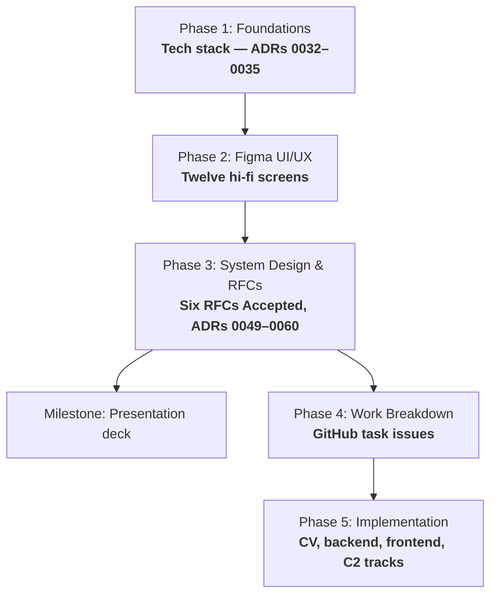

<div align="center">

<picture>
  <source media="(prefers-color-scheme: dark)" srcset="docs/assets/logo-Dark.svg">
  <source media="(prefers-color-scheme: light)" srcset="docs/assets/logo-light.svg">
  
</picture>

# IBVAP

### Intelligent Border Video Analytics Platform

Smart India Hackathon 2026 · Problem Statement ID **26187**

[](https://github.com/Sujatx/ibvap/actions/workflows/ci.yml)
[](LICENSE)


[Problem Statement](docs/problem-statement.md) ·
[System Design](docs/architecture/system-design/README.md) ·
[Roadmap](ROADMAP.md) ·
[Contributing](CONTRIBUTING.md)

</div>

---

## Table of contents

- [Overview](#overview)
- [The problem](#the-problem)
- [The solution](#the-solution)
- [Features](#features)
- [Tech stack](#tech-stack)
- [How it works](#how-it-works)
- [MVP scope](#mvp-scope)
- [Project status](#project-status)
- [Getting started](#getting-started)
- [Repository structure](#repository-structure)
- [Documentation](#documentation)
- [Contributing](#contributing)
- [License](#license)
- [Disclaimer](#disclaimer)

## Overview

IBVAP is an AI-driven software platform that turns **existing IP-based CCTV
infrastructure** at Border Out Posts (BOPs), check posts, and border roads
into an intelligent surveillance network — **without requiring dedicated FRS,
ANPR, or smart-camera hardware** — by running real-time video analytics on
top of the cameras a border force already owns.

Research and product definition are complete in
[Notion](https://app.notion.com/p/3c986dda46e28132a92fef10b9d75132?pvs=204),
system design is complete in this repo, and UI design is in
[Figma](https://www.figma.com/files/team/1549054683813925758/project/645637828?fuid=1549054681745812988).
This repository holds the code, architecture, and decision records — see
[Documentation](#documentation) for everything else. Engineering has not
started yet.

## The problem

Conventional CCTV at border posts provides only recording and live viewing,
which requires continuous human observation to be useful. Advanced
functionality — facial recognition, ANPR, intrusion detection, object
tracking — is normally sold as specialized, proprietary hardware. That makes
it expensive and hard to deploy at scale, especially at remote,
low-connectivity, low-staffed border locations.

The result: a force can own hundreds of cameras and still have no reliable
way to know what any one of them is watching, or whether it is even capable
of telling them anything useful.

## The solution

IBVAP ingests live video from cameras a force already has — native IP cameras
over RTSP/ONVIF, and analog channels behind an existing DVR/XVR/NVR — and runs
AI/computer-vision analytics on that video in software, read-only against the
existing estate.

Before running any analytic, IBVAP measures what each camera can actually
support (resolution, frame rate, pixel density at range, day/night behaviour)
and issues a per-camera, per-capability verdict: supported or refused. A
capability the camera cannot support is **refused, not silently degraded** —
IBVAP does not claim what it cannot measure.

Firings are turned into logged **Events**, a subset of which become **Alerts**
routed to a human for a one-tap real / not real / unsure assessment. Events
can also be emitted outward over a documented, generic event contract for
integration with an external command-and-control system.

IBVAP surfaces what its analytics primitives actually produce — people,
vehicles, faces, plates, movement, and timing — as input to a human
operator's decision, running alongside the existing VMS or recorder. It does
not detect contraband, currency, or trafficking.

## Features

All eight capabilities named by the problem statement are addressed. Each
ships at a declared maturity, gated per camera against what that camera can
actually measure — none is delivered as an unqualified, universal claim. Full
detail, including pixel floors and licensing, is in the System Design
Document's [core components and pipeline](docs/architecture/system-design/05-core-components-and-pipeline.md).

| Capability | Maturity | Key condition |
|---|---|---|
| Human detection and tracking | Ships | Needs ≥ 3 analysed fps for tracking |
| Vehicle detection and classification | Ships | Type only (car/truck/bus/motorcycle/bicycle) — no make/model/colour |
| Face detection | Ships, unconditionally | Detection only unless recognition is separately configured |
| Face recognition | Ships, gated | Refused everywhere until a watchlist is legally configured and enabled ([ADR 0059](docs/adr/0059-face-recognition-ships-against-a-configured-watchlist.md)) |
| Automatic Number Plate Recognition | Ships, gated by camera placement | Refused on wide-area cameras, supported on close/choke-point cameras |
| Virtual fence intrusion detection | Ships | Rule engine over zones/lines/direction/dwell |
| Suspicious activity detection | Ships, rule-based only | Operator-authored composite rules over reliable primitives — no learned anomaly model |
| Night-time movement detection | Ships | Measured separately after dark; motion detected independent of classification |
| Real-time alerts and event logging | Ships | A rule firing always writes an Event; an alerting rule also raises an Alert |

No capability is presented as working on every camera. If a specific camera
can't reliably support one, that's stated inline, in the operator's own
voice.

## Tech stack

| Layer | Choice |
|---|---|
| Decode / inference runtime | PyAV (NVDEC + software fallback), ONNX Runtime |
| Detection & tracking | YOLO-family detector, ByteTrack |
| Face detection / recognition | YuNet, SFace |
| ANPR | YOLO-family plate detector, `fast-plate-ocr` |
| Night movement | OpenCV MOG2 background subtraction |
| Rule geometry | Shapely |
| Backend | FastAPI, Pydantic v2, Python 3.12 |
| Event store | SQLite (WAL mode), SQLAlchemy 2.0, Alembic |
| Video transport | go2rtc (WebRTC/HLS/MJPEG) |
| Console | React Router, TanStack Query, Tailwind v4 |
| Packaging / tooling | `uv`, `ruff`, `mypy`, `pytest` |

Full rationale for every choice is recorded as an ADR — see
[docs/adr/README.md](docs/adr/README.md).

## How it works


## MVP scope

Per [ADR 0016](docs/adr/0016-mvp-ui-cut-to-five-screens.md), the MVP is
deliberately five screens — exactly what the problem statement names, built
as a finished product, nothing built around it:

| Screen | Answers |
|---|---|
| **Sign in** | Who's using this right now? |
| **Live View** *(home)* | What is the camera seeing, right now? |
| **Rules** | What should this camera watch for? |
| **Alerts & Events** | What happened, and what needs me? |
| **Integration** | How does this reach our other systems? |

Case management, evidence chain-of-custody export, and the
audit/authority/roles/health governance layer are cut entirely for this
MVP. See
[ADR 0016](docs/adr/0016-mvp-ui-cut-to-five-screens.md) for the reasoning and
the [PRD](https://app.notion.com/p/3c986dda46e28195ba55dd42265e7072?pvs=204)
§6 for what's kept.

ANPR and face recognition are validated separately, against fed footage that
clears their pixel floors, through the file-backed ingest source
([ADR 0060](docs/adr/0060-file-backed-frame-source-for-testing.md)).

## Project status

The project follows a phased execution plan documented in
[ROADMAP.md](ROADMAP.md).



| Home | Item | Status |
|---|---|---|
| Notion | Research, Vision & Scope, PRD | Complete |
| Repo | Decisions ([ADR 0001 – 0060](docs/adr/README.md)) | Accepted |
| Repo | MVP scope | Frozen — five screens ([ADR 0016](docs/adr/0016-mvp-ui-cut-to-five-screens.md)) |
| Figma | Screen flow (FigJam) + wireframes | Complete — 37 frames consolidated ([ADR 0039](docs/adr/0039-state-coverage-evidenced-three-ways.md)) |
| Figma | UI kit — tokens, type ramp, components | Built |
| Figma | Hi-fi screens | Phase 2 complete — twelve frames ([ADR 0048](docs/adr/0048-phase-2-closes-flow-frames-deferred.md)), plus a Watchlist screen added since ([ADR 0059](docs/adr/0059-face-recognition-ships-against-a-configured-watchlist.md)); flow-state frames deferred |
| Repo | Tech stack | Complete — models, gateway and inference placement decided |
| Repo | [Design docs](docs/rfcs/README.md) — ingest, rules, event store, API, egress, analytics | **All six Accepted** |
| Repo | [Architecture](docs/architecture/README.md) + [System Design Document](docs/architecture/system-design/README.md) | Written; detailed sequence/state diagrams still outstanding |
| Repo | Engineering | Not started — Phase 4 task-writing is now unblocked |

## Getting started

Phase 4 (task breakdown) and Phase 5 (implementation) haven't started, so
what exists today is the design set above plus the tooling CI runs against
it:

```bash
# clone
git clone https://github.com/Sujatx/ibvap.git
cd ibvap

# install uv (https://docs.astral.sh/uv/), then the dev dependency group
uv sync --group dev

# lint (src/dvr/ is excluded — see CLAUDE.md rule 5)
uv run ruff check . --extend-exclude src/dvr

# tests, once any exist
uv run pytest
```

Start by reading the [Problem Statement](docs/problem-statement.md), then the
[System Design Document](docs/architecture/system-design/README.md) for the
whole accepted design in one place.

## Repository structure

```
ibvap-surveillance/
├── CLAUDE.md                 project & workflow rules
├── CONTRIBUTING.md           branching, PRs, Definition of Ready/Done
├── LICENSE                   AGPL-3.0 (ADR 0032)
├── README.md
├── ROADMAP.md                phased SDLC execution roadmap
├── pyproject.toml            packaging, lint/type/test config (ADR 0033)
├── .github/                  issue templates, PR template, CI
├── src/
│   └── dvr/                  development CCTV/DVR access, preserved as-is
│       ├── dvr.py
│       ├── dvr.env           development CCTV credentials (gitignored)
│       ├── requirements.txt  dvr.py dependencies
│       └── backups/          original DVR encoder config
└── docs/
    ├── problem-statement.md  official, immutable SIH problem statement
    ├── adr/                  decision records, one file per decision
    ├── architecture/         arc42 description + the system design document
    ├── assets/               logo and other README assets
    └── rfcs/                 design docs, reviewed before non-trivial code
```

Product/discovery docs live in Notion and design files live in Figma — see
[Documentation](#documentation).

## Documentation

Four homes, one artifact each — see [CLAUDE.md](CLAUDE.md) §2 for the rule
and [CONTRIBUTING.md](CONTRIBUTING.md) for how work moves through the repo.

**This repo**

| Document | Description |
|---|---|
| [Roadmap](ROADMAP.md) | Phased SDLC roadmap and execution plan |
| [Problem Statement](docs/problem-statement.md) | Official, immutable SIH problem statement |
| [Decisions](docs/adr/README.md) | Architecture Decision Records, one file per decision |
| [Architecture](docs/architecture/README.md) | arc42 system architecture description |
| [System Design Document](docs/architecture/system-design/README.md) | Full design synthesis — data model, API contracts, security, deployment |
| [RFCs](docs/rfcs/README.md) | Design docs for non-trivial implementations, reviewed before code |
| [Contributing](CONTRIBUTING.md) | Branching, PRs, Definition of Ready/Done |
| [License](LICENSE) | AGPL-3.0 — see [ADR 0032](docs/adr/0032-inference-runtime-decode-path-and-detector-licence.md) for why |

**Notion** — [IBVAP workspace](https://app.notion.com/p/3c986dda46e28132a92fef10b9d75132?pvs=204)

| Page | Holds |
|---|---|
| [Vision & Scope](https://app.notion.com/p/3c986dda46e281269e61cedb44f3eb3e?pvs=204) | Vision statement plus required capabilities, outcomes and constraints |
| [PRD](https://app.notion.com/p/3c986dda46e28195ba55dd42265e7072?pvs=204) | Product Requirements Document, including MVP scope (§6) |
| [Research](https://app.notion.com/p/3c986dda46e281b1af56fe54bfbe813d?pvs=204) | Domain, SSB operational context, competitive landscape, technical feasibility |

**Figma** — [project](https://www.figma.com/files/team/1549054683813925758/project/645637828?fuid=1549054681745812988)

| File | Holds |
|---|---|
| [IBVAP — Screen Flow](https://www.figma.com/board/IyOcjBnBVh3ID2uxmrxRdT/IBVAP-%E2%80%94-Screen-Flow?t=crzSM6HZroTo7LFV-6) | FigJam board — the full screen flow |
| [IBVAP — Product Design](https://www.figma.com/design/ZDrrYveQkuzTFD9VufbQZO/IBVAP-%E2%80%94-Product-Design?m=auto&t=crzSM6HZroTo7LFV-6) | Wireframes, UI kit, hi-fi screens |

**GitHub Issues** — [Sujatx/ibvap](https://github.com/Sujatx/ibvap/issues) — tasks and bugs.

## Contributing

Discovery and delivery run continuously and in parallel, governed by the
four-homes rule in [CLAUDE.md](CLAUDE.md) §2. Every code change traces to a
GitHub issue; branch naming,
Definition of Ready/Done, and the PR flow are in
[CONTRIBUTING.md](CONTRIBUTING.md).

## License

AGPL-3.0-or-later — see [LICENSE](LICENSE). The copyleft obligation is
confined to the detection model artefact; see
[ADR 0032](docs/adr/0032-inference-runtime-decode-path-and-detector-licence.md)
for why, and how the boundary stays swappable.

## Disclaimer

IBVAP is a Smart India Hackathon 2026 development project. It is not a
production deployment, and it is not an official SSB or Government of India
system.
