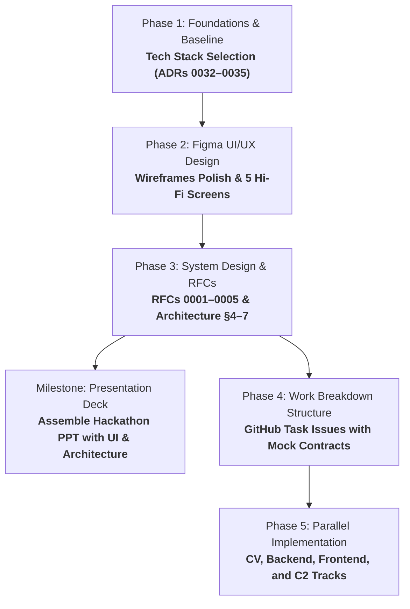

<div align="center">


# IBVAP

### Intelligent Border Video Analytics Platform

Smart India Hackathon 2026 · Problem Statement ID **26187**

</div>

---

## 1. Description

IBVAP is an AI-driven software platform that turns **existing IP-based CCTV
infrastructure** at Border Out Posts (BOPs), check posts, and border roads into
an intelligent surveillance network — **without requiring dedicated FRS, ANPR,
or smart-camera hardware** — by running real-time video analytics on top of
the cameras a border force already owns.

Research and product definition are complete, live in
[Notion](https://app.notion.com/p/3c986dda46e28132a92fef10b9d75132?pvs=204),
and design work is underway in
[Figma](https://www.figma.com/files/team/1549054683813925758/project/645637828?fuid=1549054681745812988).
This repository holds the code, architecture, and decision records —
[§8](#8-where-to-find-things) links out to everything else. Engineering has
not started; only the development CCTV rig used to validate constraints
against real hardware is here so far.

## 2. Problem

Conventional CCTV at border posts provides only recording and live viewing,
which requires continuous human observation to be useful. Advanced
functionality — facial recognition, ANPR, intrusion detection, object tracking
— is normally sold as specialized, proprietary hardware. That makes it
expensive and hard to deploy at scale, especially at remote, low-connectivity,
low-staffed border locations.

The result: a force can own hundreds of cameras and still have no reliable way
to know what any one of them is watching, or whether it is even capable of
telling them anything useful.

## 3. Solution

IBVAP ingests live video from cameras a force already has — native IP cameras
over RTSP/ONVIF, and analog channels behind an existing DVR/XVR/NVR — and runs
AI/computer-vision analytics on that video in software, read-only against the
existing estate.

Before running any analytic, IBVAP measures what each camera can actually
support (resolution, frame rate, day/night behaviour) and issues a per-camera,
per-capability verdict: eligible, eligible-but-degraded, or not eligible. A
capability the camera cannot support is **refused, not silently degraded** —
IBVAP does not claim what it cannot measure.

Firings are turned into logged **Events**, a subset of which become **Alerts**
routed to a human for a one-tap real / not real / unsure assessment. Events
can also be emitted outward over a documented, generic event contract for
integration with an external command-and-control system.

IBVAP does not replace an existing VMS or recorder, does not act as the sole
basis for a decision, and does not claim to detect contraband, currency, or
trafficking — only the people, vehicles, faces, plates, movement, and timing
that its analytics primitives actually produce.

## 4. Core capabilities

All eight capabilities named by the problem statement are addressed. Each
ships at a declared maturity, gated per camera against what that camera can
actually measure — none is delivered as an unqualified, universal claim.

| Capability | MVP grade | Key condition |
|---|---|---|
| Human detection and tracking | Support | Single-camera tracking only; needs ≥3 analysed fps |
| Vehicle detection and classification | Support | Coarse type only (car/truck/bus/motorcycle/bicycle) — no make/model/colour |
| Face detection | Support, conditional | Ships unconditionally; many overview-mounted cameras will be marked not eligible |
| Facial recognition (matching against a watchlist) | Not in MVP | Detection ships; matching a detected face against a gallery is cut ([ADR 0016](docs/adr/0016-mvp-ui-cut-to-five-screens.md)) — it needs a legal-authority workflow this build doesn't carry |
| Automatic Number Plate Recognition (ANPR) | Conditional | Lane-/gate-aimed cameras only, within a stated speed and mounting-angle envelope |
| Virtual fence intrusion detection | Support | Rule engine over zones/lines/direction/dwell |
| Suspicious activity detection | Support, rule-based only | Operator-authored composite rules over reliable primitives; no learned anomaly model in MVP |
| Night-time movement detection | Support | Detection continues after dark; a day/night state on the live view, not a separate mode |
| Real-time alerts and event logging | Primary-candidate | The product's spine: a rule firing always writes an Event; an alerting rule also raises an Alert |

No capability here is presented as working on every camera. If a specific
camera can't reliably support a class, that's stated inline, right where the
detection would have appeared — not hidden.

## 5. MVP

Per **[ADR 0016](docs/adr/0016-mvp-ui-cut-to-five-screens.md)**, the MVP is deliberately five
screens — exactly what the problem statement names, built as a finished
product, nothing built around it:

| Screen | Answers |
|---|---|
| **Sign in** | Who's using this right now? |
| **Live View** *(home)* | What is the camera seeing, right now? — human/vehicle/face/plate detection, night-time movement |
| **Rules** | What should this camera watch for? — virtual fence, suspicious activity |
| **Alerts & Events** | What happened, and what needs me? — real-time alerting, event logging |
| **Integration** | How does this reach our other systems? |

Case management, evidence chain-of-custody export, watchlist face-matching,
and the audit/authority/roles/measurement/health governance layer are cut
entirely for this MVP — not simplified, not hidden inside another screen.
They're real needs for a permanently deployed force, not what a five-screen
demo needs to show; see [ADR 0016](docs/adr/0016-mvp-ui-cut-to-five-screens.md) for the full
reasoning and the
[PRD](https://app.notion.com/p/3c986dda46e28195ba55dd42265e7072?pvs=204) §6
for what's kept.

The MVP is developed and validated against the development CCTV rig in this
repository (see [§9](#9-development-cctv-environment)) — that rig is not
claimed to represent any real border camera estate.

## 6. How it works


## 7. Project status & development roadmap

The project follows a phased SDLC execution plan documented in [ROADMAP](ROADMAP.md).



| Home | Item | Status |
|---|---|---|
| Notion | Research (domain, users, competitors, technology) | Complete |
| Notion | Vision & Scope | Complete |
| Notion | PRD | Complete |
| Repo | Decisions (ADR 0001 – 0035) | Accepted |
| Repo | MVP scope | Frozen — five screens (ADR 0016) |
| Figma | Screen flow (FigJam) + wireframes | In Progress — Drafted, pending review |
| Figma | UI kit — tokens, type ramp, components | Built (ADR 0030 palette, ADR 0031 control grammar) |
| Figma | Hi-fi screens | Not started |
| Repo | Tech stack (ADR 0032 – 0035) | Phase 1 complete — runtime, backend, event store, console |
| Repo | [RFCs](docs/rfcs/README.md) — ingest, rules, event store, API, egress | Phase 3 — none written yet |
| Repo | Architecture | Skeleton in place ([docs/architecture/](docs/architecture/README.md)), §4–7 pending RFCs |
| Repo | Engineering | Not started |

## 8. Where to find things

Four homes, one artifact each — see [CLAUDE.md](CLAUDE.md) §2 for the rule
and [CONTRIBUTING.md](CONTRIBUTING.md) for how work moves through the repo.

**Notion** — [IBVAP workspace](https://app.notion.com/p/3c986dda46e28132a92fef10b9d75132?pvs=204)

| Page | Holds |
|---|---|
| [Vision & Scope](https://app.notion.com/p/3c986dda46e281269e61cedb44f3eb3e?pvs=204) | Vision statement plus required capabilities, outcomes and constraints |
| [PRD](https://app.notion.com/p/3c986dda46e28195ba55dd42265e7072?pvs=204) | Product Requirements Document, including MVP scope (§6) — five screens, frozen per ADR 0016 |
| [Research](https://app.notion.com/p/3c986dda46e281b1af56fe54bfbe813d?pvs=204) | Domain, [SSB operational context](https://app.notion.com/p/3c986dda46e281e89fe8feeebf5f04b8?pvs=204), [SSB operational workflow](https://app.notion.com/p/3c986dda46e28150bff0ecde90f66bc5?pvs=204), [product discovery](https://app.notion.com/p/3c986dda46e281308010e0a5e861a5b4?pvs=204), [competitive landscape](https://app.notion.com/p/3c986dda46e281f39b15d3fb7ee4db82?pvs=204), [international border-surveillance platforms](https://app.notion.com/p/3c986dda46e281bbbd54c6b5c8061a3f?pvs=204), [investigative case-management platforms](https://app.notion.com/p/3c986dda46e281a88c75e6b2d7bf373e?pvs=204), [technical feasibility](https://app.notion.com/p/3c986dda46e281a7a1c3d87623970822?pvs=204) |

**Figma** — [project](https://www.figma.com/files/team/1549054683813925758/project/645637828?fuid=1549054681745812988)

| File | Holds |
|---|---|
| [IBVAP — Screen Flow](https://www.figma.com/board/IyOcjBnBVh3ID2uxmrxRdT/IBVAP-%E2%80%94-Screen-Flow?t=crzSM6HZroTo7LFV-6) | FigJam board — the full screen flow |
| [IBVAP — Product Design](https://www.figma.com/design/ZDrrYveQkuzTFD9VufbQZO/IBVAP-%E2%80%94-Product-Design?m=auto&t=crzSM6HZroTo7LFV-6) | Wireframes, UI kit, hi-fi (empty for now) |

**This repo**

| Document | Description |
|---|---|
| [Roadmap](ROADMAP.md) | Phased SDLC roadmap and execution plan |
| [Problem Statement](docs/problem-statement.md) | Official, immutable SIH problem statement |
| [Decisions](docs/adr/README.md) | Architecture Decision Records, one file per decision (ADR 0001 – 0035) |
| [Architecture](docs/architecture/README.md) | arc42 system architecture description |
| [RFCs](docs/rfcs/README.md) | Design docs for non-trivial implementations, reviewed before code |
| [Contributing](CONTRIBUTING.md) | Branching, PRs, Definition of Ready/Done |
| [License](LICENSE) | AGPL-3.0 — see [ADR 0032](docs/adr/0032-inference-runtime-decode-path-and-detector-licence.md) for why |

**GitHub Issues** — [Sujatx/ibvap](https://github.com/Sujatx/ibvap/issues) — tasks and bugs.

## 9. Development CCTV environment

This repository includes an existing home CCTV/DVR setup (`dvr.py`, `dvr.env`,
`backups/`, `requirements.txt`) that serves as the development and validation
environment for IBVAP — a real analog XVR with real firmware and bandwidth
constraints, used to test IBVAP against real-world legacy CCTV/DVR behaviour
rather than assumed behaviour.

This setup is preserved as-is and is not part of the IBVAP product. Connection
details, credentials, and network configuration for this rig are kept out of
version control and are not documented here.

## 10. Repository structure

```
ibvap-surveillance/
├── CLAUDE.md                 project & workflow rules
├── CONTRIBUTING.md           branching, PRs, Definition of Ready/Done
├── LICENSE                   AGPL-3.0 (ADR 0032)
├── README.md
├── ROADMAP.md                phased SDLC execution roadmap
├── dvr.py                    development CCTV/DVR access (preserved, not IBVAP)
├── dvr.env                   development CCTV credentials (gitignored)
├── requirements.txt          dvr.py dependencies
├── backups/                  original DVR encoder config
├── .github/                  issue templates, PR template, CI
└── docs/
    ├── problem-statement.md  official, immutable SIH problem statement
    ├── adr/                  decision records, one file per decision
    ├── architecture/         arc42 system architecture description
    ├── assets/               logo and other README assets
    └── rfcs/                 design docs, reviewed before non-trivial code
```

Product/discovery docs and design files are not in this repo — see
[§8](#8-where-to-find-things).

## 11. Development methodology

Discovery and delivery run continuously and in parallel — see
[CLAUDE.md](CLAUDE.md) §2 for the four-homes rule that replaces a
stage-gated waterfall.

## 12. Disclaimer

IBVAP is a Smart India Hackathon 2026 development project. It is not a
production deployment, and it is not an official SSB or Government of India
system.
