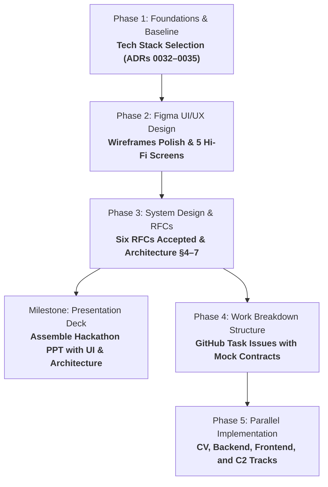

# IBVAP Development Roadmap & SDLC Execution Plan

**Project:** Intelligent Border Video Analytics Platform (IBVAP)  
**Hackathon:** Smart India Hackathon 2026 — Problem Statement ID: 26187  
**Document Purpose:** Detailed sequential roadmap mapping the project from foundations to implementation handoff, structured for single-session AI pair programming and parallel hackathon team execution.

---

## 1. Project Foundations & Operating Rules

All development adheres to the established project principles recorded in [`CLAUDE.md`](CLAUDE.md) and [`docs/adr/`](docs/adr/README.md):

1. **The Four Homes Rule**:
   - **Repository** (`git`): Code, ADRs, system architecture, RFCs, CI/CD, contributing guidelines.
   - **Notion**: PRD, problem research, vision & product scope.
   - **Figma**: Screen flows, wireframes, component library (`02 UI Kit`), hi-fi screens (`03 Hi-fi`).
   - **GitHub Issues**: Executable work packages, task tickets, bugs.
2. **Five-Screen MVP Freeze ([ADR 0016](docs/adr/0016-mvp-ui-cut-to-five-screens.md))**:
   - `S-01 Sign in`: Operator authentication & session recovery ([ADR 0037](docs/adr/0037-sign-in-follows-the-reference-username-password.md), superseding 0024).
   - `S-02 Live View`: Real-time video grid, detection bounding-box overlays, inline capability status / refusal ([ADR 0007](docs/adr/0007-refuse-unsupported-capabilities-not-degrade.md)), historical timeline on the focused-camera view ([ADR 0038](docs/adr/0038-historical-timeline-on-the-focused-camera-view.md)).
   - `S-03 Rules`: Authoring operator rules for virtual fence, loitering, ANPR, night movement ([ADR 0011](docs/adr/0011-virtual-fence-plus-open-border-framing.md), [ADR 0012](docs/adr/0012-suspicious-activity-as-operator-authored-rules.md), [ADR 0013](docs/adr/0013-night-time-movement-detection-as-explicit-capability.md)).
   - `S-04 Alerts & Events`: Chronological audit log, alert triage, snooze/suppression ([ADR 0023](docs/adr/0023-dismissal-cause-captured-on-suppression.md), [ADR 0027](docs/adr/0027-suppression-works-like-notification-snooze.md)), impact grading ([ADR 0018](docs/adr/0018-operator-assigned-impact-grade.md)).
   - `S-05 Integration`: Generic C2 egress endpoint configuration & live verification ([ADR 0006](docs/adr/0006-c2-integration-via-generic-event-contract.md)).
   - Configuration is localized within these 5 screens and environment configs.
3. **Settled Design Grammar**:
   - Palette: Dark console palette ([ADR 0030](docs/adr/0030-dark-console-palette-no-severity-colour.md)) — colour denotes category/attention, never subjective severity.
   - Component Grammar: Chips state facts, segmented controls make choices ([ADR 0031](docs/adr/0031-component-grammar-chip-states-fact-segmented-control-chooses.md)).
4. **Hardware & Rig Preservation**:
   - Read-only ingestion against existing DVR/NVR infrastructure; no proprietary camera hardware required.
   - Preserves development CCTV test rig (`dvr.py`, `dvr.env`, `backups/`, `requirements.txt`) unmodified.

---

## 2. Macro Phasing & Session Structure

To avoid context exhaustion and ensure complete technical clarity before team coding begins, work is structured into **4 sequential preparation phases**, followed by **Phase 5: Implementation**.



---

## 3. Phase-by-Phase Execution Plan

### Phase 1: Tech Stack Selection & Constraints Lock
* **Goal**: Select and formally document the core software stack that satisfies offline edge constraints (72h disconnected operation, low-latency RTSP decoding, 8-channel CCTV rig processing, rapid hackathon build velocity).
* **Key Deliverables**:
  1. Evaluate candidate combinations for:
     - **CV / Video Pipeline**: Python / OpenCV / ONNX Runtime / Ultralytics YOLOv8/v11 / ByteTrack.
     - **Backend & Streaming Server**: FastAPI (Python) + WebSockets / WebRTC / MSE gateway.
     - **Local Event Storage**: SQLite (with WAL mode) or DuckDB for fast local timeseries audit queries.
     - **Operator Web Console**: React + TypeScript + Vite + Tailwind CSS + HTML5 Canvas.
  2. Record the result as **four** ADRs in MADR format, not one — this project's convention is one file per decision, so a later change of mind on storage does not reopen the frontend:
     - [ADR 0032](docs/adr/0032-inference-runtime-decode-path-and-detector-licence.md) — inference runtime, decode path, and detector licence.
     - [ADR 0033](docs/adr/0033-backend-framework-packaging-and-auth.md) — backend framework, packaging, and the authentication mechanism.
     - [ADR 0034](docs/adr/0034-local-event-store-on-sqlite.md) — the local event store, and the egress queue inside it.
     - [ADR 0035](docs/adr/0035-operator-console-stack-and-video-transport.md) — operator console stack, and how video reaches the browser.
* **Definition of Done (DoD)**:
  - ADRs 0032–0035 are committed and indexed in [`docs/adr/README.md`](docs/adr/README.md).
  - All dependency layers are chosen with zero ambiguity remaining for backend, frontend, and ML.

> [!NOTE]
> **Status: complete (2026-09-01).** The four ADRs are written and indexed. The
> superseded RFC 0001, drafted against an earlier ordering, was removed in the
> same pass — Phase 3 writes it fresh.

---

### Phase 2: Complete Figma UI/UX Design
* **Goal**: Finalize all visual layouts and complete the 5 Hi-Fi screens in Figma before coding any frontend UI.
* **Key Tasks**:
  1. **Wireframe Audit (`01 Wireframes`)**:
     - Review all 5 screens in greyscale.
     - Add missing interactive controls (collapse controls for side navigation rail, camera selection sidebar, and event detail drawers).
     - Verify layout hierarchy, density, and spatial allocation across 1080p console displays.
  2. **Hi-Fi Screen Generation (`03 Hi-fi`)**:
     - Assemble **`S-01 Sign in`**: Screen layout, credential entry, session lock state, password reset ([ADR 0037](docs/adr/0037-sign-in-follows-the-reference-username-password.md)).
     - Assemble **`S-02 Live View`**: 8-channel grid / focused camera layout, transparent HTML5 overlay bounds, category chips ([ADR 0031](docs/adr/0031-component-grammar-chip-states-fact-segmented-control-chooses.md)), inline capability refusal badges ([ADR 0007](docs/adr/0007-refuse-unsupported-capabilities-not-degrade.md)), collapse toggles, and the historical timeline with its playback-refusal state ([ADR 0038](docs/adr/0038-historical-timeline-on-the-focused-camera-view.md)).
     - Assemble **`S-03 Rules`**: Spatial polygon/line drawing editor for virtual fences, schedule/night-mode selectors, parameter sliders.
     - Assemble **`S-04 Alerts & Events`**: Real-time event feed, filter drawer, impact grading controls ([ADR 0018](docs/adr/0018-operator-assigned-impact-grade.md)), snooze/suppression modal ([ADR 0027](docs/adr/0027-suppression-works-like-notification-snooze.md)), crop & clip preview.
     - Assemble **`S-05 Integration`**: C2 webhook/MQTT endpoint input, payload schema tester, connection status ping indicator ([ADR 0006](docs/adr/0006-c2-integration-via-generic-event-contract.md)).
* **Definition of Done (DoD)**:
  - All 5 screens are fully assembled in `03 Hi-fi` using solely components from `02 UI Kit`.
  - Wireframe gaps (collapse triggers, drawer behaviors) are completely resolved.

> [!NOTE]
> **Status: Phase 2 complete (2026-09-03).** `01 Wireframes` and `02 UI Kit`
> were done first; `03 Hi-fi` now holds twelve frames — sign in, the five
> screens (S-02 as grid and focused camera), each of the five real screens
> paired with a baked rail-collapsed counterpart at the same 1440 canvas, and
> the 1920 fluid proof — all assembled from an `AppShell` component and swept
> clean of raw values. The focused view was rebuilt at the density of the
> archived reference — a full-width picture, an alerts rail, a camera spec
> list, a camera strip, a site sketch and a timeline with its full control
> surface. Rail navigation was then fixed to stay collapsed and highlight
> correctly across every screen, and camera stills went onto Live View, Rules
> and one Alerts row. The flow-state frames (`too many attempts`, `drawing a
> zone`, and the rest) are deferred, out of Phase 2 scope. See
> [ADR 0039](docs/adr/0039-state-coverage-evidenced-three-ways.md),
> [ADR 0040](docs/adr/0040-kit-gaps-built-out-for-hi-fi.md),
> [ADR 0041](docs/adr/0041-hi-fi-assembled-from-an-appshell-component.md),
> [ADR 0043](docs/adr/0043-focused-camera-view-rebuilt-around-the-picture.md),
> [ADR 0044](docs/adr/0044-site-sketch-returns-on-live-view.md),
> [ADR 0045](docs/adr/0045-timeline-second-pass-controls-and-density.md),
> [ADR 0046](docs/adr/0046-timeline-markers-carry-class-colour.md),
> [ADR 0047](docs/adr/0047-rail-collapse-becomes-baked-frame-pairs.md) and
> [ADR 0048](docs/adr/0048-phase-2-closes-flow-frames-deferred.md).
>
> **Addendum (2026-09-04):** a Watchlist screen was added on top of the above,
> reached from Rules by a page-level tab — subject enrollment and gallery
> management, with the four-condition config behind a settings menu, closing
> the hi-fi gap [ADR 0059](docs/adr/0059-face-recognition-ships-against-a-configured-watchlist.md)
> flagged. `PhotoUpload`, `SubjectCard`, and a shared `PageHeader` component
> (title/description text properties, a swappable actions slot) were added to
> `02 UI Kit`.

---

### Phase 3: System Design & RFCs (The API & Data Contracts)
* **Goal**: Write the complete technical design documents that define all internal APIs, WebSocket message schemas, data models, and component boundaries.
* **Key Deliverables**:
  1. **RFC 0001**: *Video Ingest and Analytics Pipeline* — RTSP/ONVIF ingest including analog channels behind a DVR/XVR, the per-camera capability-measurement pass [ADR 0007](docs/adr/0007-refuse-unsupported-capabilities-not-degrade.md) requires, and inference placement (edge vs. central), which the stack ADRs deliberately left open. It must also **measure whether the recorder will serve recorded video at all** — the retrieval path the timeline in [ADR 0038](docs/adr/0038-historical-timeline-on-the-focused-camera-view.md) depends on is unverified on the rig, and if there is none, the timeline ships as a refusal on every camera.
  2. **RFC 0002**: *Rule Evaluation Engine* — Spatial geometry evaluation (Ray Casting / Shapely), loitering timers, temporal conditions, and rule matching logic.
  3. **RFC 0003**: *Event Store & Alert State Pipeline* — SQLite schema, write-ahead logging, retention policy, alert snooze/suppression state machine ([ADR 0027](docs/adr/0027-suppression-works-like-notification-snooze.md)).
  4. **RFC 0004**: *Web Application & API Contracts* — Comprehensive OpenAPI specification (REST CRUD) and `/ws/live` WebSocket frame/event schemas.
  5. **RFC 0005**: *Generic C2 Event Egress Publisher* — Outbound webhook/MQTT dispatcher, exponential retry with dead-letter queue, payload structure ([ADR 0006](docs/adr/0006-c2-integration-via-generic-event-contract.md)).
  6. **RFC 0006**: *Detection & Analytics Primitives* — the model behind each of the eight problem-statement capabilities, their licences, the gated cascade that fits them in a constrained GPU memory budget, the pixel floors RFC 0001's measurement pass applies, and the declared-maturity table [ADR 0009](docs/adr/0009-all-eight-capabilities-with-declared-maturity.md) requires. Split out of RFC 0001, which otherwise carried ingest, capability measurement, inference placement, playback retrieval *and* every model.
  7. **Architecture Documentation**: Fill sections §4–7 in [`docs/architecture/README.md`](docs/architecture/README.md) (Solution Strategy, Building Block View, Runtime View, Deployment View) referencing the accepted RFCs.
  8. **Diagrams**: the three the presentation needs — a solution architecture, a technical data flow, and a user workflow flowchart — plus supporting sequence, state and ER diagrams, in [`docs/architecture/diagrams/`](docs/architecture/diagrams/). **Still outstanding.**
* **Definition of Done (DoD)**:
  - All 6 RFCs are merged with status `Accepted`.
  - Every API endpoint and WebSocket message has an exact JSON example and TypeScript/Pydantic type definition.

> **Status: Accepted (2026-09-03).** All six RFCs are `Accepted` and
> architecture §4–7 are written; [`docs/architecture/system-design/`](docs/architecture/system-design/README.md)
> carries a fuller, review-ready synthesis of the same accepted design split
> across dedicated files. Twelve decisions taken along the way are recorded as
> ADRs 0049–0060, including that decode throughput and the recorded-playback
> route are per-deployment facts established at commissioning rather than
> one-time measurements this phase blocks on. This unblocks Phase 4 per
> [CONTRIBUTING.md](CONTRIBUTING.md)'s Definition of Ready, which gates a task
> on an accepted RFC, not on a drawn diagram. Still outstanding, tracked as
> ongoing rather than phase-blocking work: the detailed sequence and state
> diagrams each RFC names but does not draw, and a Figma/Notion home for the
> watchlist enrollment and match-review screens
> ([ADR 0059](docs/adr/0059-face-recognition-ships-against-a-configured-watchlist.md)).

> [!NOTE]
> **Milestone: Presentation & Team Preparation**  
> Following Phase 3, two deliverables need to be prepared:
> 1. **Presentation Deck (PPT)** — Assemble the hackathon PPT using the team's template, incorporating Hi-Fi UI screens from Phase 2 and finalized architecture diagrams from Phase 3.
> 2. **Project Documentation** — Write a detailed project document covering the system overview, capabilities, tech stack, and architecture, so teammates can use it to prepare for and present confidently in the internal hackathon round.

---

### Phase 4: Work Breakdown Structure (WBS) & GitHub Task Issues
* **Goal**: Translate the RFCs and Figma designs into standalone, modular GitHub task tickets ready for team assignment.
* **Team Work Tracks**:
  - **Track A (CV / AI Video Pipeline)**: RTSP decoding, YOLO inference engine, multi-object tracking (ByteTrack), class analytics (human, vehicle, face, license plate).
  - **Track B (Backend Core & Storage)**: FastAPI app, SQLite database migrations, Rule evaluation engine, alert suppression service.
  - **Track C (Frontend Web Console)**: React 5-screen UI, HTML5 Canvas overlay engine, WebSocket live telemetry hook, mock service toggle.
  - **Track D (Integration & E2E Validation)**: C2 egress dispatcher, live CCTV stream integration against `dvr.py` rig, test automation.
* **Standard Ticket Format for Teammates**:
  Each GitHub Issue must include:
  ```markdown
  ### Context & Purpose
  [Brief description of the component]

  ### Technical Specification & Contracts
  - Input: [Function arguments / REST query parameters / WS payload]
  - Output / Return: [Pydantic schema / TypeScript interface / JSON schema]

  ### Mocking & Isolated Testing Instructions
  [How to run and test this module independently before other modules are done]

  ### Definition of Done (DoD)
  - [ ] Unit tests passing
  - [ ] Lint & typing clean
  - [ ] Meets RFC specification
  ```
* **Definition of Done (DoD)**:
  - GitHub Milestones (`M1: Ingest & Detection`, `M2: Rules & Event Store`, `M3: Operator Console`, `M4: C2 Egress & Validation`) created.
  - All task issues seeded with complete contracts and mock data fixtures.

---

### Phase 5: Implementation, Integration & Verification
* **Execution Strategy**:
  - Developers branch off `main` using `<type>/<issue#>-<slug>` naming.
  - Development proceeds in parallel using mock data contracts defined in Phase 3.
  - Ingest and video overlays are validated against real CCTV streams from the `dvr.py` rig.
  - ANPR and face recognition are validated against fed footage through the file-backed ingest source (ADR 0060), since the rig's own wide-area channels measure below both capabilities' pixel floors.
  - Final integration verified against the generic C2 event contract.

---

## 4. Summary Table of Artifacts & Responsibilities

| Phase | Core Deliverable | Output Location | Next Dependent Step |
|---|---|---|---|
| **Phase 1** | Tech Stack ADRs 0032–0035 | [`docs/adr/`](docs/adr/README.md) | Unblocks RFC drafting |
| **Phase 2** | 5 Hi-Fi Screens | Figma `03 Hi-fi` | Unblocks Frontend task tickets |
| **Phase 3** | Six RFCs (0001–0006) Accepted & Architecture §4–7 | `docs/rfcs/*.md`, `docs/architecture/README.md`, `docs/architecture/system-design/` | Unblocks Backend/CV/API task tickets |
| **Phase 4** | WBS & GitHub Task Tickets | GitHub Issues & Milestones | Unblocks Team coding |
| **Phase 5** | Production Software | `src/` / `backend/` / `frontend/` | Hackathon Demo & Submission |
