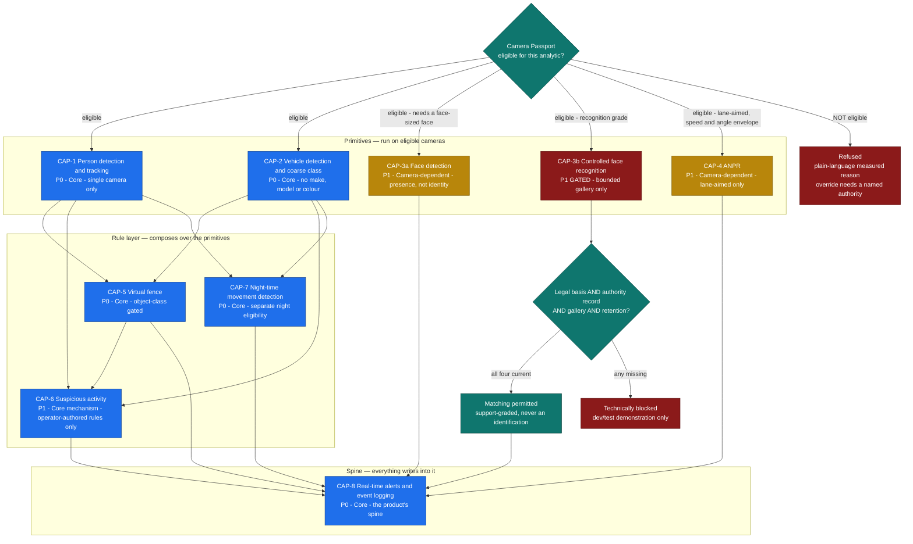
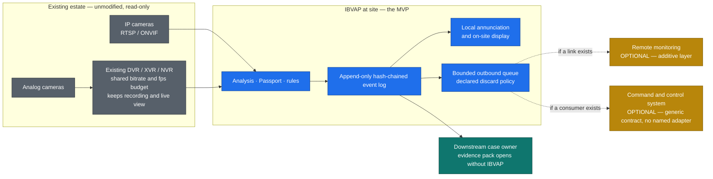
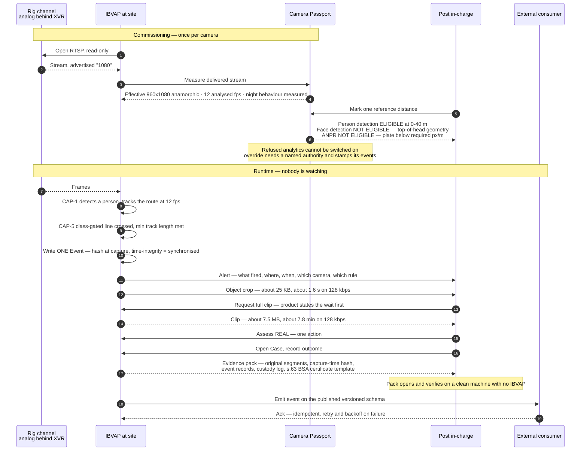
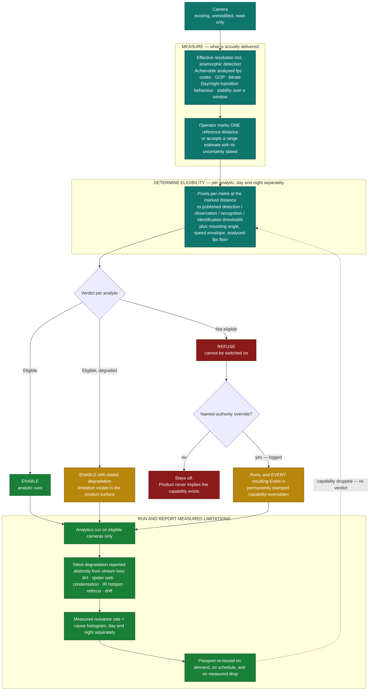
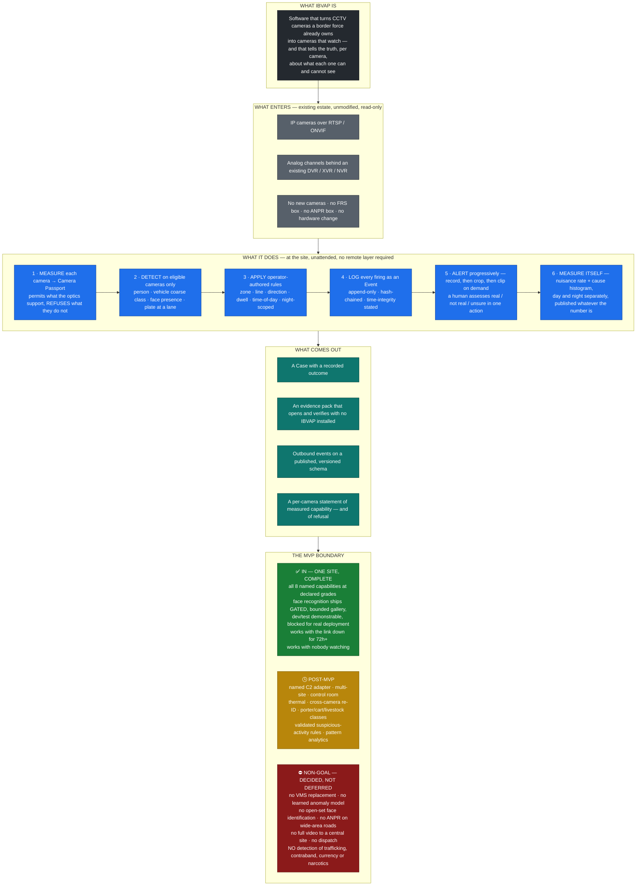

# IBVAP — MVP Scope Freeze

**Stage:** 02 — Product Definition (scope freeze)
**Date:** 2026-08-25
**Status:** Frozen scope, derived from the approved PRD and the accepted decisions
D-1 … D-14.

This document is the frozen MVP scope — a derivation of the approved PRD and
accepted decisions, not an extension of them. Every statement below traces to
[problem.md](../00-project/problem.md) (immutable), to [PRD.md](PRD.md), or to
a decision accepted in [decisions.md](../00-project/decisions.md). Where this
document is shorter than the PRD, it is a selection; where it is more concrete,
it is a re-arrangement — never a new requirement, capability, priority,
condition or acceptance criterion.

**Source of authority, in order:**

1. The official SIH problem statement, PS 26187 — [problem.md](../00-project/problem.md).
   Immutable. Every capability it names is present below.
2. [PRD.md](PRD.md) — approved product definition.
3. [decisions.md](../00-project/decisions.md) — D-1 … D-14, all **accepted**.

UI design, technical architecture, stack selection and implementation belong
to the later [03-design](../03-design/) and [04-architecture](../04-architecture/)
stages, not to this document.

**Label convention** is carried unchanged from [PRD.md §0.1](PRD.md#01-labels--and-the-one-distinction-that-matters-most)
— **FACT**, **ASSUMPTION**, **HYPOTHESIS**, **UNKNOWN**, **DECISION**,
**PRODUCT MODEL** — and the scope labels **[SIH/SSB]**, **[BORDER]**, **[GLOBAL]**,
**[MARKET:xx]** from [§0.2](PRD.md#02-scope-labels).

---

## Contents

1. [MVP objective](#1-mvp-objective)
2. [MVP user outcome](#2-mvp-user-outcome)
3. [MVP deployment boundary](#3-mvp-deployment-boundary)
4. [Complete end-to-end workflow](#4-complete-end-to-end-workflow)
5. [MVP capabilities](#5-mvp-capabilities)
6. [Capability priority](#6-capability-priority)
7. [Capability operating conditions](#7-capability-operating-conditions)
8. [MVP functional requirements](#8-mvp-functional-requirements)
9. [MVP non-functional requirements](#9-mvp-non-functional-requirements)
10. [MVP acceptance criteria](#10-mvp-acceptance-criteria)
11. [Demo scenarios](#11-demo-scenarios)
12. [Explicitly excluded capabilities](#12-explicitly-excluded-capabilities)
13. [Post-MVP capabilities](#13-post-mvp-capabilities)
14. [MVP exit gates](#14-mvp-exit-gates)
15. [Known limitations](#15-known-limitations)
16. [MVP Visual Model](#mvp-visual-model)
17. [MVP In One Picture](#mvp-in-one-picture)
18. [Final lists and the plain-English explanation](#final-lists)

---

## 1. MVP objective

> **Take one deployment site's existing cameras — unmodified, including analog
> channels behind an existing recorder — measure what each camera can actually
> support, run the eight capabilities the problem statement names at their declared
> grades on the cameras that support them, refuse them on the cameras that do not,
> and carry every firing through the complete loop to an alert, a human assessment,
> a case, an exportable evidence pack and an outbound event — locally, unattended,
> with no remote layer required.**

**Derived from:** D-13 (*the MVP is one site, complete*), D-8 (*all eight
capabilities addressed at declared grades*), D-6 (*refuse, don't degrade*), D-3
(*correct whether or not a remote layer exists*), [PRD §10.1](PRD.md#101-the-mvp-thesis),
[PRD §10.2](PRD.md#102-what-is-in-the-mvp).

The objective is deliberately **one argument, not a feature list**. Per
[PRD §10.3](PRD.md#103-why-each-block-is-in-the-mvp--the-coherence-argument),
removing any block breaks the argument:

- Without the **Camera Passport**, every claim IBVAP makes is the market's claim and D-1 is gone.
- Without **primitives**, rules regress to pixel motion — which is what the estate already has.
- Without **rules**, capabilities 5, 6 and 7 do not exist.
- Without **Event/Alert separation**, the product designs for a role the research says may not exist.
- Without **measurement**, G2 is unfalsifiable and IBVAP is indistinguishable from a vendor claim.
- Without **evidence integrity**, the loop stops at "we detected something" and the case dies at handover.
- Without **site resilience**, none of the above survives the actual site.
- Without **egress**, the statement's C2 requirement is unmet.

### What the objective explicitly does not include

The MVP objective does **not** include: proving detection-accuracy leadership
(D-1, NG-7); replacing the existing VMS or recorder (NG-1); shipping an adapter to a
named command-and-control system (D-5); asserting a legal basis for biometric
matching against a real deployment (D-7); or assuming any particular SSB control-room
workflow (D-13(e)).

---

## 2. MVP user outcome

The MVP is judged against the jobs in [PRD §4](PRD.md#4-user-needs--jobs), not against
a feature count. The outcomes it must produce, per primary user:

| User | Outcome the MVP must produce | Job | Trace |
|---|---|---|---|
| **U1 — Post in-charge** | *"I am told when something I asked to be told about happens on my stretch, with enough to judge it in seconds, without watching a screen — and when a camera cannot do a thing, I am told that too, before I rely on it."* | J1, J2, J9 | CAP-1, CAP-5, CAP-8, FR-10, FR-13 |
| **U2 — Check-post in-charge** | *"At the lane, a plate is read and logged automatically and a face is detected where the camera is sited to see one — instead of being written in a register."* | J1, J8 | CAP-3a, CAP-4 |
| **U3 — Company / Battalion commander** | *"I learn about a thing worth deciding on sooner than by waiting for it to be phoned up, and I can see how noisy the system that told me is."* | J2, J3 (partial) | CAP-8, FR-49 |
| **U4 — Monitoring operator (if the role exists)** | *"The same Events and Alerts reach my console, and the site did not have to be configured differently for me to exist."* | J1, J2 | D-3, D-4, AC-P6 |
| **U7 — Evidence custodian** | *"I can produce a pack with the capture-time hash and a certificate template naming the s.63 BSA fields, and the custody log is already written."* | J7 | FR-33, FR-36, FR-37 |
| **U8 — Downstream case owner** | *"The pack opens and verifies on my machine, which does not have IBVAP on it."* | J7 | FR-36, AC-P8 |
| **U9 — Technical maintainer** | *"When it breaks or goes blind, it says so in a sentence I can read out over a radio."* | J9 | FR-13, FR-45, NFR-11 |
| **U10 — Procurement / modernisation** | *"There is a dataset I can audit myself that says whether this contributed to anything."* | J10 | FR-50, FR-51, SM-8 |

**The single outcome that defines the MVP** (D-1, D-6, G4): **the force learns, per
camera, what that camera can and cannot tell it — before it depends on the answer.**
No other outcome in this table is unique to IBVAP; this one is
([PRD §1.2](PRD.md#12-why-the-second-half-of-that-sentence-is-in-the-vision):
no vendor surveyed ships per-camera capability disclosure as a runtime feature).

### The outcome the MVP must not imply

**NG-12 is part of the user outcome, not a footnote to it.** IBVAP detects **people,
vehicles, faces, plates, movement and time**. It does **not** detect trafficking,
contraband, currency or narcotics — which is the majority of the force's own recorded
ledger (J4, J6). The MVP must state this on the surface where a user would look for
it, not only in a document.

---

## 3. MVP deployment boundary

**DECISION D-13 (accepted)** defines the boundary. Restated exactly:

| # | Boundary clause |
|---|---|
| **(a)** | **One deployment site.** |
| **(b)** | **Complete end-to-end operation** across the full loop at that site. |
| **(c)** | **Local, site-level operation must work independently of any remote layer.** |
| **(d)** | Remote monitoring and/or command-and-control integration **may** be supported where present, but **core operation does not require it**. |
| **(e)** | The MVP **does not assume a specific, undocumented SSB CCTV or control-room workflow**. |
| **(f)** | **Core operation does not require a remote control room.** |

### What is inside the boundary

- **The site's existing cameras, unmodified** — native IP over RTSP/ONVIF, **and**
  analog channels behind an existing DVR/XVR/NVR treated as sources (FR-1, FR-2).
- **Read-only operation against the estate** — IBVAP never reconfigures a camera or
  recorder as a side effect, never takes ownership of recording, never alters the
  existing live-view path (FR-3, NG-1).
- **All analysis at the site** — full video never has to leave it (FR-40, NG-5).
- **All four artefacts** — Event, Alert, Case, Camera Passport (D-4).
- **Local operation with no uplink** for ≥72 h (NFR-6, FR-41).
- **No internet dependency; isolated-network deployable** (FR-61, NFR-13, C-41).

### What sits outside the boundary but is supported when present

- **Remote monitoring / an operator at a console** — additive, per D-3. The same
  artefacts route to a human at a console **without changing the site's
  configuration** (AC-P6).
- **Outbound integration to an external consumer** — published versioned event schema
  plus a generic outbound mechanism, demonstrated against at least one **real**
  external consumer end-to-end (D-5, FR-53, FR-54).

### Validation environment (D-14)

**DECISION D-14 (accepted)** — the MVP is developed and validated against the
**existing development CCTV rig in this repository**: five live channels behind a real
analog XVR, fixed 1080N anamorphic encode, a shared 12,288 kbps / 120 fps budget
across 8 channels, TCP-only RTSP, and firmware that returns OK for settings it
discards.

**FACT [rig-measured]** — this rig has already falsified three convenient assumptions:
UDP viability, the "1080" resolution claim, and read-back-vs-trust firmware behaviour.

**This rig is not claimed to represent the SSB camera estate**, which remains
unmeasured (OQ-2). Per [CLAUDE.md](../../CLAUDE.md) rule 6, `dvr.py`, `dvr.env`,
`backups/` and `requirements.txt` are **preserved unmodified** — IBVAP consumes them,
it does not replace them.

---

## 4. Complete end-to-end workflow

The MVP loop, from [PRD §10.1](PRD.md#101-the-mvp-thesis) and the workflows W1–W6
([PRD §5](PRD.md#5-core-user-workflows)):

```
ingest → passport → primitives → rules → event → alert → assessment → case → export → egress
```

> ⚠ **Every workflow step below is a PRODUCT MODEL**, carried unchanged from
> [PRD §5](PRD.md#5-core-user-workflows). They are design constructs chosen by the
> PRD, **not** descriptions of how SSB or any force actually works. H-1 (is live
> video monitored at all), H-2 (the real detection → response sequence), H-3 (what
> carries an alert) and H-4 (is there a QRT construct) are all **UNKNOWN**. No step
> below becomes a FACT by being built on.

| Step | What happens | Actor | Artefact produced | Requirements |
|---|---|---|---|---|
| **1. Ingest** | Point IBVAP at an existing stream — native IP camera or a channel behind an existing DVR/NVR — using credentials the force already holds. **Read-only.** Effective resolution reported, never the advertised one. | U1/U9 at the post, or U10/U9 remotely | — | FR-1 … FR-7 |
| **2. Passport** | Measure the stream as delivered: effective resolution incl. anamorphic detection, achievable analysed fps, codec/GOP, bitrate, day/night behaviour, stability. Operator marks one reference distance. IBVAP issues per-analytic `Eligible` / `Eligible, degraded` / `Not eligible` **with the measured reason in plain language**. `Not eligible` analytics **cannot be enabled** — refusal, not degradation. | U1/U9 | **Camera Passport** | FR-8 … FR-13, D-6 |
| **3. Primitives** | On eligible cameras only: person detection, vehicle detection + coarse class, single-camera tracking, face detection, ANPR where the Passport allows. Below the analysis-rate floor, tracking-dependent rules are **automatically disabled and the operator told why**. | nobody (continuous) | — | FR-14 … FR-19 |
| **4. Rules** | Object-class-gated zones, lines, directions, dwell timers; composite operator-authored conditions; starter library **marked unvalidated**; time-of-day and night scoping; open-border attention-zone framing available alongside the intrusion framing. | U1 authors; system evaluates | — | FR-23 … FR-26, D-10, D-11 |
| **5. Event** | Every rule firing becomes an **Event** in a local, append-only, hash-chained log with a time-integrity status — **whether or not anyone is watching, whether or not the link is up**. Evidence hash computed **at capture**. | nobody | **Event** | FR-27, FR-32 … FR-35 |
| **6. Alert** | Events matching an alerting rule become **Alerts**, delivered **payload-progressively**: event record → object crop → full clip **on demand**. Where no channel is reachable, they queue under a bounded, declared discard policy. Destinations are configurable and **none is assumed to exist**. | system → whoever is configured | **Alert** | FR-28, FR-31, FR-41 … FR-43 |
| **7. Assessment** | A human records **real / not real / unsure** in one action. The decision is written back onto the Event — this is the product's own ground truth. `Not real` optionally feeds **visible, reversible** per-camera-per-rule suppression. | U1, or U4 if U4 exists | assessed Event | FR-29, FR-30 |
| **8. Case** | From one or more Events a human opens a **Case** and states an outcome — apprehension / seizure / nothing found / handed over / no action. | U1 | **Case** | FR-50, W4 |
| **9. Export / evidence** | IBVAP assembles an evidence pack: **original stored bitstream segments without re-encoding**, the capture-time hash, the event records, the chain-of-custody log, and a certificate template naming the s.63 BSA fields. The pack **opens and verifies without IBVAP installed**. IBVAP **does not sign on anyone's behalf and does not assert admissibility**. | U1 → U7 → U8 | evidence pack | FR-33, FR-34, FR-36, FR-37, NG-18 |
| **10. Egress** | Events emitted outbound over a generic, configurable mechanism with retry, backoff and idempotency, against a **published, stable, versioned event schema**, demonstrated delivering to at least one **real** external consumer. | integrator, once per deployment | outbound event | FR-53 … FR-55, D-5 |

**Two cross-cutting behaviours run alongside every step:**

- **Measurement** — per-camera per-rule alert rate and **assessed-nuisance rate with a
  cause histogram**, continuously, day and night separately; outcome attribution on
  every Case; exportable as a plain, independently auditable dataset (FR-49 … FR-51).
- **Authority and audit** — authentication; audit trail on every configuration change,
  override, suppression, export and deletion; authority-record mechanism for
  legally-gated capabilities (FR-59 … FR-61).

**W5 — Look back** is part of the MVP and is **site-local and metadata-only**: query
the local event store by time, camera, zone, class, rule, assessment and outcome
(FR-39). Cross-site aggregation and pattern-over-time analytics are post-MVP and, on
this border, **legally gated** (OQ-7).

---

## 5. MVP capabilities

Two groups. **Group A** is the eight capabilities named by the problem statement (plus
face recognition from its Expected Solution), each in the required five-field form.
**Group B** is the platform capability blocks from
[PRD §10.2](PRD.md#102-what-is-in-the-mvp) without which Group A cannot be delivered
honestly or end-to-end.

### Grade vocabulary (carried from [PRD §9](PRD.md#9-sih-required-capabilities))

| Grade | Meaning |
|---|---|
| **Primary-candidate** | May be trusted as the sole detection mechanism for its rule, subject to measurement |
| **Support** | Brings a human to the right frame; the human decides *(i-LIDS' "secondary" category)* |
| **Conditional** | Available only on cameras whose Passport marks it eligible; typically lane-aimed or purpose-sited |
| **Gated** | Available only when a legal basis and named authority are recorded |

**DECISION D-9 (accepted)** — in i-LIDS terms IBVAP operates in a **support posture
for every capability in the MVP**, not as the primary (sole) detection system. Per
capability, an alert routes to a human for assessment rather than acting as the sole
basis for a decision.

---

### Group A — the statement's capabilities

#### CAP-1 — Human detection and tracking

- **Capability:** Detect persons on eligible cameras and track them within a single
  camera view, maintaining identity across the analysis window. *(FR-14, FR-16, FR-19,
  FR-23, FR-27)*
- **Priority:** **P0** — the foundation primitive. Grade: **Support**.
- **What the MVP must demonstrate:** on a Passport-eligible camera, a person walking a
  pre-marked route in daylight is detected and tracked without an identity switch at
  the product's stated analysis rate; below the analysis-rate floor, tracking-dependent
  rules disable themselves and say why in one sentence.
- **Conditions / limitations:** **(a)** detection is the least demanding pixel level
  (~25 px/m) but a person at long range on a wide-angle camera may still fall below the
  model's minimum object size (documented 12–32 px); **(b)** tracking requires **≥3
  analysed fps** — below it identity association collapses (AssA 43.6% → 27.8% between
  3 and 1 fps); **(c)** occlusion is the documented dominant tracking failure mode;
  **(d)** night detection on visible cameras degrades measurably (see CAP-7);
  **(e) cross-camera tracking is not in MVP** — feasibility Low, re-ID degrades badly
  out of domain, and fixed non-overlapping cameras give no geometric constraint.
- **Acceptance criteria:** **AC-1.1** ≥95% of frames in which the person is unoccluded
  and above the stated pixel threshold. **AC-1.2** track identity persists across the
  route without a switch. **AC-1.3** below the floor, tracking-dependent rules are
  automatically disabled with a one-sentence reason. **AC-1.4** a person below the
  camera's stated pixel threshold is **not** counted as a detection failure — the
  Passport already declared that range out of scope.

#### CAP-2 — Vehicle detection and classification

- **Capability:** Detect vehicles and assign a **coarse type** class on eligible
  cameras, with single-camera tracking. *(FR-15, FR-16, FR-23)*
- **Priority:** **P0** for detection + coarse class; **P3 / post-MVP** for non-standard
  operational classes; **excluded** for attributes. Grade: **Support**.
- **What the MVP must demonstrate:** a vehicle traversing a marked zone on an eligible
  camera in daylight is detected and given a coarse class from an **explicitly stated
  class vocabulary**; and the product states plainly where the classes that matter on
  this border are not supported.
- **Conditions / limitations:** **(a)** "classification" means **coarse type** — car /
  truck / bus / motorcycle / bicycle. **Make, model and colour are explicitly out of
  MVP** — they need Recognition-grade pixel density and are far more viewpoint- and
  illumination-sensitive; **(b)** **colour is gone at night** on IR-illuminated cameras
  — IR video is effectively monochrome, so every colour-dependent attribute degrades or
  fails after dark; **(c) [SIH/SSB]** the classes that matter most on this border — a
  loaded porter's cart, a tractor-trailer with forest produce, driven livestock — are
  **not standard model classes** (FR-22, post-MVP and research-gated).
- **Acceptance criteria:** **AC-2.1** ≥95% of unoccluded frames above threshold.
  **AC-2.2** coarse class assigned and the class vocabulary stated explicitly rather
  than implying an open taxonomy. **AC-2.3** **no user-facing surface offers
  make/model/colour in MVP.** **AC-2.4** where the ledger's real classes are not
  supported, the product says so on the surface where a user would look for them.

#### CAP-3a — Face detection

- **Capability:** Detect faces — presence and location, **not identity** — on eligible
  cameras, with Passport eligibility gating. *(FR-17, FR-10)*
- **Priority:** **P1**, ships **unconditionally** in MVP (D-7). Grade: **Support,
  Conditional**.
- **What the MVP must demonstrate:** the Passport reports face-detection eligibility per
  camera with the measured reason; on an eligible lane- or gate-aimed camera a face at
  the stated range is detected; on a `Not eligible` camera the analytic **cannot be
  switched on** without a logged override.
- **Conditions / limitations:** **(a)** face detection is high-achievability *where a
  face is large enough — and that is the whole question*; **(b)** an overhead-mounted
  wide-angle camera installed for area overview **looks down on the tops of heads** —
  mounting geometry, which no model fixes; **(c)** accuracy is dominated by face angle
  and lighting; **(d)** consequence: on most of an inherited overview estate this
  capability will be marked `Not eligible` — **and the product will say so rather than
  return nothing and imply nothing was there**.
- **Acceptance criteria:** **AC-3a.1** per-camera eligibility with measured reason.
  **AC-3a.2** detection at the stated range on an eligible camera. **AC-3a.3** cannot be
  enabled on a `Not eligible` camera without a logged override. **AC-3a.4** the product
  **never** presents "no faces detected" from a `Not eligible` camera as evidence that
  no face was present.

#### CAP-3b — Controlled face recognition

*(the statement's Expected Solution: "support facial recognition … through software")*

- **Capability:** Recognise faces against a **bounded, explicitly configured, authorized
  watchlist gallery**. *(FR-20, FR-60, FR-10)*
- **Priority:** **P1, gated** (D-7). Grade: **Gated, Conditional, watchlist-only**.
- **What the MVP must demonstrate:** **(i)** in a **controlled development/test
  environment**, the capability is enabled and demonstrated against an explicitly
  configured, bounded test gallery; **(ii)** against a **real deployment**, biometric
  matching is **technically blocked** unless all four D-7 conditions are configured and
  current — a recorded legal basis for that deployment, the required authority record,
  the authorized bounded gallery, and applicable retention/oversight requirements;
  **(iii)** the environment classification itself is authority-controlled and audited;
  **(iv)** every biometric operation is logged and auditable.
- **Conditions / limitations:** **(a)** NIST's own conclusion — video face recognition
  may approach still-photo accuracy *"but only if image collection can be improved"*:
  camera positioning, mounting, lighting, optics. **All four are hardware, and improving
  them is precisely what this deployment model forbids.** **(b)** NIST FIVE reports
  identification anywhere from **~60% to >99%** purely on video/image quality; the named
  degradations are small faces, uneven lighting, non-forward-facing angles. **(c)**
  Sub-0.1% error rates quoted in the market come from mugshot- and visa-quality stills
  and are **not transferable to CCTV**. **(d)** NIST's own advice is to **limit gallery
  size**; only bounded-watchlist matching is contemplated — never open-set. **(e)
  [SIH/SSB] Legal:** on a treaty-open border this processes biometrics of people
  committing no offence who have a **treaty right** to be there. Legal basis,
  authorisation level, retention rule and oversight are **UNKNOWN (OQ-7)** — and
  **this document does not claim, and D-7 does not create, a legal basis for the SSB
  deployment**. **(f) [MARKET:EU]** real-time remote biometric identification in
  publicly accessible spaces for law enforcement is prohibited by default under EU AI
  Act Art. 5 from 2 Feb 2025. **(g) [SIH/SSB]** the named department has **already
  procured** a CCTV setup with FRS and ANPR; where it is deployed and what it is are
  **UNKNOWN (OQ-6)**. **(h)** **No unrestricted, open-set or population-scale face
  recognition ships at any point** (NG-3).
- **Acceptance criteria:** **AC-3b.1** demonstrable in a controlled dev/test environment
  against a bounded test gallery **without** satisfying AC-3b.2 — because a dev/test
  environment does not process the biometrics of the actual protected population.
  **AC-3b.2** against a real deployment, matching is technically blocked unless all four
  conditions are configured and current, and **the authority record is never treated as
  evidence that the legal basis exists — they are separate, independently required,
  independently recorded fields**. **AC-3b.3** the environment classification is an
  explicit, authority-controlled, audited setting; an operator **cannot self-declare an
  operational site as "test"** to bypass AC-3b.2. **AC-3b.4** gallery is bounded and its
  size is stated in the product surface. **AC-3b.5** only Passport recognition-grade
  cameras may run it. **AC-3b.6** a no-match generates **no biometric record**; template
  and probe retention is explicit, configurable and audited. **AC-3b.7** every match is
  `support`-graded — a reason to look, never an identification assertion. **AC-3b.8**
  every biometric operation — enable, match, no-match, gallery change, authority-record
  change, legal-basis-record change, environment-classification change, expiry — is
  logged and auditable.

#### CAP-4 — Automatic Number Plate Recognition (ANPR)

- **Capability:** Read number plates on cameras whose Passport marks ANPR eligible, and
  log the reads with per-read confidence. *(FR-18, FR-10, FR-32)*
- **Priority:** **P1 at eligible nodes** — check post / ICP lane / barrier; **excluded
  elsewhere**. Grade: **Conditional (lane-aimed cameras only)**.
- **What the MVP must demonstrate:** the Passport derives ANPR eligibility per camera
  from measured plate-scale pixel density and mounting angle and **states the speed and
  angle envelope** it is valid within; within that envelope on an eligible camera,
  plates are read and logged with confidence; reads outside the envelope are marked as
  such; the product publishes its **measured** read rate on the deployment's own footage.
- **Conditions / limitations:** **(a)** already solved twice in software by the two
  largest VMS vendors — and **both attach physical constraints** (≤50 km/h in one case,
  ≤30° mounting angle in the other): **the dependency moved from the camera's silicon to
  the camera's mounting; it did not disappear**; **(b)** plate reading needs
  Identification-grade pixel density (~250 px/m under the 2015 standard) — far above a
  wide-area border-road camera at range; **(c)** documented failure modes: plate
  condition, non-standard formats, motion blur, contrast, reflections, tilt/skew, fog,
  day/night; **(d)** dedicated ANPR cameras achieve 95–99% using **fast/global shutters
  and plate-tuned IR illuminators** — physical mechanisms software cannot substitute;
  **(e)** end-to-end accuracy drops ~15 points between two *curated* research datasets
  (93.53% → 78.33%); **(f) [MARKET:IN]** ~210 million vehicles and **50+ plate types**,
  against ANPR accuracy often exceeding 90% in standardised-plate countries; **(g)**
  ANPR on wide-area border-road cameras is a **non-goal (NG-4) — physics, not effort**;
  **(h) [SIH/SSB]** whether an eligible camera exists at all, and who owns the CCTV at
  ICP Raxaul and Jogbani, are **UNKNOWN (OQ-11)** — **so this capability may have no
  eligible camera in the validation estate, which the Passport will state plainly rather
  than hide**.
- **Acceptance criteria:** **AC-4.1** per-camera eligibility with a stated speed/angle
  envelope. **AC-4.2** reads logged with per-read confidence inside the envelope.
  **AC-4.3** reads outside the envelope are marked, not silently included. **AC-4.4**
  cannot be enabled on a `Not eligible` camera without a logged override. **AC-4.5** the
  **measured** read rate is published on the deployment's own footage; **no vendor-style
  headline accuracy figure is claimed**.

#### CAP-5 — Virtual fence intrusion detection

- **Capability:** Author zones, lines, directions and dwell timers per camera, gated on
  object class, confidence and minimum track length — **never on raw pixel motion** —
  with the intrusion framing shipped in full and an additional open-border
  attention-zone framing. *(FR-23, FR-26, FR-30, FR-49; D-10)*
- **Priority:** **P0**. Grade: **Support** (mechanism is Primary-candidate; nuisance rate
  unproven).
- **What the MVP must demonstrate:** a non-technical user authors a class-gated line or
  zone; a person crossing it in daylight on an eligible camera generates **exactly one
  Event**; the measured alert rate and cause histogram are visible per camera per rule,
  continuously; suppression driven by `not real` assessments is visible and reversible;
  and a zone can be framed as an **attention zone** — reporting *who/what/when* rather
  than *that a line was crossed*.
- **Conditions / limitations:** **(a) the mechanism is trivial; the product is the
  nuisance rejection** — polygons, lines, directions and dwell timers are commodity,
  including in free open source; the entire industry's effort goes into false-alarm
  rejection; **(b)** documented outdoor false-trigger sources: rain/fog/snow altering
  contrast, wind-moved vegetation, sunrise/sunset and headlights creating reflections and
  shadows *"that basic algorithms read as suspicious movement"*, and at night IR hotspot
  glare and insects at the emitter; **(c)** the precedent is **90% false alarms**
  (SBInet), and CIBMS analysis records that its design **defines no protocol for
  distinguishing infiltrators from wildlife**; **(d) [SIH/SSB] the framing constraint:**
  on the validation border **crossing is a treaty right** and MHA's own statement of the
  problem is *"misuse of the open border"* — **a line-crossing alarm firing with perfect
  accuracy would still be almost entirely noise there**; **(e) [SIH/SSB]** the usual
  "noise" categories invert — cattle (432 cases), forest products (398) and wildlife (78)
  are **seizure categories, i.e. targets** — so mitigations tuned for a fenced border may
  not transfer.
- **Acceptance criteria:** **AC-5.1** rules authorable per camera by a non-technical
  user, gated on class, confidence and minimum track length. **AC-5.2** exactly one Event
  per crossing. **AC-5.3** measured alert rate and cause histogram visible per camera per
  rule, continuously. **AC-5.4** suppression is visible, reversible and shows what it
  suppressed. **AC-5.5 [SIH/SSB]** attention-zone framing supported; **the intrusion
  framing remains available and unchanged for closed-border deployments**.

#### CAP-6 — Suspicious activity detection

- **Capability:** An **operator-authored composite rule engine** over reliable primitives
  — class, zone, direction, dwell, time-of-day and camera — plus a starter rule library
  **explicitly marked unvalidated**. *(FR-24, FR-25, FR-26, FR-23; D-11)*
- **Priority:** **P1** as operator-authored composite rules; **P-never (MVP)** as a
  learned anomaly model (NG-2). Grade: **Support, rule-based only**.
- **What the MVP must demonstrate:** a non-technical user authors a composite rule
  without writing code; each rule states in the UI what it will and will not catch; the
  starter library ships with every entry marked as an **unvalidated proposal, not a
  definition of suspicious**; rule firings carry the same measured nuisance reporting as
  CAP-5; and **no learned anomaly score is presented as "suspicious activity" anywhere**.
- **Conditions / limitations:** **(a) the term is undefined** — in the problem statement
  and in **every retrieved source**, and it is materially harder to define on an open
  border where crossing is lawful (**OQ-4, unresolved; no experiment substitutes for the
  force's answer**); **(b)** learned anomaly detection does not transfer — models scoring
  **94.55% AUC collapse to 16.35%** on same-scene evaluation with reversed labels, i.e.
  much of the reported performance is scene memorisation; **(c)** methods with ≤10% FAR
  on standard test sets show a **42% average increase** on hard-normal benchmarks, some
  **exceeding 70% FAR**; **(d)** the ground truth is contested — human annotators agree
  only at Fleiss' κ **0.51–0.68**; **(e)** the headline metrics (AUC, AP) are
  **insensitive to *when* a detection occurs**, which is the entire operational point;
  **(f)** the market has no consensus solution either.
- **Acceptance criteria:** **AC-6.1** composite rule authoring without code. **AC-6.2**
  every rule states what it will and will not catch. **AC-6.3** starter library entries
  marked unvalidated. **AC-6.4** same measured nuisance reporting as CAP-5. **AC-6.5** no
  learned anomaly score presented as "suspicious activity" in MVP.

#### CAP-7 — Night-time movement detection

- **Capability:** An **explicit, first-class, separately-measured operating mode** across
  the existing detection primitives — **not** a separate night model or a separate
  product surface. Delivered as: night-specific camera eligibility measured after dark
  and reported independently of the day verdict; the same CAP-1/CAP-2 movement
  primitives run against night-eligible cameras; night-scoped rules; and measured,
  disclosed night-vs-day limitations published per camera. *(FR-8, FR-10, FR-13, FR-26,
  FR-49; D-12)*
- **Priority:** **P0**. Grade: **Support, with per-camera night eligibility**.
- **What the MVP must demonstrate:** the Passport carries a **separate night verdict per
  analytic, measured after dark**; rules can be night-scoped and auto-disable on cameras
  whose night verdict is `Not eligible`, with the reason shown; nuisance rate and cause
  histogram are reported **separately for night**; and the product publishes **its own
  measured day-vs-night gap** on the deployment's own footage.
- **Conditions / limitations:** **(a) the night inversion — the central risk of the whole
  programme until measured:** visible-light detection scores mAP@0.5:0.95 of **0.430**
  against **0.651** for infrared on the *same* night scenes — a **33.9% relative drop** —
  while infiltration and smuggling are believed to concentrate in darkness; **(b)**
  "night-time movement detection" is **not a distinct product feature anywhere in the
  market** — vendors sell it as sensor quality or as a thermal camera, never as an
  analytic; **(c)** thermal analytics *is* solved, but only by buying thermal cameras
  with the analytics inside, and **what proportion of any border estate is thermal is
  UNKNOWN (OQ-12)** — thermal support is **post-MVP**; **(d)** thermal is **not
  weather-immune** — fog and rain attenuate infrared by droplet scattering; **(e)**
  IR-illuminated video is effectively **monochrome**, so colour-dependent mechanisms
  fail; **(f)** IR illuminators create their own nuisance sources: hotspot glare, lit
  insects and dust, retroreflection from vegetation and signage.
- **Acceptance criteria:** **AC-7.1** separate night verdict per analytic, measured after
  dark, **not inferred from the day verdict**. **AC-7.2** night-scoped rules auto-disable
  on night-`Not eligible` cameras with the reason shown. **AC-7.3** nuisance rate and
  cause histogram reported separately for night. **AC-7.4** night degradation stated
  numerically from **the deployment's own footage**, not a literature figure. **AC-7.5**
  the product **never reports "quiet night" from a camera that was not night-eligible**.

#### CAP-8 — Real-time alert generation and event logging

- **Capability:** The Event/Alert spine — Event/Alert separation, payload-progressive
  alert delivery, one-action assessment, append-only hash-chained local log, hash at
  capture, no silent transcode, time-integrity status, evidence export, retention,
  local query. *(FR-27 … FR-39 in full)*
- **Priority:** **P0** — the product's spine; every other capability writes into it.
  Grade: **Primary-candidate** (the mechanism is fully in IBVAP's control).
- **What the MVP must demonstrate:** every rule firing produces exactly one Event in an
  append-only hash-chained local log **with no link and no operator present**; the log
  survives unclean power loss with the chain intact; alerts are delivered
  payload-progressively and **the product states the expected wait for a clip before it
  is requested**; events queue ≥72 h and reconcile idempotently under a declared discard
  policy; every Event carries a time-integrity status; an evidence pack opens and
  verifies on a machine with no IBVAP installed; the store is locally queryable.
- **Conditions / limitations:** **(a)** what an alert carries is a bandwidth decision
  worth a factor of ~300 — a 15 s 1080p clip ≈ 7.5 MB ≈ **7.8 minutes** on 128 kbps; a
  320×320 crop ≈ 25 KB ≈ **1.6 seconds** — so the ordering event → crop → clip-on-demand
  is **arithmetic, not preference**; **(b)** a per-frame metadata firehose is *not* cheap
  — 13–30 kbps per camera, and eight cameras of it saturates a 128 kbps link; **(c)**
  event logging's presence *as a requirement* indicates it is currently absent or
  inadequate, and **[SIH/SSB]** every verified force reporting instrument is
  outcome-shaped — **a detection that produces no seizure has no existing home**;
  **(d) [MARKET:IN]** the log is also the evidence: s.63 BSA requires a hash and two
  signatures, and **transcoding changes the hash**; **(e) time integrity is unestablished
  at target sites (OQ-13) and a silent wrong clock is the worst version of the evidential
  risk**.
- **Acceptance criteria:** **AC-8.1** exactly one Event per rule firing, append-only,
  hash-chained, with no link and no operator. **AC-8.2** log survives unclean power loss
  with the chain intact. **AC-8.3** payload-progressive delivery with the expected clip
  wait stated before it is requested. **AC-8.4** ≥72 h queueing with idempotent
  reconciliation and a declared discard policy. **AC-8.5** every Event carries a
  time-integrity status; Events under a suspect clock are marked. **AC-8.6** an evidence
  pack opens and verifies on a machine with **no IBVAP installed**. **AC-8.7** the store
  is queryable by time, camera, zone, class, rule, assessment and outcome.

---

### Group B — platform capabilities that make Group A deliverable

These are the blocks of [PRD §10.2](PRD.md#102-what-is-in-the-mvp). They are not extra
scope; they are the MVP.

#### B1 — Ingest from the existing estate

- **Capability:** RTSP/ONVIF from IP cameras **and** channels behind an existing
  DVR/XVR/NVR; read-only; read-back verification on any write; anamorphic/1080N
  correction with **effective** resolution reported; tested-device record; visible
  graceful degradation. *(FR-1 … FR-7)*
- **Priority:** **P0.**
- **What the MVP must demonstrate:** events produced from cameras with **zero** hardware
  change (SM-6 = 100%); an analog channel behind the rig's XVR ingested as a source; the
  effective resolution reported, never the advertised one; a written device setting
  verified by read-back with the **actual landed value** reported.
- **Conditions / limitations:** **FACT [rig-measured]** — "1080" can mean 960 horizontal
  pixels (1080N squeezes 1920×1080 into 960×1080); firmware returns OK for values it
  silently discards; the recorder's total bitrate and frame rate are **fixed and shared**
  across channels and **no downstream software raises it** (C-14). **NG-8 — no claim of
  universal camera support**; only the tested-device record counts.
- **Acceptance criteria:** **AC-P2** zero hardware change for every MVP capability;
  **AC-P1 / NFR-9** concurrent IBVAP ingest does **not** degrade the existing recorder's
  own recording or live-view path — **this precedes every other activity on a live
  estate**.

#### B2 — Camera Passport

- **Capability:** Per-camera measurement (effective resolution, achievable analysed fps,
  codec/GOP, bitrate, day/night behaviour, stability), px/m at operator-marked reference
  distances against published DORI-style thresholds, per-analytic
  `Eligible` / `Eligible, degraded` / `Not eligible` verdicts **with plain-language
  measured reasons**, **refusal with logged named-authority override that permanently
  stamps resulting events `capability-overridden`**, re-issue on demand and on change,
  and **silent-degradation reporting distinct from stream loss**. *(FR-8 … FR-13; D-6)*
- **Priority:** **P0** — without it, D-1 is gone and every claim IBVAP makes is the
  market's claim.
- **What the MVP must demonstrate:** 100% Passport coverage of the demonstration estate,
  and **at least one analytic genuinely refused on at least one camera with a
  plain-language reason** (Exit Gate 2). Refusals are a **success signal, not a defect
  count** (SM-5).
- **Conditions / limitations:** the Passport measures what it can measure — it does not
  improve any camera's optics, mounting, illumination or field of view (PRD §2.4). A
  reference distance is one operator mark, not a survey; where a range estimate is
  accepted instead, **its uncertainty is stated**. Override is possible, requires a
  **named authority**, and permanently marks resulting events (D-6).
- **Acceptance criteria:** **AC-P3 (honesty invariant)** — no user-facing surface states
  or implies a capability the Passport marks `Not eligible`; every refusal carries a
  plain-language measured reason; every override is logged and stamps its events.
  **NFR-16.** **SM-5** — 100% coverage.

#### B3 — Events, alerts and assessment

- **Capability:** Event/Alert separation; payload-progressive delivery; one-action
  human assessment; **visible, reversible** per-camera-per-rule suppression that never
  suppresses silently, globally, or without showing the count of what was suppressed;
  configurable destinations that **assume none exists**. *(FR-27 … FR-31)*
- **Priority:** **P0.**
- **What the MVP must demonstrate:** the same artefacts route to a local annunciation at
  the post, to an on-site display, to a queued message to a higher echelon, or to an
  outbound integration — **without the site being configured differently** depending on
  whether a human is watching (AC-P6, D-3, D-4).
- **Conditions / limitations:** a silently self-muting system is the failure mode T2
  describes — hence FR-30's three prohibitions. **UNKNOWN** — what actually carries an
  alert to a responder (H-3), and whether a QRT construct exists (H-4). **NG-9 — IBVAP
  produces notice and evidence; it does not dispatch, task or command.**
- **Acceptance criteria:** **AC-8.3**, **FR-29** one-action assessment, **FR-30** visible
  reversible suppression, **AC-P6** works with somebody watching, **AC-P5** works with
  nobody watching.

#### B4 — Log, evidence and time integrity

- **Capability:** Append-only hash-chained local log; **hash at capture** over the stored
  bitstream; **never silently re-encode**; displayed time-integrity status
  (synchronised / drifting / unverified / known-bad) with Events under a suspect clock
  marked; evidence export pack openable **without IBVAP installed**; chain-of-custody
  record on every export; per-class configurable retention with logged deletion; local
  query. *(FR-32 … FR-39)*
- **Priority:** **P0.**
- **What the MVP must demonstrate:** a pack exported from the rig opens and verifies on a
  clean machine with the **capture-time hash intact** and the custody log present
  (Exit Gate 6).
- **Conditions / limitations:** **[MARKET:IN]** s.63 BSA requires a certificate with a
  hash signed by the device custodian **and** an expert; **transcoding changes the hash**.
  **UNKNOWN (OQ-13)** — whether target sites have NTP, GNSS or any time source, which is
  why time-integrity status is displayed rather than assumed. Mandated retention is
  unestablished (OQ-9), therefore **configurable, never hard-coded**. **NG-18 — IBVAP
  does not sign on anyone's behalf and does not assert admissibility.**
- **Acceptance criteria:** **AC-8.1, AC-8.2, AC-8.5, AC-8.6, AC-8.7**; **AC-P8** evidence
  survives departure; **SM-11** 100% of packs valid.

#### B5 — Site resilience and operation

- **Capability:** All analysis at the site; **≥72 h** operation with the uplink down;
  idempotent store-and-forward with monotonic identifiers; bounded queue with a
  **declared, visible discard policy**; **never expire, disable or degrade because a
  licence or update server was unreachable**; plain-language health reporting; unclean
  power-loss survival; commissioning **without a certified integrator and without a
  formal site survey**; interruption-tolerant update assuming no engineer visits.
  *(FR-40 … FR-48)*
- **Priority:** **P0.**
- **What the MVP must demonstrate:** a ≥72 h link-down soak in which analysis continued,
  events reconciled without duplication or loss, no licence expiry occurred, and clock
  status stayed honest (Exit Gate 5); and a two-camera commissioning in ≤1 h by a
  non-specialist (NFR-10, SM-7).
- **Conditions / limitations:** **[SIH/SSB] → [BORDER]** 42% of BOPs (308 of 734) lack
  road connectivity; power is generator- or solar-based and fuel-limited; connectivity is
  unestablished and may be satellite (**OQ-8**); **no IT, cyber, video or electronics
  cadre exists in the force** (C-31). At a site offline for days the queue **will** fill —
  hence the declared discard policy.
- **Acceptance criteria:** **AC-P5** works with nobody watching; **AC-P9** legibility —
  every failure state expressible in one sentence a non-technical post commander can
  relay over a radio; **AC-P10** non-technical commissioning; **AC-P14** isolation;
  **SM-9** ≥72 h, zero duplicates, zero losses.

#### B6 — Measurement and attribution

- **Capability:** Continuous per-camera per-rule **alert rate and assessed-nuisance rate
  with a cause histogram**, reported day and night separately; **outcome attribution on
  every Case**; the attribution data exportable as a plain dataset the force can audit
  independently of IBVAP's own reporting. *(FR-49 … FR-51)*
- **Priority:** **P0** — without it G2 is unfalsifiable and IBVAP is indistinguishable
  from a vendor claim.
- **What the MVP must demonstrate:** a ≥7-day unattended run has produced a per-camera
  nuisance rate and cause histogram, **and the number is published in the product surface
  whatever it is** (Exit Gate 3); the same, separately, for night (Exit Gate 4).
- **Conditions / limitations:** **NFR-4 — no numeric nuisance target is set, and setting
  one before the 7-day run would be fiction.** The requirement is that the number is
  measured, exposed and improvable. The 90% SBInet precedent is **the thing to beat, not
  a target to adopt**. Energy reporting (FR-52) is **post-MVP**.
- **Acceptance criteria:** **AC-P7 — measured, not claimed**: every number IBVAP
  publishes about itself is measured on the deployment's own footage and dated.
  **SM-1, SM-2, SM-8** (independently auditable dataset).

#### B7 — Egress and integration

- **Capability:** A **published, stable, versioned, documented event schema** covering
  time, camera, site, object class, rule, confidence, geometry, evidence pointer,
  assessment and outcome; a generic configurable outbound mechanism with retry, backoff
  and idempotency; a local read API for events, evidence pointers and health.
  *(FR-53 … FR-55; D-5)*
- **Priority:** **P0** — without it the statement's C2 requirement is unmet.
- **What the MVP must demonstrate:** the generic mechanism **actually delivering events
  to at least one real external consumer end-to-end**, and that consumer ingesting the
  published schema **without bespoke help** (SM-12).
- **Conditions / limitations:** **UNKNOWN — blocking (OQ-5/H-6)** — what "existing command
  and control systems" means for this force. SIMS is eliminated (it is MHA's national
  NDPS seizure e-portal, not an SSB system and not a C2 system) and **nothing has
  replaced it**. Therefore **no adapter to a named C2 system ships in MVP** (D-5).
  Standards-based egress — ONVIF Profile M over MQTT, MISB ST 0903 VMTI within
  STANAG 4609 — is **post-MVP** (FR-56, FR-57), and **no vendor surveyed emits either
  standard today**. **NG-5 — no full video egress to a central site.**
- **Acceptance criteria:** **SM-12** ≥1 independent consumer; **AC-P4** the loop
  terminates in egress end-to-end.

#### B8 — Authority, audit and isolation

- **Capability:** Authentication; an audit trail on every configuration change, override,
  suppression, export and deletion; an **authority record** — who authorised, under what
  instrument, with what expiry — gating legally-sensitive capabilities, **never a feature
  flag**; no outbound internet dependency; isolated-network deployable.
  *(FR-59 … FR-61)*
- **Priority:** **P0.**
- **What the MVP must demonstrate:** the authority record gating CAP-3b, **with the
  legal-basis record as a separate, independently required, independently recorded
  condition**; full deployment and operation on an isolated network with no cloud service
  reachable.
- **Conditions / limitations:** **The authority record is necessary but not sufficient —
  the product must never treat it as evidence that an underlying legal basis exists**
  (FR-60, D-7). **UNKNOWN (OQ-10)** — data classification, security accreditation and
  network policy for a platform handling live border video, therefore **assume the most
  restrictive**. **NG-13 — no biometric processing of any kind without a recorded legal
  authority.**
- **Acceptance criteria:** **NFR-14** every override, suppression, export, deletion and
  authority grant attributable to a person and a time; **AC-P14** isolation;
  **AC-3b.2/3/8**.

---

## 6. Capability priority

Priorities are carried unchanged from [PRD §9.1](PRD.md#91-capability--mvp-summary) and
[PRD §10.2](PRD.md#102-what-is-in-the-mvp). **P0 = the MVP does not exist without it.
P1 = in the MVP, conditional on eligibility or on a gate.** P3 / post-MVP and excluded
items are listed in §12–13.

| Priority | Capability | Grade | Condition on delivery |
|---|---|---|---|
| **P0** | **CAP-1** Human detection and tracking | Support | Single-camera only; ≥3 analysed fps |
| **P0** | **CAP-2** Vehicle detection + coarse classification | Support | Coarse type only; no attributes |
| **P0** | **CAP-5** Virtual fence intrusion detection | Support | Object-class-gated; open-border framing additionally available |
| **P0** | **CAP-7** Night-time movement detection | Support | Separate night eligibility per camera |
| **P0** | **CAP-8** Real-time alerts and event logging | Primary-candidate | None — fully in IBVAP's control |
| **P0** | **B1** Ingest from existing estate | — | Read-only; estate safety verified first |
| **P0** | **B2** Camera Passport | — | Refusal, not degradation |
| **P0** | **B3** Events, alerts, assessment | — | Destinations assume none exists |
| **P0** | **B4** Log, evidence, time integrity | — | Hash at capture; no silent transcode |
| **P0** | **B5** Site resilience | — | ≥72 h disconnected |
| **P0** | **B6** Measurement and attribution | — | Published whatever the number is |
| **P0** | **B7** Egress and integration | — | Generic contract; no named adapter |
| **P0** | **B8** Authority, audit, isolation | — | Authority ≠ legal basis |
| **P1** | **CAP-3a** Face detection | Support, Conditional | Passport-eligible cameras only; ships unconditionally |
| **P1, gated** | **CAP-3b** Controlled face recognition | Gated, Conditional, watchlist-only | Dev/test demonstrable; **real deployment technically blocked** pending D-7's four conditions |
| **P1 at eligible nodes** | **CAP-4** ANPR | Conditional | Lane-aimed cameras only; **excluded elsewhere** |
| **P1** | **CAP-6** Suspicious activity detection | Support, rules only | Operator-authored rules; **no learned model** |
| **P3 / post-MVP** | Non-standard operational classes — porter, cart, livestock, timber | — | Research- and data-gated (FR-22, PM-11) |
| **P-never (MVP)** | Learned anomaly model presented as "suspicious activity" | — | NG-2 |
| **Excluded** | Vehicle make / model / colour | — | Needs Recognition-grade density (AC-2.3) |

### Why the P0/P1 split falls where it does

- **P0** is everything the loop cannot omit, plus the four capabilities the statement
  names that are achievable on an **overview-grade** estate: person, vehicle, virtual
  fence, night — and the event/alert spine all of them write into.
- **P1** is everything that depends on a camera being **sited for identity** (CAP-3a,
  CAP-3b, CAP-4) or on a **definition the force has not yet supplied** (CAP-6, OQ-4).
- **Nothing named in the problem statement is below P1.** Per D-8, no SIH capability is
  silently omitted, and per [PRD §9.1](PRD.md#91-capability--mvp-summary): *"every row of
  the statement's capability list is present. Not one is dropped."*

---

## 7. Capability operating conditions

The conditions under which each capability is **valid**, and what makes it invalid. Full
per-capability detail is in §5; this is the condition matrix.

### 7.1 Conditions common to every capability

| # | Condition | Consequence when unmet |
|---|---|---|
| **OC-1** | The camera has a **current Camera Passport** | The analytic cannot be enabled (FR-11) |
| **OC-2** | The Passport marks that analytic `Eligible` or `Eligible, degraded` **for the relevant period — day and night measured separately** | The analytic is **refused**, not degraded (D-6). Override requires a named authority and permanently stamps resulting events |
| **OC-3** | Analysed frame rate is **at or above the product floor of ≥3 fps** for any tracking-dependent rule | The rule is **automatically disabled** and the operator told why in one sentence (FR-19, NFR-5) |
| **OC-4** | **No hardware change** has been made — the estate is inherited as-is | Not a limitation but the premise: AC-P2, SM-6 = 100% |
| **OC-5** | Analysis runs **at the site**; full video never has to leave it | FR-40, NG-5 |
| **OC-6** | Every firing produces an **Event**; only rule-selected Events become **Alerts** | FR-27 — the Event/Alert distinction is a condition of the whole design (D-4) |
| **OC-7** | Every capability operates in a **support posture** — an alert routes to a human for assessment, never acting as the sole basis for a decision | D-9 |

### 7.2 Camera-dependency classes

| Class | Meaning | Capabilities |
|---|---|---|
| **Overview-grade camera is sufficient** | Works on the estate as inherited, subject to px/m and fps | CAP-1, CAP-2, CAP-5, CAP-7, CAP-8 |
| **Requires a purpose-sited / lane-aimed camera** | Needs Recognition- or Identification-grade density and a constrained mounting angle | CAP-3a, CAP-3b, CAP-4 |
| **Camera-independent** | A property of the platform, not of the optics | CAP-6 (composes over primitives), B3–B8 |

### 7.3 Environmental and temporal conditions

| Condition | Effect | Trace |
|---|---|---|
| **Darkness** | Visible-light detection drops **33.9% relative** vs infrared on the same night scenes (mAP 0.430 vs 0.651). Night eligibility is **measured after dark**, never inferred from the day verdict | CAP-7 (a), AC-7.1, C-8 |
| **IR illumination** | Video is effectively **monochrome** — every colour-dependent mechanism degrades or fails; IR creates its own nuisance sources: hotspot glare, lit insects and dust, retroreflection | CAP-2 (b), CAP-7 (e)(f), C-22 |
| **Rain, fog, snow** | Contrast alteration and line-of-sight degradation — **and thermal is not exempt** | CAP-5 (b), C-9 |
| **Sunrise / sunset / headlights** | Reflections and shadows *"that basic algorithms read as suspicious movement"* | CAP-5 (b) |
| **Wind-moved vegetation** | Documented outdoor false-trigger source | CAP-5 (b) |
| **Target velocity** | Motion blur is set by exposure and velocity — **why software ANPR is speed-limited**, ≤50 km/h in a documented case | CAP-4 (a)(c), C-10 |
| **Occlusion** | The dominant tracking failure mode | CAP-1 (c), C-15 |
| **Lens condition** — dirt, web, condensation, IR hotspot, refocus, drift | Degrades **silently**; must be reported **distinctly from stream loss**, in language a non-technical post commander can relay | FR-13, C-26 |
| **Clock drift** | Breaks correlation and evidential timestamps; **a silent wrong clock is the worst version of the evidential risk** | FR-35, C-27, OQ-13 |
| **Link down** | Analysis, logging and local alerting continue; outbound queues under a declared discard policy for ≥72 h | FR-41 … FR-43, NFR-6 |
| **Unclean power loss** | Log and hash chain survive intact | FR-46, AC-8.2 |

### 7.4 Legal and authority conditions [SIH/SSB] / [MARKET:xx]

| Condition | Gates | Trace |
|---|---|---|
| **Recorded legal basis for that deployment** — separate from, and independently recorded from, the authority record | CAP-3b against a real deployment | D-7, FR-20, FR-60 |
| **Authority record** — who authorised, under what instrument, scope, expiry. **Never evidence that the legal basis exists** | CAP-3b; any capability behind FR-60 | D-7, FR-60 |
| **Authorized, bounded gallery**, with its size stated in the product surface | CAP-3b | AC-3b.4 |
| **Retention and oversight requirements configured and current** | CAP-3b | AC-3b.2 |
| **Environment classification (dev/test vs operational)** — itself authority-controlled and audited; an operator cannot self-declare an operational site as "test" | CAP-3b | AC-3b.3 |
| **OQ-7 unresolved** — legal basis, authorisation level, retention rule and oversight for biometrics on a treaty-open border | CAP-3b at a real deployment; PM-1, PM-5; NG-14 | PRD §17.1 |
| **[MARKET:EU]** EU AI Act Art. 5 default prohibition on real-time remote biometric identification in publicly accessible spaces for law enforcement | CAP-3b in that market | C-38, NG-3 |
| **[MARKET:IN]** s.63 BSA 2023 — certificate with hash, signed by device custodian **and** expert | B4 evidence export | C-34, FR-33, FR-36 |

---

## 8. MVP functional requirements

Every FR below is already marked **MVP** in [PRD §7](PRD.md#7-functional-requirements).
Nothing is added; POST-MVP requirements are listed in §13.

### 8.1 Ingest and camera handling

| # | Requirement |
|---|---|
| **FR-1** | Ingest live video from standard IP-based CCTV via RTSP, and via ONVIF where the device supports it, using credentials the force already holds |
| **FR-2** | Ingest from analog cameras behind an existing DVR/XVR/NVR, treating each channel as a source |
| **FR-3** | Operate **read-only** against the existing estate: never reconfigure a camera or recorder as a side effect, never take ownership of recording, never alter the existing live-view path |
| **FR-4** | Where the product *is* asked to write a device setting, **verify by read-back** and report the actual landed value |
| **FR-5** | Detect and correct anamorphic/"1080N"-style encoding, and report the **effective** resolution, never the advertised one |
| **FR-6** | Maintain and expose a **tested-device record**: which makes/models/firmware have been verified, with what result |
| **FR-7** | Degrade gracefully and *visibly* when a source is unavailable, unstable, or returns fewer frames than requested |

### 8.2 Camera Passport

| # | Requirement |
|---|---|
| **FR-8** | Measure, per camera: effective resolution, achievable analysed fps, codec/GOP, bitrate, day/night transition behaviour, and stability |
| **FR-9** | Derive **pixels-per-metre at operator-marked reference distances**, expressed against published detection/observation/recognition/identification thresholds |
| **FR-10** | Publish a per-camera, per-analytic eligibility verdict — `Eligible` / `Eligible, degraded` / `Not eligible` — **with the measured reason in plain language** |
| **FR-11** | **Refuse to enable an analytic on a camera whose Passport marks it `Not eligible`**, with an explicit, logged, named-authority override that stamps every resulting Event as `capability-overridden` |
| **FR-12** | Re-issue the Passport on demand and on schedule; raise a change when a camera's measured capability drops |
| **FR-13** | Report **silent analytic degradation** distinctly from stream loss, in language a non-technical post commander can relay over a radio |

### 8.3 Analytics primitives

| # | Requirement |
|---|---|
| **FR-14** | Detect **persons** on eligible cameras |
| **FR-15** | Detect **vehicles** and assign a **coarse type** class on eligible cameras |
| **FR-16** | **Track** detected objects within a single camera view, maintaining identity across the analysis window |
| **FR-17** | Detect **faces** — presence and location, not identity — on eligible cameras |
| **FR-18** | Read **number plates** on cameras whose Passport marks ANPR eligible |
| **FR-19** | Operate every primitive at a configurable analysed frame rate, with a **product floor** below which tracking-dependent rules are automatically disabled and the operator told why |
| **FR-20** | Recognise faces against a **bounded, explicitly configured, authorized watchlist gallery** — **MVP, gated** in dev/test; **blocked** for real deployment pending the four D-7 conditions |

### 8.4 Rules, zones and alerting

| # | Requirement |
|---|---|
| **FR-23** | Author **zones, lines, directions and dwell timers** per camera, gated on object class, confidence and minimum track length |
| **FR-24** | Compose rules into **operator-authored composite conditions** across class, zone, direction, dwell, time-of-day and camera |
| **FR-25** | Ship a **starter rule library**, every entry explicitly marked *unvalidated against this force's definition of suspicious* |
| **FR-26** | Apply **time-of-day scoping** to any rule, with per-camera night eligibility applied automatically |
| **FR-27** | Distinguish **Event** from **Alert**: every observation is logged; only rule-selected observations interrupt a human |
| **FR-28** | Deliver alerts **payload-progressively**: event record → object crop → full clip on demand |
| **FR-29** | Record a human **assessment** — real / not real / unsure — against any Alert, in one action |
| **FR-30** | Offer **visible, reversible, per-camera-per-rule suppression** driven by assessments. Never suppress silently, never globally, never without showing the count of what was suppressed |
| **FR-31** | Route alerts to a configurable set of destinations **without assuming any of them exists** |

### 8.5 Event log, evidence and time

| # | Requirement |
|---|---|
| **FR-32** | Write every Event to a **local, append-only, hash-chained log** that continues to function with no link and no operator |
| **FR-33** | Compute the evidence **hash at capture**, over the stored bitstream, not over an exported copy |
| **FR-34** | **Never silently re-encode** media on any export or retrieval path |
| **FR-35** | Maintain and **display a time-integrity status** for every camera and Event — synchronised / drifting / unverified / known-bad — and mark Events created under a suspect clock |
| **FR-36** | Produce an **evidence export pack** — original segments, hashes, event records, custody log, and a certificate template naming the s.63 BSA fields — openable and verifiable **without IBVAP installed** |
| **FR-37** | Record chain of custody for every export: who, when, what, from which device |
| **FR-38** | Apply **per-class retention** with configurable periods and an explicit, logged deletion record |
| **FR-39** | Query the local event store by time, camera, zone, class, rule, assessment and outcome |

### 8.6 Site operation, resilience and health

| # | Requirement |
|---|---|
| **FR-40** | Perform all analysis **at the site**; never require full video to leave it |
| **FR-41** | Continue analysing, logging and locally alerting **with the uplink down**, for a declared minimum duration |
| **FR-42** | Queue outbound events and reconcile on reconnect **idempotently** — no duplication, no loss, monotonic identifiers |
| **FR-43** | Bound the local queue and apply a **declared, visible discard policy** when it fills |
| **FR-44** | **Never expire, disable or degrade because it could not reach a licence or update server** |
| **FR-45** | Report health in **plain language for a non-technical reader** — source down, source degraded, analytic degraded, clock suspect, queue filling, storage filling, power event |
| **FR-46** | Survive unclean power loss without corrupting the event log or the hash chain |
| **FR-47** | Install and be commissioned **without a certified integrator and without a formal site survey** |
| **FR-48** | Update in a way that assumes no engineer visits the site and tolerates interruption |

### 8.7 Measurement and attribution

| # | Requirement |
|---|---|
| **FR-49** | Continuously compute and expose, per camera and per rule, the **alert rate and the assessed-nuisance rate**, with a **cause histogram** |
| **FR-50** | Record an **outcome attribution** on every Case: did this event contribute to an apprehension, a seizure, a dismissal, or nothing |
| **FR-51** | Make the attribution data exportable as a **plain dataset**, auditable independently of IBVAP's own reporting |

### 8.8 Egress and integration

| # | Requirement |
|---|---|
| **FR-53** | Publish a **stable, versioned, documented event schema** covering time, camera, site, object class, rule, confidence, geometry, evidence pointer, assessment and outcome |
| **FR-54** | Emit events outbound over a generic, configurable mechanism, with retry, backoff and idempotency |
| **FR-55** | Expose a local read API for events, evidence pointers and health |

### 8.9 Administration, authority and audit

| # | Requirement |
|---|---|
| **FR-59** | Authenticate users and record an **audit trail** for every configuration change, override, suppression, export and deletion |
| **FR-60** | Gate legally-sensitive capabilities behind an explicit **authority record** — who authorised, under what instrument, with what expiry — not behind a feature flag. **The authority record is necessary but not sufficient; the legal-basis record is a separate, independently required, independently recorded condition** |
| **FR-61** | Operate with **no outbound internet dependency**, and permit deployment on an isolated network |

**FRs explicitly not in the MVP:** FR-21 (cross-camera tracking), FR-22 (non-standard
operational classes), FR-52 (energy reporting), FR-56 (ONVIF Profile M over MQTT),
FR-57 (MISB ST 0903 VMTI), FR-58 (multi-site aggregation). See §13.

---

## 9. MVP non-functional requirements

Carried unchanged from [PRD §8](PRD.md#8-non-functional-requirements). **FACT [GLOBAL]**
— the industry publishes neither accuracy, nor false-alarm rate, nor power, nor
disconnection behaviour, so **there are no market figures to inherit**; every target
below is either derived from measured evidence or explicitly marked **to be validated**.

| # | Requirement | Status in MVP |
|---|---|---|
| **NFR-1** | **Alert latency, site-local:** rule-satisfying frame → locally-annunciated alert, **target ≤ 5 s** at the analysis-rate floor | **To be validated**, not asserted — no latency budget exists anywhere in the research |
| **NFR-2** | **Alert latency, remote:** same frame → remote human sees *event + crop*, **target ≤ 30 s on a 128 kbps link**; the crop is ~1.6 s of transfer | Target, from arithmetic |
| **NFR-3** | **Evidence latency:** full clip retrievable on demand; **the product states the expected wait before the user asks** — 7.8 min on 128 kbps is a legitimate answer, a silent 7.8-minute wait is not | Required behaviour |
| **NFR-4** | **Nuisance rate:** measured and published per camera per rule. **No numeric target is set, and setting one before the 7-day run would be fiction** | Requirement is measurement, exposure, improvability |
| **NFR-5** | **Analysis-rate floor:** tracking-dependent rules require **≥3 analysed fps**; below it they are disabled, not silently degraded | Hard behaviour |
| **NFR-6** | **Disconnection tolerance:** full local function for **≥72 hours** with no uplink, reconciling without duplication or loss | Exit Gate 5 |
| **NFR-7** | **Bandwidth:** steady-state outbound at a quiet site fits within a **128 kbps** shared link alongside voice; the product exposes its own consumption | Required |
| **NFR-8** | **Power:** the analytics workload has a **stated, measured** wattage per site configuration — at a fuel-limited unroaded site an extra 15–60 W is a **logistics** cost, not an electrical one | Measured; energy *reporting as a product feature* is post-MVP (FR-52) |
| **NFR-9** | **Estate safety:** adding IBVAP must not degrade the existing recorder's own recording or live-view path — **verified before any live estate is touched.** *A safety precondition, not a performance goal* | **Exit Gate 1 — precedes everything** |
| **NFR-10** | **Commissioning effort:** a two-camera site commissioned by a non-specialist in **≤1 hour**, without a site survey or certified integrator | Required |
| **NFR-11** | **Legibility:** every user-facing failure state expressible in one sentence a non-technical post commander can relay over a radio | Required |
| **NFR-12** | **Scale axis:** cost, configuration and operational model scale by **site count**, not by user count or central capacity | Required |
| **NFR-13** | **Data residency / isolation:** deployable with no internet access and no cloud dependency | Required |
| **NFR-14** | **Auditability:** every override, suppression, export, deletion and authority grant attributable to a person and a time | Required |
| **NFR-15** | **Integrity:** the event log is append-only and tamper-evident **in every deployment**, not in an upper edition | Required |
| **NFR-16** | **Honesty invariant:** no user-facing surface may state or imply a capability the Camera Passport marks `Not eligible` | Required |

---

## 10. MVP acceptance criteria

Two levels. **Capability-level** acceptance criteria are stated per capability in §5
(AC-1.1 … AC-8.7). **Product-level** acceptance criteria decide whether IBVAP as a whole
is what the PRD said it would be.

### 10.1 Product-level acceptance criteria

| # | Criterion | Verified by |
|---|---|---|
| **AC-P1** | **Estate safety.** Running IBVAP against a live estate does not degrade the existing recorder's recording or live-view path | OQ-21 measurement, **before any live deployment** |
| **AC-P2** | **Zero hardware change.** Every MVP capability demonstrated on cameras with **no** hardware modification, replacement, re-aiming or added illumination | Deployment record; SM-6 |
| **AC-P3** | **Honesty invariant.** No user-facing surface states or implies a capability the Passport marks `Not eligible`; every refusal carries a plain-language measured reason; every override is logged and stamps its events | Adversarial review against NFR-16 + audit of every override path |
| **AC-P4** | **Complete loop at one site.** A single post demonstrates ingest → passport → primitive → rule → event → alert → assessment → case → export → egress, end to end, unattended | End-to-end demonstration on the rig |
| **AC-P5** | **Works with nobody watching.** With no operator, no console open and no link, the system continues to analyse, log, alert locally and queue — and reconciles cleanly on reconnect | 72 h soak (OQ-25) |
| **AC-P6** | **Works with somebody watching.** The same artefacts route to a human at a console **without changing the site's configuration** or requiring a different deployment | Configuration demonstration; validates D-3 / D-4 |
| **AC-P7** | **Measured, not claimed.** Every number IBVAP publishes about itself — nuisance rate, day/night gap, latency, bandwidth, watts, read rate — is measured on the deployment's own footage and dated | Metrics audit against PRD §13 |
| **AC-P8** | **Evidence survives departure.** An export pack opens and verifies on a clean machine with no IBVAP present, hash matching the capture-time hash, custody log intact | Clean-machine verification |
| **AC-P9** | **Legibility.** Every failure state IBVAP can enter is expressible in one sentence a non-technical post commander can relay over a radio | Enumerate every failure state; review each sentence |
| **AC-P10** | **Non-technical commissioning.** A two-camera site commissioned in ≤1 h by someone with no video-analytics training, without a site survey or certified integrator | Timed commissioning with a naive operator |
| **AC-P11** | **Full statement coverage.** All eight named capabilities demonstrable at their declared grades; facial recognition demonstrable as a **gated mechanism** with its authority record; every documented limitation visible in the product | §5 / PRD §9.1 walkthrough |
| **AC-P12** | **Traceability.** Every implemented feature traces to a requirement in §8 or §5, and every such requirement traces to the problem statement or a cited research finding | Requirements trace audit — CLAUDE.md rule 2 |
| **AC-P13** | **No silent anything.** No silent suppression, no silent degradation, no silent transcode, no silent clock, no silent discard. Each has a visible state and a record | Negative-path review against NG-15 |
| **AC-P14** | **Isolation.** Deploys and runs fully with no internet access and no cloud service reachable | Isolated-network deployment |
| **AC-P15** | **Unknowns preserved.** Every open question in [PRD §17](PRD.md#17-open-questions) is either answered-and-recorded or still open — **none quietly closed by an implementation assumption** | Review at MVP exit |

### 10.2 What MVP acceptance explicitly does not require

- A stated detection-accuracy percentage (NG-7).
- A stated false-alarm target (NFR-4 — the requirement is measurement, not a number).
- Support for any specific camera make (NG-8 — only the tested-device record counts).
- A working adapter to a **named** C2 system (D-5, until OQ-5 answers).
- Face recognition operating against any general or open population — only bounded,
  explicitly authorized gallery matching, and against a real deployment only where all
  four D-7 conditions are configured and current. **The authority record alone does not
  satisfy this.**
- Any claim that a detected event is an offence, an intrusion, or contraband (NG-12,
  NG-18).

---

## 11. Demo scenarios

Per **C-45**, the MVP exit gates *are* the demo's substance — the demo is the gates being
walked, not a separate artefact. Every scenario below runs on the **existing development
CCTV rig** (D-14). No scenario asserts an SSB workflow (D-13(e)).

> Detailed demo materials, scripts and staging belong to [06-demo](../06-demo/) and are
> **not** written here.

| # | Scenario | What it proves | Gate / criteria |
|---|---|---|---|
| **DS-1** | **Estate safety first.** Start concurrent IBVAP ingest against the rig's XVR while it is recording and being live-viewed; show the recorder's own recording and live-view path unaffected | The precondition for touching any live estate | **Gate 1**, NFR-9, AC-P1, OQ-21 |
| **DS-2** | **Commission and refuse.** Commission two rig channels in under an hour with no site survey. Show the Passport reporting **effective** resolution on a 1080N channel — 960, not 1920 — then show at least one analytic **refused** on at least one camera with its plain-language measured reason, and show that it **cannot be switched on** without a named-authority override that stamps its events | D-1 and D-6 — the product's central claim | **Gate 2**, AC-P3, AC-P10, SM-5, SM-7 |
| **DS-3** | **The complete loop, daylight.** Person walks a marked route → CAP-1 detects and tracks → a class-gated CAP-5 line fires → **one** Event → Alert with crop → one-action assessment `real` → Case opened with an outcome → evidence pack exported → pack verified on a clean machine → event delivered to a real external consumer over the published schema | AC-P4 in full — the MVP thesis | **Gates 6 and 7**, AC-P4, AC-P8, SM-11, SM-12 |
| **DS-4** | **Nobody is watching.** Pull the uplink. Show analysis, logging and local annunciation continuing; the queue growing under its declared discard policy; no licence expiry; clock status honest. Restore the link after ≥72 h and show idempotent reconciliation — zero duplicates, zero losses | D-3 and D-13(c)/(f) — local operation independent of any remote layer | **Gate 5**, AC-P5, NFR-6, SM-9, OQ-25 |
| **DS-5** | **Somebody is watching.** Without changing the site's configuration, route the same Events and Alerts to a console or remote destination | D-3 and D-4 — correct under both answers to H-1 | AC-P6 |
| **DS-6** | **Night.** Show the Passport's **separate night verdict** measured after dark; a night-scoped rule auto-disabling on a night-`Not eligible` camera with its reason shown; the night nuisance rate and cause histogram reported separately; and **IBVAP's own measured day-vs-night gap** on rig footage | D-12 — night as an explicit, measured capability | **Gate 4**, AC-7.1 … AC-7.5, OQ-23 |
| **DS-7** | **The number nobody publishes.** Present the ≥7-day unattended run's per-camera per-rule nuisance rate and cause histogram **as measured, whatever it is**, and show it visible in the product surface | G2 and the disclosure asymmetry | **Gate 3**, AC-P7, SM-1, SM-2, FR-49, OQ-22 |
| **DS-8** | **Suspicious activity, honestly.** Author a composite rule without code — e.g. *"a person in this zone between 2200 and 0500 for more than 90 seconds"* — show the rule stating what it will and will not catch, and show the starter library entries marked **unvalidated**. State that OQ-4 is unanswered | D-11 and NG-2 | AC-6.1 … AC-6.5 |
| **DS-9** | **Controlled face recognition.** In the **controlled dev/test environment only**, enable recognition against a bounded test gallery and show a match presented as `support`-graded. Then show that under an operational classification it is **technically blocked** without all four D-7 conditions, that the environment classification is itself authority-controlled and audited, and that **every** biometric operation is logged | D-7 — the capability ships and is demonstrable **without** asserting a legal basis | AC-3b.1 … AC-3b.8, AC-P11 |
| **DS-10** | **ANPR where eligible — and only there.** On a lane-aimed rig channel within the stated speed/angle envelope, read and log plates with per-read confidence, and publish the **measured** read rate on rig footage. On a wide-area channel, show ANPR **refused** with its measured reason | CAP-4 and NG-4 — physics, not effort | AC-4.1 … AC-4.5, OQ-27 |
| **DS-11** | **The honest limit.** State plainly, on the product surface, that IBVAP detects people, vehicles, faces, plates, movement and time — and **does not** detect trafficking, contraband, currency or narcotics | NG-12 — a requirement, not a caveat | AC-P11, AC-P13 |

**Composite scenario for a single continuous walkthrough:** DS-1 → DS-2 → DS-3 → DS-6 →
DS-7 → DS-4 → DS-5 → DS-11. This is the sequence diagrammed in
[§5 of the Visual Model](#5-one-complete-demo-scenario).

---

## 12. Explicitly excluded capabilities

**A non-goal is a commitment, not an omission** ([PRD §12](PRD.md#12-explicit-non-goals)).
These are excluded from the MVP **and** from the product as currently defined.

| # | Excluded | Why |
|---|---|---|
| **NG-1** | **Replacing or becoming the VMS/recorder** — IBVAP does not own recording, take over live view, or require the recording layer to change | Outside the statement's scope; multiplies deployment burden at exactly the sites that cannot absorb it |
| **NG-2** | **A learned anomaly model presented as "suspicious activity"** in MVP | 94.55% → 16.35% AUC on reversed same-scene labels; FAR +42% on hard-normal sets, some >70%; annotator agreement only κ 0.51–0.68; AUC insensitive to detection timing |
| **NG-3** | **Open-set face identification of the border population** | Legally unresolved on a treaty-open border; prohibited by default for law enforcement in publicly accessible spaces under EU AI Act Art. 5 [MARKET:EU]; NIST's precondition — improve image collection — is what this deployment model forbids |
| **NG-4** | **ANPR on wide-area border-road cameras** | A plate at that range and angle is far below the required pixel density. **Physics, not effort** |
| **NG-5** | **Full video egress to a central site** | Arithmetic at these link speeds; the market has already converged away from it |
| **NG-6** | **Cloud-dependent SaaS as the primary deployment mode** | Contradicts the connectivity and power evidence; data classification and network policy are unestablished (OQ-10) |
| **NG-7** | **Competing on published detection-accuracy benchmarks** | Benchmarks here are unpublished, paywalled or scene-overfitted; IBVAP publishes **its own measured** numbers on **its own** footage |
| **NG-8** | **Any claim of universal camera support** — "works with any ONVIF camera" is not asserted | Two of the best-resourced organisations in this market both built per-model compatibility labs and still warn buyers |
| **NG-9** | **Dispatch, tasking, resource management or response coordination** — IBVAP produces notice and evidence; it does not command | H-3 and H-4 are UNKNOWN; building a dispatch model on them would invent a workflow |
| **NG-10** | **Drone / counter-UAS detection** | Not named in the statement; not a documented event class on the validation borders; fixed ground CCTV is geometrically poorly positioned for it |
| **NG-11** | **Tunnel detection** | Out of reach of surface video analytics |
| **NG-12** | **Detecting trafficking, contraband, currency or narcotics.** IBVAP detects **people, vehicles, faces, plates, movement and time** — and says so plainly | **A camera cannot see contraband inside a sack.** Trafficking's signal is relational and behavioural at a lawful crossing. **This is the honest limit of the whole product against the force's actual ledger, and stating it is a requirement** |
| **NG-13** | **Biometric processing of any kind without a recorded legal authority** | Legality gates biometrics, not capability |
| **NG-14** | **Retention of records of lawful crossings** until OQ-7 resolves | Treaty-protected movement; DPDP applicability unresolved |
| **NG-15** | **Silent suppression, silent degradation, silent transcode, silent clock** | Each is a documented failure mode; together they are the honesty invariant (NFR-16) |
| **NG-16** | **Cross-border data sharing** | OQ-14 — no legal basis established |
| **NG-17** | **A pricing model** | The floor competitor is **free** open source; "cheaper" is currently untestable (OQ-15) |
| **NG-18** | **Asserting admissibility of evidence** | IBVAP produces what s.63 BSA asks for and records who signed. Admissibility is a court's finding, not a product's claim |

**Additionally out of scope for this release but in scope for the product** (see §13):
cross-camera tracking, non-standard operational classes, vehicle make/model/colour
attributes, thermal analytics, standards-based egress, energy reporting as a product
feature, multi-site aggregation, a control-room surface, pattern-over-time analytics, a
named C2 adapter, mobile client, body-worn camera ingest, UAV ingest, PTZ slew-to-cue,
compressed-domain pre-filtering.

---

## 13. Post-MVP capabilities

Carried from [PRD §11](PRD.md#11-post-mvp-scope). **Ordered by the condition that
unblocks each, not by appeal.**

### 13.1 Unblocked by an answer from the force

| # | Item | Unblocked by |
|---|---|---|
| **PM-1** | **Enabling face recognition for a live SSB deployment specifically.** The capability itself ships in MVP and is demonstrable in dev/test (CAP-3b, D-7); what remains blocked for a real deployment is satisfying all four gating conditions — **none of which is evidence that the others are satisfied** | **OQ-7** + configuring the authorized gallery for that deployment |
| **PM-2** | **Reference C2 adapter** for a named system | **OQ-5** — what the C2 actually is |
| **PM-3** | **Multi-site aggregation to a higher echelon** (FR-58) | **OQ-1** + OQ-5 |
| **PM-4** | **Control-room surface** — multi-camera wall, operator hierarchy, shift handover | **OQ-1** resolving to "yes, staffed" |
| **PM-5** | **Pattern-over-time / route-usage analytics** for intelligence use | **OQ-7** — on a treaty-open border, retaining records of lawful crossings may not be permissible at all. **A legality question before it is a product question** |
| **PM-6** | **Validated "suspicious activity" rule set** replacing the unvalidated starter library | **OQ-4** — the force's own definition, stated as observable behaviour |
| **PM-7** | **ICP / check-post deployment profile** — lane-aimed ANPR + face detection at scale | **OQ-11** |

### 13.2 Unblocked by measurement or engineering

| # | Item | Unblocked by |
|---|---|---|
| **PM-8** | **Thermal stream analytics** | **OQ-12** — and thermal is not weather-immune |
| **PM-9** | **Standards-based egress** — ONVIF Profile M over MQTT (FR-56); MISB ST 0903 VMTI in STANAG 4609 (FR-57) | An interoperability spike; both exist, no surveyed vendor emits either |
| **PM-10** | **Energy reporting** per site configuration (FR-52) | Instrumented measurement; zero vendors publish watts |
| **PM-11** | **Non-standard operational classes** — loaded porter, cart, driven livestock, timber load (FR-22) | Training data. **The single item that most determines whether IBVAP can address J4 at all** |
| **PM-12** | **Cross-camera tracking / re-identification** (FR-21) | Feasibility currently Low; needs geometry or overlap the estate does not provide |
| **PM-13** | **Mobile / handheld alert client** | **OQ-8** determining whether it is usable at all |
| **PM-14** | **Body-worn camera ingest** | **OQ-13** |
| **PM-15** | **UAV / drone video ingest** | Nothing establishes a *job* for it; the statement does not name it |
| **PM-16** | **PTZ control / slew-to-cue** | Stable-background analytics are invalid while a PTZ moves |
| **PM-17** | **Compressed-domain pre-filtering** as a power/bandwidth lever | An experiment on real border-type footage |

---

## 14. MVP exit gates

Carried unchanged from [PRD §10.5](PRD.md#105-mvp-exit-gates--what-must-be-true-before-mvp-is-called-done).
**All seven must be true before MVP is called done.** Per C-45 these gates are also the
demo's substance.

| Gate | Condition | What it protects | Demo |
|---|---|---|---|
| **Gate 1 — Safety** | **NFR-9 passes:** concurrent IBVAP ingest does **not** degrade the existing recorder's own recording or live-view path. **This gate precedes every other activity on a live estate** | Everything | DS-1 |
| **Gate 2 — Honesty** | Every camera in the demonstration estate has a Passport, **and at least one analytic is refused on at least one camera with a plain-language reason** — because the estate genuinely cannot support it | D-1, D-6, AC-P3 | DS-2 |
| **Gate 3 — Measured nuisance** | A **≥7-day unattended run** has produced a per-camera nuisance rate and cause histogram, **and the number is published in the product surface whatever it is** | G2, SM-1, SM-2 | DS-7 |
| **Gate 4 — Night** | The same measurement exists **separately for night**, with the product's **own measured** day-vs-night gap | D-12, CAP-7 | DS-6 |
| **Gate 5 — Disconnection** | A **≥72 h link-down soak**: analysis continued, events reconciled without duplication or loss, no licence expiry, clock status honest | D-3, D-13(c), NFR-6 | DS-4 |
| **Gate 6 — Evidence** | An **export pack from the rig opens and verifies on a clean machine with no IBVAP present**, and its hash matches the capture-time hash | J7, AC-P8 | DS-3 |
| **Gate 7 — Compliance** | **Every row of the capability summary is demonstrable at its declared grade, and every limitation listed is visible in the product surface** | D-8, AC-P11, SM-13 | DS-2, DS-3, DS-6, DS-8 … DS-11 |

### Gate ordering

**Gate 1 is not one of seven — it is the precondition for the other six.** No activity
touches a live estate until it passes. Gates 3 and 4 each require a multi-day unattended
run and therefore cannot be compressed. Gate 7 is last, because it is a walkthrough of
everything the other gates produced.

---

## 15. Known limitations

Stated plainly **in the MVP itself**, per **AC-P3** and **NFR-16** — a limitation that
lives only in a document is not disclosed.

### 15.1 Physical limits software cannot remove [GLOBAL]

| # | Limitation | Effect on the MVP |
|---|---|---|
| **L-1** | **Pixels on target.** Detection ~25 px/m; identification 250 px/m (2015) / reported 500 px/m (2025). **Interpolation manufactures no information** | Passport refusal is the correct behaviour, not a defect (NG-3, NG-4) |
| **L-2** | **Field of view and mounting.** A face that enters frame only as the top of a head cannot be recognised. NIST: improvement requires positioning, mounting, lighting, optics — **all hardware** | CAP-3a will be `Not eligible` on most of an inherited overview estate |
| **L-3** | **Photons at night.** 33.9% relative detection drop, visible vs infrared, on the same scenes. Enhancement trades noise for blur; **it adds no photons** | CAP-7's night verdict must be measured, never inferred |
| **L-4** | **Atmospheric attenuation.** Rain, fog and storms degrade line-of-sight — **and thermal is not exempt** | Weather-conditional eligibility; honest degradation reporting |
| **L-5** | **Motion blur.** Set by exposure and target velocity | CAP-4's speed envelope |
| **L-6** | **Viewing angle.** Software LPR requires ≤30° look-down; panoramic, fisheye, 360 and PTZ geometries are excluded outright | CAP-4's angle envelope |
| **L-7** | **Temporal sampling.** Identity association collapses below ~2–3 analysed fps | NFR-5 floor; tracking rules disable themselves |
| **L-8** | **Codec information loss.** An upscaled 1080N frame contains the information of 960×1080; **artefacts are indistinguishable from content downstream** | FR-5 reports effective resolution |
| **L-9** | **The recorder's shared budget.** Total bitrate and frame rate are fixed and shared. **No downstream software raises it** | Site sizing; per-channel analysed fps |
| **L-10** | **Occlusion** — the dominant tracking failure mode | CAP-1 (c) |
| **L-11** | **The link.** 128 kbps carries 128 kilobits per second | Payload-progressive alerts; NG-5 |
| **L-12** | **Energy.** Inference costs joules, and at a fuel-limited site that is a **logistics** fact | NFR-8 |

### 15.2 Product limits chosen deliberately

| # | Limitation | Decision |
|---|---|---|
| **L-13** | **IBVAP is a support layer, not a sole detection system, and not a replacement for the existing surveillance system.** Every capability routes to a human for assessment | D-9 |
| **L-14** | **No capability runs on a camera the Passport refuses** — without a logged named-authority override that permanently stamps its events | D-6 |
| **L-15** | **"Suspicious activity" is operator-authored rules only.** No learned anomaly model. The starter library is **explicitly unvalidated** | D-11, NG-2 |
| **L-16** | **Face recognition is bounded-gallery only, gated, and demonstrable in dev/test; against a real deployment it is technically blocked** pending four separately recorded conditions. **This document does not create a legal basis** | D-7, PM-1 |
| **L-17** | **Vehicle classification is coarse type only.** No make, model or colour — and **colour is gone at night** | CAP-2 |
| **L-18** | **Tracking is single-camera only** | FR-21 post-MVP |
| **L-19** | **The classes that dominate the force's own ledger — porter, cart, driven livestock, timber load — are not standard model classes and are not in MVP** | FR-22, PM-11 |
| **L-20** | **IBVAP does not detect trafficking, contraband, currency or narcotics** | NG-12 |
| **L-21** | **IBVAP does not dispatch, task or command** | NG-9 |
| **L-22** | **IBVAP does not assert admissibility** | NG-18 |
| **L-23** | **No adapter to a named C2 system** — a published, demonstrated generic contract instead | D-5 |
| **L-24** | **No numeric nuisance-rate target is set.** Setting one before the 7-day run would be fiction | NFR-4 |
| **L-25** | **[SIH/SSB]** On the validation border **crossing is a treaty right**. A line-crossing alarm firing with perfect accuracy would still be almost entirely noise there — hence the open-border attention-zone framing alongside the unchanged intrusion framing | D-10, CAP-5 (d) |

### 15.3 Limits arising from what is not yet known

**None of these is silently resolved by an implementation assumption (AC-P15).**

| # | Unknown | What it limits |
|---|---|---|
| **U-1 (OQ-1 / H-1)** | Whether the force monitors live video at all, and at which echelon | Why D-3 and D-4 exist; PM-3 and PM-4 are blocked on it |
| **U-2 (OQ-2)** | The installed camera base — count, make, model, resolution, codec, PTZ vs fixed, thermal vs visible, ONVIF conformance, native IP vs analog behind a DVR | **Which rows of the capability list have any eligible camera at all.** The rig is a development/validation environment, **not** a claim about the SSB estate (D-14) |
| **U-3 (OQ-4)** | What "suspicious activity" means, stated as observable behaviour, on a border where crossing is lawful | CAP-6 entirely. **No experiment substitutes for this answer** |
| **U-4 (OQ-5 / H-6)** | What the "existing command and control systems" are, by name, with interfaces. SIMS is eliminated; **nothing has replaced it** | Whether D-5 suffices or PM-2 becomes MVP |
| **U-5 (OQ-6)** | Where the already-procured FRS/ANPR CCTV setup is deployed and whether it exposes streams or APIs | Whether IBVAP complements, replaces or duplicates it |
| **U-6 (OQ-7)** | Legal basis, authorisation level, retention rule and oversight for biometric processing of people exercising a treaty right | CAP-3b at a real deployment; PM-1, PM-5, NG-14 |
| **U-7 (OQ-8)** | What connectivity exists at a post | Bandwidth assumptions; PM-13 |
| **U-8 (OQ-10)** | Data classification, security accreditation and network policy for live border video | Why FR-61 assumes the most restrictive |
| **U-9 (OQ-11)** | Who owns and operates the CCTV at ICP Raxaul and Jogbani | **CAP-4 may have no eligible camera in the validation estate** |
| **U-10 (OQ-12)** | What proportion of the estate is thermal | PM-8 |
| **U-11 (OQ-13)** | Whether a disconnected site has NTP, GNSS or **no time source at all** | **Blocks any evidential design** — hence FR-35's displayed time-integrity status |
| **U-12 (OQ-16)** | Whether the SIH department attribution is actually SSB (A1) | **Costs minutes; close it first** |
| **U-13 (OQ-17)** | The real nuisance profile here, given that cattle, porters and forest produce are **targets** rather than nuisances | Whether mitigations tuned for a fenced border transfer at all |

### 15.4 The limitation that is a risk to the MVP itself

**R3 — nuisance alarms make the system untrusted, which is worse than no system.** The
precedent is 90% false alarms (SBInet); all documented environmental triggers are present
on this estate; and here the usual "noise" categories are **targets**. The MVP's answer is
structural, not aspirational: object-class gating (FR-23), a **measured and published**
nuisance rate with cause histogram (FR-49), visible reversible suppression (FR-30), and
**a 7-day unattended run before any claim** (Gate 3). **ASSUMPTION A13** — an untrusted
alerting system is worse than none, because it consumes attention and supplies false
assurance. *Falsified by:* an operator study on this estate.

---
## MVP Visual Model

Seven views of the same frozen scope. **Nothing in this section adds scope** — each
diagram is a rendering of §1–§15 above. Where a diagram shows a boundary, that boundary
is D-13's. Where it shows a gate, that gate is D-6's or D-7's.

**Colour convention used throughout:**

| Class | Meaning |
|---|---|
| **Core** | P0. In MVP unconditionally. The loop does not work without it |
| **Conditional** | In MVP, but only on cameras whose Passport marks the analytic eligible |
| **Gated** | In MVP, but blocked behind a recorded legal basis + authority record for real deployment |
| **Post-MVP** | In scope for the product, out of scope for this release |
| **Non-goal** | Excluded by decision, not deferred |

---

### 1. HIGH-LEVEL PRODUCT FLOW

The complete MVP loop at one site. Everything left of the dashed boundary is site-local
and works with no remote layer present (D-13(c), D-3).

```mermaid
flowchart LR
    CAM["Camera<br/>existing IP or analog behind DVR"]
    ING["Video Ingestion<br/>RTSP / ONVIF, read-only"]
    PASS["Camera Passport<br/>measure, then permit or refuse"]
    AI["AI Detection and Tracking<br/>person, vehicle, face, plate"]
    RULE["Rules<br/>zone, line, direction, dwell, time-of-day"]
    EV["Event<br/>append-only, hash-chained, time-stamped"]
    AL["Alert<br/>record, then crop, then clip on demand"]
    AS["Assessment<br/>real / not real / unsure"]
    CASE["Case<br/>human-opened, outcome recorded"]
    EXP["Evidence / Export<br/>original bitstream, capture-time hash"]
    EXT["External Integration<br/>published versioned event schema"]

    CAM --> ING --> PASS --> AI --> RULE --> EV --> AL --> AS --> CASE --> EXP --> EXT

    PASS -. "refused analytics<br/>cannot be enabled" .-> STOP["Refusal<br/>with measured reason"]
    EV -. "no link? queue<br/>for 72h or more" .-> Q["Local queue<br/>declared discard policy"]
    Q -. "idempotent<br/>reconcile" .-> EXT

    classDef core fill:#1f6feb,stroke:#0b3d91,color:#ffffff
    classDef refuse fill:#8b1a1a,stroke:#5c0f0f,color:#ffffff
    classDef queue fill:#6e5494,stroke:#452c63,color:#ffffff
    class CAM,ING,PASS,AI,RULE,EV,AL,AS,CASE,EXP,EXT core
    class STOP refuse
    class Q queue
```



**Reading it:** the Passport sits **between ingest and analytics** deliberately. It is
not a report produced after the fact — it is the gate that decides whether an analytic
may run at all (D-6, FR-11). The dotted paths are the two behaviours the market's
architectures assume away: **refusal**, and **operating with the link down**.

---

### 2. CAPABILITY MAP

All eight statement capabilities plus controlled face recognition, mapped to Core /
Conditional-Gated / Camera-dependent.



| Legend | Capabilities |
|---|---|
| 🟦 **Core** — P0/P1, runs on an overview-grade estate | CAP-1, CAP-2, CAP-5, CAP-6, CAP-7, CAP-8 |
| 🟨 **Camera-dependent** — needs a purpose-sited or lane-aimed camera | CAP-3a, CAP-4 |
| 🟥 **Conditional / Gated** — camera-dependent **and** legally gated | CAP-3b |

**Note on CAP-6 and CAP-7:** neither is camera-dependent in itself. CAP-6 composes over
whatever primitives are eligible; CAP-7 is **a condition the existing primitives are
measured and gated against, not a distinct detector** (D-12).

---

### 3. MVP BOUNDARY

Three zones, and the difference between the second and third matters: **Post-MVP is
deferred; a non-goal is decided.**

```mermaid
flowchart TB
    subgraph IN["✅ IN MVP — one site, complete"]
        direction TB
        I1["CAP-1 person · CAP-2 vehicle coarse class"]
        I2["CAP-3a face detection · CAP-4 ANPR at eligible nodes"]
        I3["CAP-3b controlled face recognition — GATED"]
        I4["CAP-5 virtual fence + attention-zone framing"]
        I5["CAP-6 operator-authored rules · CAP-7 night mode"]
        I6["CAP-8 alerts and event log"]
        I7["Camera Passport · refusal with measured reason"]
        I8["Evidence pack · capture-time hash · custody log"]
        I9["72h+ disconnected operation · isolated network"]
        I10["Measured nuisance rate + cause histogram, published"]
        I11["Published versioned event schema + generic egress"]
    end

    subgraph POST["🕓 POST-MVP — deferred, unblocked by a condition"]
        direction TB
        O1["Face recognition at a live SSB deployment — OQ-7"]
        O2["Named C2 adapter — OQ-5"]
        O3["Multi-site aggregation · control-room surface — OQ-1"]
        O4["Validated suspicious-activity rule set — OQ-4"]
        O5["Thermal analytics — OQ-12"]
        O6["Non-standard classes: porter, cart, livestock — training data"]
        O7["Cross-camera re-ID · PTZ slew-to-cue · mobile client"]
        O8["ONVIF Profile M / MISB ST 0903 egress · energy reporting"]
        O9["Pattern-over-time analytics — legally gated"]
    end

    subgraph NEVER["⛔ EXPLICIT NON-GOAL — decided, not deferred"]
        direction TB
        N1["Replacing the VMS or recorder"]
        N2["Learned anomaly model sold as suspicious activity"]
        N3["Open-set face identification of the population"]
        N4["ANPR on wide-area border-road cameras"]
        N5["Full video egress to a central site"]
        N6["Cloud-dependent SaaS as primary deployment"]
        N7["Benchmark accuracy competition · universal camera support"]
        N8["Dispatch, tasking or response coordination"]
        N9["Drone / counter-UAS · tunnel detection"]
        N10["Detecting trafficking, contraband, currency, narcotics"]
        N11["Biometrics without a recorded legal authority"]
        N12["Silent suppression, degradation, transcode, clock"]
        N13["Cross-border data sharing · a pricing model"]
        N14["Asserting admissibility of evidence"]
    end

    IN -.->|"unblocked by an answer<br/>or by measurement"| POST
    POST -.->|"never crosses"| NEVER

    classDef inmvp fill:#1a7f37,stroke:#0d4a20,color:#ffffff
    classDef postmvp fill:#b8860b,stroke:#7a5a07,color:#ffffff
    classDef nogo fill:#8b1a1a,stroke:#5c0f0f,color:#ffffff
    class I1,I2,I3,I4,I5,I6,I7,I8,I9,I10,I11 inmvp
    class O1,O2,O3,O4,O5,O6,O7,O8,O9 postmvp
    class N1,N2,N3,N4,N5,N6,N7,N8,N9,N10,N11,N12,N13,N14 nogo
```



---

### 4. DEPLOYMENT MODEL

**The dashed line is the MVP boundary.** Everything left of it must work with everything
right of it absent, unreachable, or non-existent (D-13(c)(d)(f), D-3).



**What this diagram deliberately does not show:** any particular control-room layout,
operator hierarchy, shift pattern, or escalation chain. **UNKNOWN (OQ-1 / H-1)** — whether
the force monitors live video at all, and at which echelon. The two optional boxes are
drawn as destinations, **not as a workflow**, because the workflow is not established
(D-13(e)).

---

### 5. ONE COMPLETE DEMO SCENARIO

One realistic run, end to end, on the development rig. This is DS-3 with the Passport
step from DS-2 in front of it.



**What this scenario proves:** AC-P4 (complete loop at one site), AC-P3 (honesty
invariant — two analytics refused with measured reasons on the same camera that runs a
third), AC-P8 (evidence survives departure), SM-12 (an independent consumer ingests the
schema), Gate 2, Gate 6 and Gate 7.

**What it does not prove, and does not claim to:** that the crossing was an offence
(NG-12, NG-18); that a responder was dispatched (NG-9); that the person was identified
(CAP-3a is presence only, and it was refused on this camera anyway).

---

### 6. CAMERA PASSPORT CONCEPT

The product's central claim (D-1, D-6), as a state machine.



**The one sentence this diagram exists to make true:** *"a person at 40 m is 19 px tall
here; person detection needs ~25 px/m — this camera can tell you **someone** is there,
not **who**."* A refusal is a **success signal, not a defect count** (SM-5).

---

### 7. CAPABILITY MATURITY

Every capability the problem statement names, plus controlled face recognition, in one
matrix. **No row is dropped** (D-8).

| Capability | MVP status | Operating conditions | Major limitation | Validation requirement |
|---|---|---|---|---|
| **CAP-1** Human detection and tracking | **P0 — in MVP**, Support grade, single-camera | Passport-eligible camera; **≥3 analysed fps** for tracking; unoccluded and above the stated pixel threshold | **Cross-camera tracking is not in MVP.** Occlusion is the dominant tracking failure mode; long range on a wide-angle camera falls below minimum object size | AC-1.1 ≥95% of qualifying frames; AC-1.2 no identity switch on the marked route; AC-1.3 auto-disable below the floor with a reason |
| **CAP-2** Vehicle detection and classification | **P0 — in MVP** for detection + coarse class; attributes **excluded**; non-standard classes **post-MVP** | Passport-eligible camera; daylight for colour-dependent anything | **Coarse type only** — car/truck/bus/motorcycle/bicycle. **No make, model or colour. Colour is gone at night** under IR. The classes that dominate the force's ledger — porter, cart, livestock, timber — are **not standard model classes** | AC-2.1 ≥95% of qualifying frames; AC-2.2 explicit stated class vocabulary; AC-2.3 no make/model/colour surface; AC-2.4 unsupported classes stated on the surface |
| **CAP-3a** Face detection | **P1 — in MVP unconditionally** (D-7), Support + Conditional | **Camera must be sited so a face is large enough** — lane- or gate-aimed, not overhead overview | **Overhead wide-angle mounting sees the tops of heads — no model fixes geometry.** On most of an inherited overview estate this will be `Not eligible` | AC-3a.1 per-camera eligibility with measured reason; AC-3a.3 cannot enable on `Not eligible` without a logged override; AC-3a.4 never present "no faces" from an ineligible camera as evidence |
| **CAP-3b** Controlled face recognition | **P1, GATED — ships in MVP**; demonstrable in dev/test; **technically blocked for real deployment** pending four conditions | Recognition-grade Passport eligibility **AND** legal basis **AND** authority record **AND** bounded authorized gallery **AND** retention/oversight — all four separately recorded and current | **NIST: video FR approaches still-photo accuracy "only if image collection can be improved" — all four levers are hardware.** FIVE reports ~60% to >99% purely on quality. **OQ-7 unresolved on a treaty-open border. No open-set recognition ships at any point** | AC-3b.1 dev/test demonstration; AC-3b.2 four-condition technical block, **authority ≠ legal basis**; AC-3b.3 environment classification is authority-controlled and audited; AC-3b.6 no-match leaves no biometric record; AC-3b.8 every operation logged |
| **CAP-4** ANPR | **P1 at eligible nodes — in MVP**; **excluded elsewhere**, Conditional | **Lane-aimed camera only**, within a stated **speed and angle envelope** — documented software LPR limits are ≤50 km/h and ≤30° look-down | **Needs identification-grade density (~250 px/m). NG-4 — no ANPR on wide-area border-road cameras: physics, not effort.** May have **no eligible camera at all** in the validation estate (OQ-11) | AC-4.1 eligibility with a stated envelope; AC-4.2 per-read confidence; AC-4.3 out-of-envelope reads marked; AC-4.5 **measured** read rate on own footage, no headline figure |
| **CAP-5** Virtual fence intrusion detection | **P0 — in MVP in full**, plus open-border attention-zone framing (D-10), Support | Object-class-, confidence- and minimum-track-length-gated — **never raw pixel motion**; time-of-day scoped | **The mechanism is trivial; the product is the nuisance rejection.** Precedent is 90% false alarms. **[SIH/SSB]** on a treaty-open border a perfectly accurate line-crossing alarm is still almost entirely noise, and the usual "noise" categories are **targets** | AC-5.2 exactly one Event per crossing; AC-5.3 measured rate + cause histogram visible continuously; AC-5.4 visible reversible suppression; **Gate 3** — 7-day unattended run |
| **CAP-6** Suspicious activity detection | **P1 — in MVP as operator-authored composite rules**; **P-never (MVP)** as a learned model (D-11, NG-2), Support | Composes over eligible primitives; rules state what they will and will not catch; starter library **marked unvalidated** | **The term is undefined in the statement and in every retrieved source (OQ-4).** Learned VAD collapses 94.55% → 16.35% AUC on reversed same-scene labels; FAR +42% on hard-normal sets; annotator agreement only κ 0.51–0.68 | AC-6.1 authoring without code; AC-6.3 library entries marked unvalidated; AC-6.5 **no learned anomaly score presented as suspicious activity**; **OQ-4 must be answered by the force — no experiment substitutes** |
| **CAP-7** Night-time movement detection | **P0 — in MVP as an explicit capability**, delivered as a separately-measured mode across the existing primitives (D-12), Support | **Separate night verdict per analytic, measured after dark**, never inferred from the day verdict; night-scoped rules auto-disable on night-ineligible cameras | **33.9% relative detection drop, visible vs infrared, on the same scenes — while the operational peak is at night.** IR video is monochrome. IR illuminators create their own nuisance sources. **Thermal is post-MVP and not weather-immune** | AC-7.1 separate measured night verdict; AC-7.3 night nuisance rate reported separately; AC-7.4 **own measured** day-vs-night gap; AC-7.5 never report "quiet night" from a night-ineligible camera; **Gate 4** |
| **CAP-8** Real-time alerts and event logging | **P0 — in MVP in full**, Primary-candidate (the mechanism is fully in IBVAP's control) | Runs with no link and no operator; payload-progressive delivery; ≥72 h queueing under a declared discard policy | **Bandwidth is the constraint, worth a factor of ~300** — crop ≈1.6 s vs clip ≈7.8 min on 128 kbps. **Time integrity at target sites is unestablished (OQ-13), and a silent wrong clock is the worst version of the evidential risk** | AC-8.1 exactly one Event per firing, unattended; AC-8.2 survives unclean power loss; AC-8.4 ≥72 h idempotent reconciliation; AC-8.5 time-integrity status on every Event; AC-8.6 pack verifies with **no IBVAP installed**; **Gates 5 and 6** |

**Platform blocks (Group B), same treatment:**

| Block | MVP status | Operating conditions | Major limitation | Validation requirement |
|---|---|---|---|---|
| **B1 Ingest** | **P0** | Read-only against the existing estate; credentials the force already holds | **NG-8 — no claim of universal camera support**; the recorder's shared bitrate/fps budget is fixed and no software raises it | **Gate 1 / AC-P1** — must not degrade the recorder's own recording or live view. **Precedes everything** |
| **B2 Camera Passport** | **P0** | One operator-marked reference distance; re-issued on change | Measures; **does not improve** optics, mounting, illumination or field of view | **Gate 2** — 100% coverage **and** at least one genuine refusal with a plain-language reason |
| **B3 Events, alerts, assessment** | **P0** | Destinations configurable, **none assumed to exist** | **NG-9 — produces notice and evidence, does not dispatch.** What carries an alert to a responder is UNKNOWN (H-3) | AC-P5 nobody watching; **AC-P6 somebody watching, same configuration** |
| **B4 Log, evidence, time** | **P0** | Hash at capture; never silently re-encode | Mandated retention unestablished (OQ-9) → configurable, never hard-coded. **NG-18 — does not assert admissibility** | **Gate 6 / AC-P8** — clean-machine verification, hash matches capture-time hash |
| **B5 Site resilience** | **P0** | Generator/solar power; possibly satellite link; no on-site technical cadre | At a site offline for days **the queue will fill** — hence the declared discard policy | **Gate 5** — ≥72 h soak, zero duplicates, zero losses; AC-P9 legibility; AC-P10 ≤1 h commissioning |
| **B6 Measurement** | **P0** | Continuous, per camera per rule, day and night separately | **NFR-4 — no numeric target is set; setting one before the run would be fiction** | **Gates 3 and 4**; AC-P7 measured, not claimed; SM-8 independently auditable dataset |
| **B7 Egress** | **P0** | Generic mechanism + published versioned schema | **No adapter to a named C2 system (D-5) — OQ-5 unresolved, SIMS eliminated and nothing replaced it** | SM-12 — ≥1 **real** independent consumer ingests the schema without bespoke help |
| **B8 Authority and audit** | **P0** | Authority record with instrument, scope and expiry; isolated-network deployable | **The authority record is never evidence that a legal basis exists** | NFR-14 full attribution; AC-P14 isolation; AC-3b.2/3/8 |

---

## MVP In One Picture

Everything above, on one screen, for a reader who has never seen this project.



---

<a id="final-lists"></a>

## Final MVP feature list

Everything that ships in the MVP, in one list.

**The eight statement capabilities, plus controlled face recognition:**

1. **Human detection and tracking** — persons detected and tracked within a single
   camera view, at ≥3 analysed fps. *(P0)*
2. **Vehicle detection and coarse classification** — car / truck / bus / motorcycle /
   bicycle, from an explicitly stated class vocabulary. *(P0)*
3. **Face detection** — presence and location, not identity, on Passport-eligible
   cameras. *(P1, unconditional)*
4. **Controlled face recognition** — bounded, explicitly configured, authorized
   watchlist gallery; demonstrable in a controlled dev/test environment; **technically
   blocked against a real deployment** pending a recorded legal basis, the authority
   record, the authorized gallery and retention/oversight — all four separate and
   current. *(P1, gated)*
5. **ANPR** — on lane-aimed, Passport-eligible cameras within a stated speed and angle
   envelope, with per-read confidence. *(P1 at eligible nodes; excluded elsewhere)*
6. **Virtual fence intrusion detection** — object-class-gated zones, lines, directions
   and dwell timers, shipped in full, **plus** an open-border attention-zone framing.
   *(P0)*
7. **Suspicious activity detection** — an operator-authored composite rule engine over
   the primitives, plus a starter library **marked unvalidated**. No learned anomaly
   model. *(P1)*
8. **Night-time movement detection** — an explicit capability delivered as a
   separately-measured operating mode: night eligibility measured after dark, the same
   movement primitives on night-eligible cameras, night-scoped rules, and a published
   measured day-vs-night gap. *(P0)*
9. **Real-time alert generation and event logging** — the spine everything writes into.
   *(P0)*

**The platform blocks that make the above deliverable:**

10. **Ingest from the existing estate** — RTSP/ONVIF and analog-behind-DVR, read-only,
    read-back verification, anamorphic/effective-resolution correction, tested-device
    record.
11. **Camera Passport** — per-camera measurement, px/m against published thresholds,
    per-analytic eligibility with plain-language reasons, **refusal with logged
    named-authority override**, re-issue on change, silent-degradation reporting.
12. **Events, alerts and assessment** — Event/Alert separation, payload-progressive
    delivery, one-action assessment, visible reversible suppression, configurable
    destinations that assume none exists.
13. **Log, evidence and time integrity** — append-only hash-chained log, hash at
    capture, no silent transcode, time-integrity status, evidence export pack openable
    without IBVAP, custody log, per-class retention, local query.
14. **Site resilience** — site-local analysis, ≥72 h disconnected operation, idempotent
    store-and-forward with a declared discard policy, no licence-server dependency,
    plain-language health, unclean-power survival, commissioning without integrator or
    survey.
15. **Measurement and attribution** — per-camera per-rule alert and nuisance rate with
    cause histogram, outcome attribution on every Case, exportable independently
    auditable dataset.
16. **Egress and integration** — published, stable, versioned event schema; generic
    outbound with retry, backoff and idempotency; local read API.
17. **Authority, audit and isolation** — authentication, full audit trail, authority
    record for legally-gated capabilities, no internet dependency, isolated-network
    deployable.

---

## Final non-goal list

**Decided, not deferred.**

1. **Replacing or becoming the VMS/recorder.** *(NG-1)*
2. **A learned anomaly model presented as "suspicious activity".** *(NG-2)*
3. **Open-set face identification of the border population.** *(NG-3)*
4. **ANPR on wide-area border-road cameras** — physics, not effort. *(NG-4)*
5. **Full video egress to a central site.** *(NG-5)*
6. **Cloud-dependent SaaS as the primary deployment mode.** *(NG-6)*
7. **Competing on published detection-accuracy benchmarks.** *(NG-7)*
8. **Any claim of universal camera support.** *(NG-8)*
9. **Dispatch, tasking, resource management or response coordination.** *(NG-9)*
10. **Drone / counter-UAS detection.** *(NG-10)*
11. **Tunnel detection.** *(NG-11)*
12. **Detecting trafficking, contraband, currency or narcotics** — IBVAP detects people,
    vehicles, faces, plates, movement and time, and says so plainly. *(NG-12)*
13. **Biometric processing of any kind without a recorded legal authority.** *(NG-13)*
14. **Retention of records of lawful crossings** until OQ-7 resolves. *(NG-14)*
15. **Silent suppression, silent degradation, silent transcode, silent clock.** *(NG-15)*
16. **Cross-border data sharing.** *(NG-16)*
17. **A pricing model.** *(NG-17)*
18. **Asserting admissibility of evidence.** *(NG-18)*

---

## Complete end-to-end demo flow

One continuous run, in order. Each step names the gate or criterion it satisfies.

| # | Step | Satisfies |
|---|---|---|
| 1 | **Estate safety.** Run concurrent IBVAP ingest against the rig's XVR while it records and is live-viewed; show the recorder's own paths unaffected | **Gate 1**, NFR-9, AC-P1 |
| 2 | **Commission.** Two rig channels commissioned by a non-specialist in ≤1 h, no site survey, no integrator | AC-P10, SM-7 |
| 3 | **Measure.** Passport reports **effective** resolution on the 1080N channel — 960, not 1920 — plus achievable analysed fps, codec, bitrate, stability | FR-5, FR-8 |
| 4 | **Refuse.** At least one analytic marked `Not eligible` on at least one camera with its plain-language measured reason, and shown to be **unswitchable** without a named-authority override that stamps its events | **Gate 2**, AC-P3, SM-5, D-6 |
| 5 | **Detect.** A person walks the marked route; CAP-1 detects and tracks without an identity switch | AC-1.1, AC-1.2 |
| 6 | **Rule.** A class-gated CAP-5 line fires — object class, confidence and minimum track length all satisfied | AC-5.1, AC-5.2 |
| 7 | **Event.** Exactly one Event, append-only, hash-chained, hash computed at capture, time-integrity status recorded | AC-8.1, FR-33 |
| 8 | **Alert.** Delivered payload-progressively — record, then crop, then clip on demand, **with the expected wait stated before it is requested** | AC-8.3, NFR-3 |
| 9 | **Assess.** One action: `real`. The decision is written back onto the Event as the product's own ground truth | FR-29, SM-1 |
| 10 | **Case.** Human opens a Case and records an outcome | FR-50 |
| 11 | **Evidence.** Pack assembled — original segments, capture-time hash, event records, custody log, s.63 BSA certificate template — and **verified on a clean machine with no IBVAP installed** | **Gate 6**, AC-P8, SM-11 |
| 12 | **Egress.** The event is delivered to a **real** external consumer over the published, versioned schema, idempotently | SM-12, D-5 |
| 13 | **Night.** Show the separate measured night verdict, a night-scoped rule auto-disabling on a night-ineligible camera, the night nuisance rate reported separately, and IBVAP's **own measured** day-vs-night gap | **Gate 4**, AC-7.1 … AC-7.5 |
| 14 | **The number nobody publishes.** Present the ≥7-day unattended run's per-camera per-rule nuisance rate and cause histogram, in the product surface, whatever it is | **Gate 3**, AC-P7 |
| 15 | **Nobody watching.** Pull the link for ≥72 h — analysis, logging and local annunciation continue; queue bounded by a declared discard policy; no licence expiry; clock honest. Reconnect and reconcile idempotently | **Gate 5**, AC-P5, SM-9 |
| 16 | **Somebody watching.** Route the same Events and Alerts to a console **without changing the site's configuration** | AC-P6, D-3, D-4 |
| 17 | **Gated recognition.** In dev/test only, match against a bounded gallery, `support`-graded; then show the four-condition technical block under an operational classification, the audited environment setting, and the full biometric audit log | AC-3b.1 … AC-3b.8 |
| 18 | **Compliance walkthrough.** Every capability demonstrated at its declared grade, every limitation visible in the product surface | **Gate 7**, AC-P11, SM-13 |
| 19 | **The honest limit.** State on the product surface: IBVAP detects people, vehicles, faces, plates, movement and time — **not** trafficking, contraband, currency or narcotics | NG-12, AC-P13 |

---

## IBVAP MVP explained simply

A border force already owns CCTV cameras it cannot watch — too many screens, too few
people, at posts that are hard to reach, on links too thin to carry video. IBVAP is
software that runs at one such site, plugs into those cameras exactly as they are —
including old analog cameras behind an existing recorder — and starts watching for them.
Before it promises anything, it **measures each camera** and issues a Camera Passport
saying, in plain language, which kinds of analysis that camera can actually support and
which it cannot; anything it cannot support is **refused, not quietly done badly**. On
the cameras that qualify it detects people and vehicles, detects faces and reads number
plates where a camera is aimed to see them, watches lines and zones the operator draws,
runs the operator's own rules for what matters on their stretch, and does all of it after
dark under a **separately measured** night verdict rather than pretending nothing changed.
Everything it sees becomes an Event in a tamper-evident local log; the things worth
interrupting a person for become an Alert that arrives small and fast first — a line of
text, then a thumbnail, then the full clip only if asked. A human says *real* or *not
real* in one tap, opens a Case if it matters, and exports an evidence pack that opens and
verifies on a machine that has never had IBVAP on it. All of that keeps working with the
link down for days and with nobody watching; where a control room or a command system
does exist, IBVAP feeds it over a published event format — but it never needs one. It
also **publishes its own false-alarm rate**, which nobody else in this market does. And
it is explicit about what it is not: it does not replace the existing recorder, does not
identify people from the general population, does not dispatch anyone, and **cannot see
contraband inside a sack** — it sees people, vehicles, faces, plates, movement and time,
and it says so.

---

## Document status

**Stage:** 02 — Product Definition. **MVP scope: FROZEN.**

**Derived from:** [problem.md](../00-project/problem.md) (immutable), [PRD.md](PRD.md),
and decisions D-1 … D-14 accepted in [decisions.md](../00-project/decisions.md).

**Nothing in this document is new.** Every capability, priority, condition, requirement,
criterion, gate, exclusion and limitation restates an item already present in those three
sources. If a reader finds something here that is not traceable to one of them, that is a
defect in this document, not a scope change.

**Next stages, in order** ([CLAUDE.md](../../CLAUDE.md) §2): Design
([03-design](../03-design/)) → Architecture ([04-architecture](../04-architecture/)) →
Engineering ([05-engineering](../05-engineering/)) → Testing → Demo
([06-demo](../06-demo/)). **No UI, no architecture and no stack is chosen here.**

**Open questions remain open.** OQ-1 … OQ-28 in [PRD §17](PRD.md#17-open-questions) are
unchanged by this freeze. Per **AC-P15**, none may be quietly closed by an implementation
assumption.
