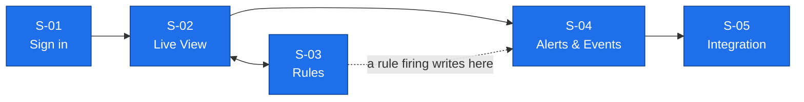

# IBVAP — UX Definition

**Stage:** 03 — Design (UX, before visual UI)
**Date:** 2026-08-26 (rewritten, five-screen scope — see [ADR 0016](../adr/0016-mvp-ui-cut-to-five-screens.md))
**Status:** Proposed. Nothing here is approved product scope.

This is what a person at a border post actually sees. IBVAP takes the video
already coming off existing CCTV, runs AI detection on it, raises an alert
when a rule says a human should look, and can hand those events to whatever
command system the post already uses. That is the whole product. This
document builds exactly that, as five finished screens, and nothing around
it.

## Contents

1. [The five screens](#1-the-five-screens)
2. [S-01 — Sign in](#s-01--sign-in)
3. [S-02 — Live View](#s-02--live-view-home)
4. [S-03 — Rules](#s-03--rules)
5. [S-04 — Alerts & Events](#s-04--alerts--events)
6. [S-05 — Integration](#s-05--integration)
7. [Rules that apply on every screen](#7-rules-that-apply-on-every-screen)
8. [What isn't here, and why](#8-what-isnt-here-and-why)
9. [Document status](#9-document-status)

---

## 1. The five screens

| # | Screen | Answers | Covers |
|---|---|---|---|
| **S-01** | Sign in | *Who's using this right now?* | baseline access |
| **S-02** | Live View *(home)* | *What is the camera seeing, right now?* | human/vehicle/face/plate detection, night-time movement |
| **S-03** | Rules | *What should this camera watch for?* | virtual fence, suspicious activity |
| **S-04** | Alerts & Events | *What happened, and what needs me?* | real-time alerting, event logging, ANPR log, face log |
| **S-05** | Integration | *How does this reach our other systems?* | command-and-control integration |

Sign in once. Everything else is one click from Live View. There is no
deeper navigation than that.

---

## S-01 — Sign in

**Get in, fast, at a post with no IT desk to call.**

One shared credential is enough — this is a one-person or few-person post,
not an enterprise with a roster of accounts to manage.

- **Shows:** a credential prompt, and a plain reason on failure — wrong
  credential, or locked.
- **You do:** sign in, sign out.
- **Locked out** after repeated failures clears itself after a stated wait —
  nobody has to call anyone to unlock it.

---

## S-02 — Live View *(home)*

**This is the product.** Everything else is secondary to this screen.

- **Shows:** the selected camera's live stream, at its real delivered
  resolution — not the resolution printed on the camera. Every detection the
  camera can actually support is drawn on top, live: a box around each person,
  vehicle, or face, labelled by class. Plate reads appear as text over the
  plate, not just a box. Any zone or line a rule uses is drawn on the scene
  too. A day/night indicator, since detection behaves differently after dark.
- **You do:** pick a camera; add a camera by pasting its existing stream
  address — nothing else required, IBVAP never changes the camera's own
  settings; toggle which detection classes are drawn; jump straight to Rules
  for this camera.
- **When a camera can't do something:** if this specific camera — too far,
  too low-res, wrong angle — can't support a class reliably, that class's
  boxes simply don't appear for it, with one line explaining why, right on
  this screen. No separate certification step, no override flow. The honesty
  is inline, not a gate you have to pass through first.
- **Never shows:** a box or label for a class the camera can't actually
  support. A label like "intruder," "suspect," or "threat" — only what class
  was detected. Any claim that the camera has been modified, reconfigured, or
  taken over — IBVAP only watches the stream that already exists.

---

## S-03 — Rules

**Draw the fence line. Say what counts as worth flagging.**

- **Shows:** the camera's frame with drawing tools — a line, a zone. A short
  list of what a rule can watch for: a class crossing a line, entering a
  zone, or lingering past a set time. Whether the rule raises an alert or
  just logs quietly. A list of existing rules on this camera, each with how
  often it's fired.
- **You do:** draw a line or zone; pick the class and condition; choose
  alert-or-log-only; save; enable or disable a rule.
- **Never shows:** a rule as "smart" or pre-validated — every rule is
  exactly what was drawn, nothing inferred. A claim that a drawn line makes
  crossing it unlawful on its own.

---

## S-04 — Alerts & Events

**Everything the system saw, in one place — what needed a human is marked
apart from what didn't.**

- **Shows:** a single chronological feed. Each entry: what fired (or was
  logged), which camera, which rule, when, a thumbnail. Alerts — the entries
  a rule marked worth a human's attention — sit visually apart from plain
  logged events. Plate reads and face detections show up here too, as
  filterable entries, not a separate log.
- **You do:** open any entry — see the record immediately, then a full clip
  only if you ask for it, with the expected wait shown before you ask, since
  a full clip can take minutes on a slow link and a snapshot doesn't. Mark an
  alert **real / not real / unsure** — one tap, that's the whole decision.
  If not real, optionally mute that camera+rule combination for a while — 1
  hour, 1 day, 1 week, or until you turn it back on — so the same false
  alarm doesn't keep interrupting you. Filter by camera, class, or
  alerts-only.
- **Never shows:** every observation as if it needed attention — only
  rule-selected entries are marked as alerts. A severity or threat score
  IBVAP computed itself.

---

## S-05 — Integration

**Get these events into whatever system the post already runs.**

- **Shows:** the destination this feeds into — one address, its connection
  state, and what the data being sent actually looks like.
- **You do:** set the destination; send a test event; see whether delivery
  is working.
- **Never shows:** a named adapter or logo for a specific outside system —
  IBVAP publishes a plain event feed; what's on the other end is not this
  product's problem to solve.

---

## 7. Rules that apply on every screen

| Rule | Means |
|---|---|
| **No invented vocabulary** | Never "intruder," "suspect," "threat level," "identified." Say what class was detected and what rule fired — nothing more. |
| **No silent overclaiming** | If a camera can't reliably support a class, that's said in one line, right where the class would have appeared. Never hidden, never a generic "error." |
| **Night is not a separate screen** | It's a state Live View and Alerts & Events already carry — dark, IR-lit, detection behaves differently — never a fifth screen. |
| **The system works with nobody watching it** | Detection, logging, and alerting keep running with no screen open. The UI is a window onto the system, not the system itself. |
| **One action to decide** | Real / not real / unsure is a single tap. No form, no required comment. |

---

## 8. What isn't here, and why

Per [ADR 0016](../adr/0016-mvp-ui-cut-to-five-screens.md), these are cut from this build
entirely — not simplified, not merged elsewhere:

- **Case management and evidence export.** No case object, no chain-of-custody
  pack. The event log itself is still the record of what happened; turning
  that into something a court or a handover accepts is downstream work, not
  in this build.
- **Face-recognition matching against a gallery.** Face *detection* — a box
  on a person's face — ships. Matching that face against a watchlist does
  not: doing that responsibly needs a legal-authority workflow this build
  doesn't carry.
- **A dedicated camera-capability certification screen.** The honesty
  behaviour survives (see S-02) — it's just inline, not its own gate,
  override flow, or re-issue workflow.
- **Audit log, authority records, people & roles management, a measurement
  dashboard, a system-health dashboard.** Real needs for a force running this
  permanently. Not what a five-screen build demonstrates.

If this goes past MVP, these are the first things to bring back — deferred
because they weren't named in the problem statement, not because they were
wrong ideas.

---

## 9. Document status

**Stage:** 03 — Design (UX). **Status: proposed, not approved.**

**Derived from:** [problem.md](../00-project/problem.md) (immutable) and
[ADR 0016](../adr/0016-mvp-ui-cut-to-five-screens.md). [PRD.md](../02-product/PRD.md)
§6 now matches this document's five-screen scope (merged with the former
`MVP.md` per [ADR 0028](../adr/0028-mvp-md-merged-into-prd-md.md)).

**Nothing in this document exceeds `problem.md`.** Every screen, action and
line traces to a named SIH capability. Where it says less than a capability
could support, that's the five-screen decision (D-15), not an oversight.

**Format caveat (D-16):** this document's per-screen "Shows / You do / Never
shows" structure is a content spec, not a real UX/UI artifact. It has no
layout and no verified, exhaustive screen flow — real work on either belongs
in Figma, connected to this project but not yet authorized. Treat this
document as what a screen must say and do, not as what it looks like or a
checked map of every navigation path.
