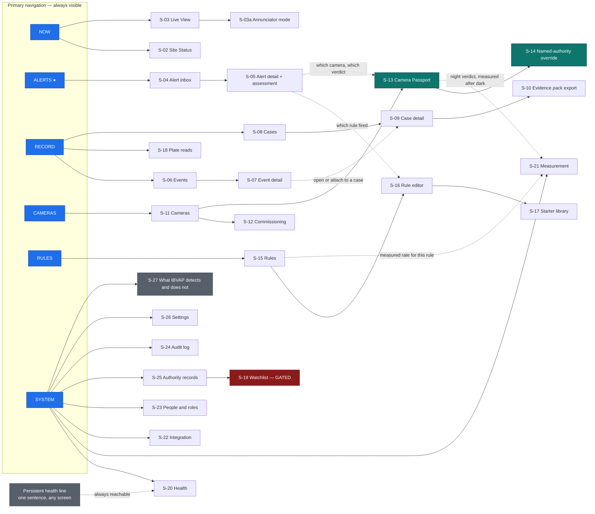
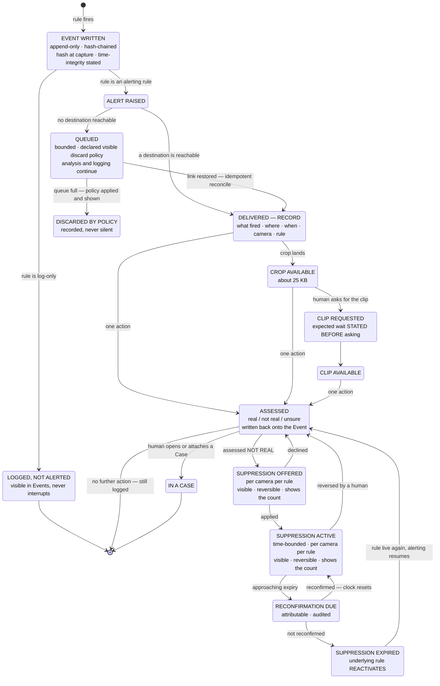
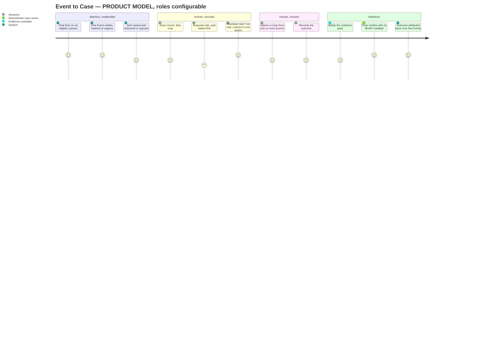
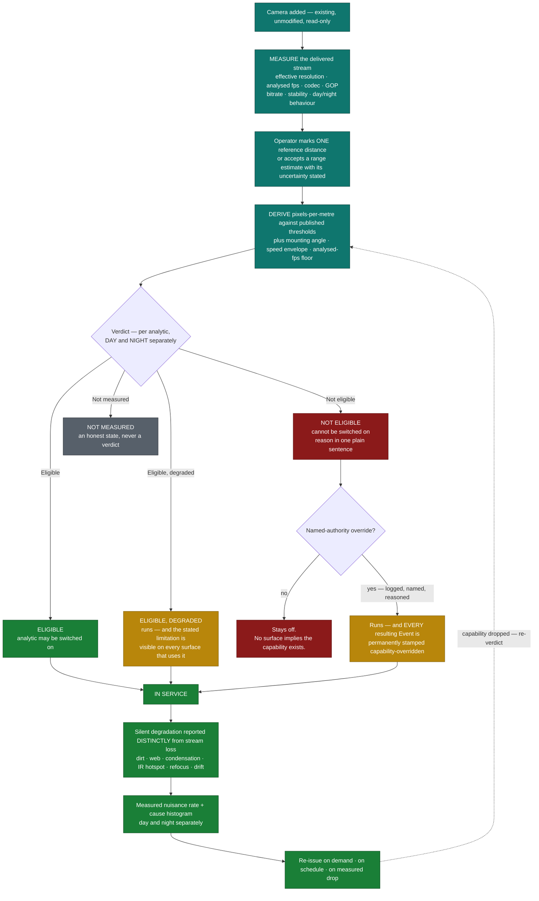

# IBVAP — UX Definition

**Stage:** 03 — Design (UX, before visual UI)
**Date:** 2026-08-25
**Status:** Proposed. Nothing here is approved product scope; scope is frozen elsewhere.

This document designs the experience of the frozen MVP — the product's
information architecture, screens, navigation, journeys, states and
interaction rules: what the user sees, what they can do, and what the product
must never say to them. It adds no capability. Every screen, state, action and
prohibition below traces to [problem.md](../00-project/problem.md) (immutable),
to [PRD.md](../02-product/PRD.md), to [MVP.md](../02-product/MVP.md) (frozen),
or to a decision accepted in [decisions.md](../00-project/decisions.md)
(D-1 … D-14). Where this document is narrower than the MVP it is a selection;
where it is more concrete it is a *presentation* of an already-frozen
requirement, never a new one.

Visual design, component libraries, style guides, system architecture
([04-architecture](../04-architecture/)), frontend technology choice, and
implementation belong to the stages that follow this one — no stack,
architecture, layout, grid, colour, type scale, icon set or motion behaviour
is specified here.

---

## 0. How to read this document

### 0.1 Label convention

Carried unchanged from [PRD §0.1](../02-product/PRD.md#01-labels--and-the-one-distinction-that-matters-most)
and [MVP.md](../02-product/MVP.md):

| Label | Meaning in this document |
|---|---|
| **FACT** | Established in the research corpus and already carried into the PRD/MVP |
| **ASSUMPTION** | Believed true, unverified; states what would falsify it |
| **HYPOTHESIS** | A design proposition to be tested with users |
| **UNKNOWN** | Not established. **Never** read as "does not exist" |
| **UX DECISION** | A design-stage choice made here. **Provisional.** Belongs in a stage decisions log (`docs/03-design/decisions.md`) when that log is created; **this document does not write to [decisions.md](../00-project/decisions.md)** |
| **PRODUCT MODEL** | A workflow, role or sequence **IBVAP chooses to design for** where the real workflow is unknown. It never becomes a FACT by being designed on |

Scope labels **[SIH/SSB]**, **[BORDER]**, **[GLOBAL]**, **[MARKET:xx]** carry the
meanings in [PRD §0.2](../02-product/PRD.md#02-scope-labels).

### 0.2 The workflow warning, restated for design

> ⚠ **Every role name, screen sequence and journey below is a PRODUCT MODEL.**
> H-1 (is live video monitored at all), H-2 / OQ-3 (the real detection → response
> sequence), H-3 (what carries an alert), H-4 / OQ-19 (is there a QRT construct) are
> all **UNKNOWN**. This document therefore designs around **artefacts and their
> states** (D-4), not around an organisational chart. Roles below are
> **configurable permission sets**, never ranks, posts, or an SSB hierarchy.

### 0.3 Design source of authority, in order

1. [problem.md](../00-project/problem.md) — immutable.
2. [MVP.md](../02-product/MVP.md) — **frozen**; the capability, requirement, gate and
   non-goal set this document may express and nothing more.
3. [PRD.md](../02-product/PRD.md) — users, jobs, workflows, constraints.
4. [decisions.md](../00-project/decisions.md) — D-1 … D-14, accepted.

If a reader finds a capability, claim, action or state on any screen below that is not
traceable to one of those four, **that is a defect in this document, not a scope
change.**

---

## Contents

1. [Product information architecture](#1-product-information-architecture)
2. [Core screens and views](#2-core-screens-and-views)
3. [Navigation model](#3-navigation-model)
4. [User journeys](#4-user-journeys)
5. [Event → Alert → Assessment → Case flow](#5-event--alert--assessment--case-flow)
6. [Camera management](#6-camera-management)
7. [Camera Passport experience](#7-camera-passport-experience)
8. [Live monitoring experience](#8-live-monitoring-experience)
9. [Alert experience](#9-alert-experience)
10. [Investigation and evidence experience](#10-investigation-and-evidence-experience)
11. [Rule and zone configuration](#11-rule-and-zone-configuration)
12. [ANPR experience](#12-anpr-experience)
13. [Face detection and gated recognition experience](#13-face-detection-and-gated-recognition-experience)
14. [Night-time monitoring experience](#14-night-time-monitoring-experience)
15. [System health and resilience experience](#15-system-health-and-resilience-experience)
16. [External integration experience](#16-external-integration-experience)
17. [Permissions, authority and audit experience](#17-permissions-authority-and-audit-experience)
18. [Empty, error, blocked and ineligible states](#18-empty-error-blocked-and-ineligible-states)
19. [MVP design principles](#19-mvp-design-principles)
20. [MVP Screen Inventory](#mvp-screen-inventory)
21. [Design Questions](#design-questions)

---

## 1. Product information architecture

### 1.1 The organising idea

**UX DECISION UX-1 — the information architecture is the artefact model, not a
feature menu.**
D-4 states that the product produces four artefacts — **Event, Alert, Case, Camera
Passport** — and that every workflow is a path through their states. The IA mirrors
that exactly: four artefact spines, one configuration spine, one integrity spine.
*Rationale:* a feature-shaped IA ("Detection", "Face", "ANPR", "Night") would imply
eight independent products, would give CAP-7 a product surface D-12 explicitly forbids,
and would put the capability list — the SIH evaluator's mental model, and
[PRD §3.3](../02-product/PRD.md#33-non-users--recorded-so-they-are-not-mistaken-for-users)
records that evaluators are *not* users — ahead of the person at the post.

### 1.2 The six top-level areas

| Area | Contains | Artefact / spine | Trace |
|---|---|---|---|
| **Now** | Site Status, Live View, Annunciator display | *(no artefact — a live lens over Cameras and Alerts)* | FR-45, D-3, AC-P5/P6 |
| **Alerts** | Alert inbox, Alert detail and assessment | **Alert** | FR-27 … FR-31 |
| **Record** | Events, Event detail, Plate reads, Cases, Case detail, Evidence packs | **Event**, **Case** | FR-32 … FR-39, FR-50 |
| **Cameras** | Camera list, Commissioning, **Camera Passport**, tested-device record | **Camera Passport** | FR-1 … FR-13 |
| **Rules** | Rule list, Rule editor, starter library | *(configuration over primitives)* | FR-23 … FR-26 |
| **System** | Health, Measurement, Integration, People & roles, Authority records, Audit log, Settings, Capability & Limits | *(integrity and configuration)* | FR-40 … FR-61 |

**Two structural rules the IA enforces:**

- **The Camera Passport is not a report inside a camera page; it is the gate every
  analytic passes through.** It is reachable from every surface that mentions an
  analytic, and every analytic control anywhere in the product resolves to a Passport
  verdict before it can be switched on (FR-11, D-6).
- **"Night" is not a top-level area and never becomes one.** Per D-12, night is a
  *measured condition* applied across Passport verdicts, rule scoping and measurement —
  not a distinct detector with its own surface (CAP-7 (b), §14 below).

### 1.3 Information architecture diagram

```mermaid
flowchart TD
    ROOT["IBVAP — one site"]

    ROOT --> NOW["NOW"]
    ROOT --> AL["ALERTS"]
    ROOT --> REC["RECORD"]
    ROOT --> CAM["CAMERAS"]
    ROOT --> RUL["RULES"]
    ROOT --> SYS["SYSTEM"]

    NOW --> N1["Site Status<br/>health · alerts today · passport coverage"]
    NOW --> N2["Live View<br/>eligible analytics only, labelled"]
    NOW --> N3["Annunciator display mode<br/>unattended on-site display"]

    AL --> A1["Alert inbox<br/>queue · state · camera · rule"]
    AL --> A2["Alert detail and assessment<br/>record then crop then clip on demand"]

    REC --> R1["Events<br/>query by time, camera, zone, class, rule, assessment, outcome"]
    REC --> R2["Event detail"]
    REC --> R3["Plate reads<br/>ANPR log with per-read confidence"]
    REC --> R4["Cases"]
    REC --> R5["Case detail and outcome"]
    REC --> R6["Evidence pack builder and export"]

    CAM --> C1["Camera list<br/>source state · passport state"]
    CAM --> C2["Add camera — commissioning"]
    CAM --> C3["CAMERA PASSPORT<br/>per-analytic verdict, day and night"]
    CAM --> C4["Tested-device record"]
    C3 --> C5["Named-authority override<br/>logged · stamps every resulting event"]

    RUL --> U1["Rule list<br/>per camera per rule alert and nuisance rate"]
    RUL --> U2["Rule editor<br/>zone · line · direction · dwell · composite · time-of-day"]
    U2 --> U3["Starter library<br/>every entry marked UNVALIDATED"]

    SYS --> S1["Health<br/>plain language, one sentence per state"]
    SYS --> S2["Measurement<br/>alert rate · nuisance rate · cause histogram · day and night"]
    SYS --> S3["Integration<br/>published versioned schema · destinations · delivery"]
    SYS --> S4["People and roles"]
    SYS --> S5["Authority records"]
    SYS --> S6["Audit log"]
    SYS --> S7["Settings<br/>retention · time integrity · environment classification"]
    SYS --> S8["What IBVAP detects and does not"]
    S5 --> S9["Watchlist and recognition — GATED"]

    C3 -. "gates every analytic control<br/>everywhere in the product" .-> RUL
    C3 -. "gates" .-> N2
    C3 -. "gates" .-> R3
    C3 -. "gates" .-> S9

    classDef area fill:#1f6feb,stroke:#0b3d91,color:#ffffff
    classDef gate fill:#0f766e,stroke:#08403b,color:#ffffff
    classDef gated fill:#8b1a1a,stroke:#5c0f0f,color:#ffffff
    classDef honest fill:#57606a,stroke:#2f3439,color:#ffffff
    class NOW,AL,REC,CAM,RUL,SYS area
    class C3,C5 gate
    class S9 gated
    class S8,U3 honest
```

### 1.4 What the IA deliberately does not contain

| Absent | Why |
|---|---|
| A **control-room / video-wall** area, operator hierarchy, shift handover | PM-4, post-MVP, blocked on OQ-1. Designing it would invent the workflow H-1 leaves unknown |
| A **dispatch / tasking / response** area | NG-9. IBVAP produces notice and evidence; it does not command |
| A **multi-site / echelon rollup** area | PM-3, post-MVP (FR-58). MVP is one site (D-13(a)) |
| A **"Night analytics"** area | D-12 — night is a condition, not a product surface |
| A **"Suspicious activity"** area separate from Rules | D-11 — it *is* the rule engine; a separate area would imply a detector that does not exist |
| A **"Trafficking / contraband"** area, filter, or class | NG-12. The product must not imply a capability it does not have |
| A **person / identity** area outside the gated watchlist | NG-3. No open-set identification surface exists at any point |
| A **pricing, licence or subscription** surface | NG-17; and FR-44 — nothing may expire or degrade for a licence reason |
| A **cloud account / sign-up** surface | FR-61, NFR-13, AC-P14 — isolated-network deployable, no internet dependency |

---

## 2. Core screens and views

The catalogue. Full specifications — purpose, primary user goal, information shown,
primary actions, secondary actions, important states, what must **not** be shown or
claimed — are given per screen in [§6](#6-camera-management) … [§17](#17-permissions-authority-and-audit-experience),
and summarised in the [MVP Screen Inventory](#mvp-screen-inventory).

| ID | Screen / view | Area | Kind |
|---|---|---|---|
| **S-01** | Sign in | — | Full screen |
| **S-02** | Site Status *(home)* | Now | Full screen |
| **S-03** | Live View | Now | Full screen |
| **S-03a** | Annunciator display mode | Now | Display state of S-02/S-03 |
| **S-04** | Alerts *(inbox)* | Alerts | Full screen |
| **S-05** | Alert detail and assessment | Alerts | Full screen / panel |
| **S-06** | Events | Record | Full screen |
| **S-07** | Event detail | Record | Full screen / panel |
| **S-08** | Cases | Record | Full screen |
| **S-09** | Case detail and outcome | Record | Full screen |
| **S-10** | Evidence pack builder and export | Record | Flow |
| **S-11** | Cameras | Cameras | Full screen |
| **S-12** | Add camera — commissioning | Cameras | Flow |
| **S-13** | **Camera Passport** | Cameras | Full screen |
| **S-14** | Named-authority override | Cameras | Modal flow on S-13 |
| **S-15** | Rules | Rules | Full screen |
| **S-16** | Rule editor | Rules | Full screen |
| **S-17** | Starter rule library | Rules | Panel within S-15/S-16 |
| **S-18** | Plate reads *(ANPR log)* | Record | Full screen |
| **S-19** | Watchlist and recognition — **gated** | System | Full screen |
| **S-20** | System health | System | Full screen |
| **S-21** | Measurement — alert and nuisance | System | Full screen |
| **S-22** | Integration | System | Full screen |
| **S-23** | People and roles | System | Full screen |
| **S-24** | Audit log | System | Full screen |
| **S-25** | Authority records | System | Full screen |
| **S-26** | Settings | System | Full screen |
| **S-27** | What IBVAP detects — and does not | System | Full screen |

**Form factor.** **UX DECISION UX-2 — one surface: an on-site workstation-class
display, delivered as a single responsive layout that remains usable on a small
screen.** A **mobile / handheld client is post-MVP** (PM-13, blocked on OQ-8), so no
separate mobile product is designed here; but nothing in the layout may *require* a
large display, because OQ-8 may resolve such that the only reachable surface at a post
is small. *Falsified by:* OQ-8 establishing that a workstation display is always
present at a post.

---

## 3. Navigation model

### 3.1 Rules

**UX DECISION UX-3 — flat, six-destination primary navigation, always visible, with no
nesting deeper than three levels.** *Rationale:* NFR-10 requires a two-camera site
commissioned by a non-specialist in ≤1 h and C-31 [SIH/SSB] records that **no IT,
cyber, video or electronics cadre exists in the force**; a discoverable flat structure
is the design consequence. *Falsified by:* a naive-operator commissioning test
(AC-P10) showing users cannot find the Passport or the assessment action.

| # | Navigation rule | Trace |
|---|---|---|
| **N-1** | The six areas of §1.2 are the primary navigation and never change position or membership | UX-3 |
| **N-2** | **Alerts is the only area permitted to carry an attention indicator.** Nothing else in the navigation may compete for attention | FR-27 — only rule-selected observations may interrupt a human |
| **N-3** | Every analytic name anywhere is a link to the **Camera Passport** verdict that governs it | FR-11, D-6, AC-P3 |
| **N-4** | Every Alert links to its Event; every Event links to its camera, its rule and its Passport verdict; every Case links to its Events; every export links to its custody record | FR-39, FR-37 |
| **N-5** | **Health status is globally persistent**, not a page you must visit. A degraded source, suspect clock, filling queue or filling storage is visible from any screen in one line | FR-45, NFR-11, AC-P9, NG-15 |
| **N-6** | No navigation destination is hidden, greyed away, or removed because a capability is ineligible or blocked. **The destination remains and states the refusal** | AC-P3, AC-3a.4 — a missing menu item is a silent claim |
| **N-7** | Destructive or authority-bearing actions (override, suppression, deletion, export, authority grant, environment classification) are never reachable by a single unconfirmed action, and always name the person they will be attributed to | NFR-14, FR-59 |
| **N-8** | The product is usable with **no** navigation at all in Annunciator mode (S-03a) — the unattended on-site display requires no interaction to convey state | AC-P5, D-3 |

### 3.2 Navigation diagram

### 3.3 Roles as configurable permission sets *(PRODUCT MODEL)*

Per **D-4**, the product carries **no assumption about who occupies which step.**
Navigation is filtered by permission set, and every permission set is configurable
(S-23). The sets below are **defaults offered by the product**, not an organisational
model, and every one of them can be renamed, merged or split.

| Default permission set | May do | Trace |
|---|---|---|
| **Viewer** | See Now, Alerts, Record; no assessment, no configuration | FR-59 |
| **Assessor** | Viewer + record assessments (real / not real / unsure), open Cases | FR-29, FR-50 |
| **Rule author** | Assessor + author zones, lines, rules; apply/reverse suppression | FR-23 … FR-26, FR-30 |
| **Camera commissioner** | Add cameras, mark reference distances, re-issue Passports | FR-1, FR-9, FR-12 |
| **Evidence custodian** | Build and export evidence packs; sees the custody log | FR-36, FR-37 |
| **Authority holder** | Record and revoke authority records; approve Passport overrides; set environment classification | FR-60, FR-11, AC-3b.3 |
| **Integrator** | Configure destinations and egress; read the published schema | FR-53 … FR-55 |
| **Administrator** | People, roles, retention, time settings; sees the full audit log | FR-38, FR-59 |

> **PRODUCT MODEL.** These names describe *permissions*, not ranks or posts. **UNKNOWN
> (OQ-1, OQ-3, OQ-19)** — who in a real force would hold any of them. The product must
> work if one person holds all eight, and if eight people hold one each.

**UX DECISION UX-13 (resolves [DQ-4](#design-questions)) — a single Authority holder
may authorise a Passport override; no two-person approval workflow is introduced.**
The **Authority holder** permission set above is confirmed sufficient, on its own, to
record the named authority, instrument, scope, expiry and reason on S-14 (§7.2).
*Rationale:* D-4 and D-13(a) design the product to work at a single-person site — the
same premise this table already states ("the product must work if one person holds all
eight"); requiring a second approver could make the override unreachable at exactly the
sites the MVP boundary is built to serve. The named-authority record, its audit trail
(S-24) and the permanent `capability-overridden` stamp (F-7) remain the control against
misuse, per D-6.

---

## 4. User journeys

All journeys are **PRODUCT MODEL** (D-4, PRD §5). Each maps to a PRD workflow (W1–W6)
and to a user from [PRD §3](../02-product/PRD.md#3-target-users) and a job from
[PRD §4](../02-product/PRD.md#4-user-needs--jobs).

### J-A — "I have a camera and I want to know what it can do" *(W1; U1/U9; J9)*

1. **S-11 Cameras** → *Add camera*.
2. **S-12 Commissioning** — enter the stream address and the credentials the force
   already holds. The screen states, before anything else, that IBVAP will operate
   **read-only** and will not change the camera or the recorder (FR-3).
3. IBVAP measures the delivered stream. The screen shows measurement in progress with
   what is being measured and how long is left — never a bare spinner (NFR-11).
4. The operator marks **one** reference distance in the scene, or accepts a range
   estimate **with its uncertainty stated** (FR-9). One mark; no survey kit.
5. **S-13 Camera Passport** is issued: per analytic, `Eligible` / `Eligible, degraded` /
   `Not eligible`, **day and night separately**, each with the measured reason in one
   plain sentence (FR-10, AC-7.1).
6. The operator sees at least one refusal presented as a **result, not a failure**, and
   discovers the refused analytic **cannot be switched on** (FR-11, D-6).

**Success is measured, not felt:** two cameras, ≤1 hour, a non-specialist, no site
survey, no integrator (NFR-10, AC-P10, SM-7).

### J-B — "Something happened and nobody was watching" *(W2; no actor; J1, J8)*

1. No screen is open. A rule fires. **Exactly one Event** is written to the local
   append-only hash-chained log with a time-integrity status (FR-32, FR-35, AC-8.1).
2. If the rule is an alerting rule, an **Alert** is raised and delivered to whatever
   destinations are configured — including none (FR-31).
3. If no destination is reachable, the Alert and its Event **queue**, under a bounded
   **declared, visible** discard policy (FR-43).
4. **S-03a Annunciator mode**, if an on-site display exists, shows the alert without
   anyone touching anything (AC-P5, N-8).
5. On reconnection, the queue reconciles **idempotently** — no duplication, no loss
   (FR-42, AC-8.4).

**The journey's design target:** the product is correct when no human is in it. The UI
is a *view onto* the system, never the system (D-3, AC-P5).

### J-C — "Is this real?" *(W3; U1, or U4 if U4 exists; J2)*

1. The Alert arrives carrying, in this order: **what fired, where, when, which camera,
   which rule** → then a **small object crop** → then the full clip **only on demand**
   (FR-28).
2. **S-05** shows the record immediately and the crop as it lands. The clip is a
   **request**, and the screen **states the expected wait before the user asks** —
   "about 7.8 minutes on this link" is a legitimate answer; a silent wait is not
   (NFR-3, AC-8.3).
3. The human records **real / not real / unsure in one action** (FR-29).
4. The decision is written back onto the Event — this is the product's own ground truth
   and the input to the measured nuisance rate (SM-1, SM-2).
5. If `not real`, the screen **offers** — never applies automatically — a per-camera,
   per-rule suppression that is **visible, reversible, and shows the count of what it
   suppressed** (FR-30).

### J-D — "This matters; make it survive handover" *(W4; U1 → U7 → U8; J7)*

1. From one or more Events (**S-07**), a human opens a **Case** (**S-09**) and states an
   outcome: apprehension / seizure / nothing found / handed over / no action (FR-50).
2. **S-10** assembles the evidence pack: **original stored bitstream segments without
   re-encoding**, the hash computed **at capture**, the event records, the
   chain-of-custody log, and a certificate template naming the s.63 BSA fields
   [MARKET:IN] (FR-33, FR-34, FR-36).
3. The export screen states plainly that the pack **opens and verifies on a machine
   with no IBVAP installed** (AC-P8) and that **IBVAP does not sign on anyone's behalf
   and does not assert admissibility** (NG-18).
4. The custody record is written: who, when, what, from which device (FR-37).

### J-E — "What did this camera see last Tuesday?" *(W5; U1, U3, U5; J5, J8)*

1. **S-06 Events** — query by time, camera, zone, class, rule, assessment and outcome
   (FR-39).
2. Any result opens **S-07**, which links to its camera, its rule, its Passport verdict
   and its Case if it has one (N-4).
3. The screen states that this is **site-local, metadata-first** query; cross-site
   aggregation and pattern-over-time analytics are **post-MVP** and, on this border,
   **legally gated** (PM-3, PM-5, OQ-7).

### J-F — "Send this to whatever system we have" *(W6; integrator; C2 requirement)*

1. **S-22 Integration** — read the **published, versioned event schema**, configure a
   generic outbound destination, and see delivery, retry, backoff and idempotency state
   (FR-53, FR-54).
2. The screen states plainly that **no adapter to a named command-and-control system
   ships** (D-5, L-23), and why: **UNKNOWN (OQ-5)** — what the C2 actually is.

### J-G — "Is this system lying to me?" *(cross-cutting; U3, U10; J10)*

1. **S-21 Measurement** — per camera, per rule: alert rate, **assessed-nuisance rate**,
   and a **cause histogram**, day and night reported separately, continuously (FR-49).
2. Every number is **dated and labelled as measured on this deployment's own footage**
   (AC-P7). No literature figure is presented as this system's performance.
3. The whole dataset exports as a plain file the force can audit **independently of
   IBVAP's own reporting** (FR-51, SM-8).

### J-H — "What can this thing not do?" *(cross-cutting; every user)*

**S-27** exists because **NG-12 is a requirement, not a caveat** (MVP §2, DS-11): the
product states on its own surface that it detects **people, vehicles, faces, plates,
movement and time**, and does **not** detect trafficking, contraband, currency or
narcotics. It is reachable from the navigation and linked from every empty result set
(§18).

---

## 5. Event → Alert → Assessment → Case flow

### 5.1 The four artefacts on screen

| Artefact | Where it lives | Created by | May be created by a human? |
|---|---|---|---|
| **Event** | S-06 / S-07 | The system, on every rule firing | **No.** Events are machine-generated (D-4) |
| **Alert** | S-04 / S-05 | The system, when an Event matches an alerting rule | **No** |
| **Case** | S-08 / S-09 | **A human**, from one or more Events | **Yes — only** |
| **Camera Passport** | S-13 | Measurement, on commissioning and re-issue | **No** — but a human marks the reference distance and may override a refusal |

**UX DECISION UX-4 — Event and Alert are never merged into one object in the
interface.** They have different screens, different lists, different counts and
different language. *Rationale:* FR-27 and D-4 — every observation is logged; only
rule-selected observations interrupt a human. A UI that showed one list would design
for a role the research does not establish exists (H-1) and would make the Event log —
the statement's own named capability — invisible.

### 5.2 Alert lifecycle

**States the market's designs usually omit, and which are mandatory here:** **Queued**,
**Discarded by policy**, and the full suppression lifecycle — **offered**, **active**,
**reconfirmation due**, and **expired** — each visible, each recorded, none silent
(NG-15, FR-30, FR-43, AC-P13). The **reconfirmation-due → expired → rule reactivates**
chain is **UX DECISION UX-14** (resolving [DQ-6](#design-questions)) — see [§5.4](#54-the-flows-non-negotiable-interaction-rules)
and the [Design Questions](#design-questions) section for the full decision. The
specific expiry duration or reconfirmation schedule is **not set by this diagram** —
it is an unresolved product parameter (§5.4, F-4).

### 5.3 Event → Case journey

### 5.4 The flow's non-negotiable interaction rules

| # | Rule | Trace |
|---|---|---|
| **F-1** | **Exactly one Event per rule firing.** The interface never shows a burst of duplicates for one crossing | AC-5.2, AC-8.1 |
| **F-2** | Assessment is **one action** — not a form, not a wizard, not a required comment | FR-29 |
| **F-3** | `unsure` is a **first-class outcome**, presented equally with `real` and `not real` — never a fallback or a skip | FR-29 |
| **F-4** | Suppression is **never automatic and never global.** It is offered, scoped to one camera and one rule, always reversible, and always shows the count of what it suppressed. **Once applied, it is time-bounded or subject to periodic reconfirmation** (UX DECISION UX-14) — **the specific duration or reconfirmation schedule is not set here; it is an unresolved product parameter, to be established through validation**, echoing NFR-4's caution against setting a number before it is measured. Reconfirming a suppression is itself a human action, **attributable and audited** to the same standard as override, export and deletion. **On expiry without reconfirmation, the underlying rule reactivates** and alerting resumes | FR-30, R3, T2, NFR-14, UX-14 |
| **F-5** | The **expected wait for a clip is stated before it is requested** | NFR-3, AC-8.3 |
| **F-6** | A Case is opened **only by a human**, and always carries an outcome field | FR-50, D-4 |
| **F-7** | An Event whose camera ran under a Passport override is **permanently stamped `capability-overridden`**, and that stamp is visible on the Event, the Alert, the Case and inside the evidence pack | FR-11, D-6 |
| **F-8** | An Event created under a suspect clock is **marked**, everywhere it appears | FR-35, AC-8.5 |

---

## 6. Camera management

### S-11 — Cameras

| Facet | Definition |
|---|---|
| **Purpose** | The single list of every source IBVAP ingests at this site, and the state of each |
| **Primary user goal** | *"Which of my cameras are working, and which of them can actually do the thing I am relying on?"* (J9) |
| **Information shown** | Per camera: name and location label; source type — **native IP over RTSP/ONVIF**, or **channel behind an existing DVR/XVR/NVR** (FR-1, FR-2); source state (live / degraded / lost); **Passport state** (measured / not yet measured / re-issue due / capability dropped); a one-line summary of which analytics are eligible **and which are refused**, day and night; whether any analytic runs under an override |
| **Primary actions** | Add a camera (→ S-12); open a camera's **Passport** (→ S-13); re-issue a Passport (FR-12) |
| **Secondary actions** | Rename / relabel; view the **tested-device record** (FR-6); filter by source state, Passport state, or by analytic eligibility |
| **Important states** | **Not yet measured** — no analytic may run; **degraded source** — visible, distinct from lost (FR-7); **capability dropped** — a measured drop since the last Passport, raised as a change (FR-12); **override in force** — always visible at list level, never only in a detail page |
| **Must NOT show or claim** | Any analytic as available on a camera whose Passport refuses it (NFR-16, AC-P3). **The advertised resolution** — only the **effective** resolution, including anamorphic/1080N correction (FR-5). Any implication that IBVAP records, owns, or has changed the camera or the recorder (FR-3, NG-1). Any make/model support claim beyond the tested-device record (NG-8) |

### S-12 — Add camera (commissioning)

| Facet | Definition |
|---|---|
| **Purpose** | Turn an existing stream into a measured, Passported source without a site survey or a certified integrator |
| **Primary user goal** | *"Get this camera in, in minutes, without breaking anything."* |
| **Information shown** | A read-only promise stated **before** credentials are entered: IBVAP will not reconfigure the camera or recorder, will not take over recording, and will not alter the existing live-view path (FR-3, NG-1). Then: connection result; **effective** resolution with anamorphic detection called out explicitly; achievable analysed fps; codec/GOP; bitrate; stability over the observation window; day/night transition behaviour (FR-8). Where the product *is* asked to write a device setting, the **actual landed value read back** — never the value requested (FR-4) |
| **Primary actions** | Connect; **mark one reference distance** in the scene, or accept a range estimate **with its uncertainty stated** (FR-9); issue the Passport |
| **Secondary actions** | Test the connection again; label the camera; defer the night measurement (it cannot be inferred — see §14) |
| **Important states** | **Measuring** — with what is being measured and how long remains, never a bare spinner; **connected but unstable**; **credentials rejected**; **stream reachable but starved** — returning fewer frames than requested (FR-7); **night not yet measured** — an explicit, honest state, never an assumed verdict (AC-7.1) |
| **Must NOT show or claim** | A verdict for an analytic that has not been measured. A night verdict inferred from the day measurement (AC-7.1). A resolution the stream does not deliver (FR-5, L-8). Success on a device write that was silently discarded by firmware — the rig has already proven firmware returns OK for values it drops (FR-4, D-14) |

**FACT [rig-measured]** — "1080" can mean **960** horizontal pixels; the commissioning
screen is the first place the product either tells that truth or begins lying (FR-5,
DS-2).

---

## 7. Camera Passport experience

**The Passport is the product's central claim (D-1, D-6). It is a gate, not a report.**

### 7.1 Passport journey

### S-13 — Camera Passport

| Facet | Definition |
|---|---|
| **Purpose** | State, per camera, what this camera can and cannot support **at this mounting, right now** — and enforce it |
| **Primary user goal** | *"Tell me what this camera can actually tell me, before I depend on the answer."* — **the single outcome that defines the MVP** (MVP §2) |
| **Information shown** | The measured facts (effective resolution incl. anamorphic correction, achievable analysed fps, codec/GOP, bitrate, stability, day/night behaviour); the marked reference distance and derived **px/m**, expressed against published detection / observation / recognition / identification thresholds (FR-9); a **per-analytic verdict, day and night as separate rows** — CAP-1 person, CAP-2 vehicle, CAP-3a face detection, CAP-3b recognition, CAP-4 ANPR, and the tracking-dependent rule floor; **the measured reason for every verdict, in one plain sentence**; the date of measurement; whether an override is in force, by whom, under what instrument |
| **Primary actions** | Re-issue the Passport (FR-12); mark or re-mark the reference distance; **request a named-authority override** on a refusal (→ S-14) |
| **Secondary actions** | View the day-vs-night gap for this camera (→ S-21); view this camera's nuisance history; view the rules that depend on each verdict; print / export the Passport |
| **Important states** | `Eligible` · `Eligible, degraded` · `Not eligible` · **`Not measured`** · **`Night not measured`** · **`Capability dropped since last measurement`** (FR-12) · **`Running under override`** |
| **Must NOT show or claim** | A verdict as a **score, grade, star rating or percentage of camera quality** — the verdict is per analytic and carries a reason, not a rank. A night verdict **inferred** from day (AC-7.1). A refusal styled as an **error or a defect** — a refusal is a success signal (SM-5). Any suggestion that IBVAP can improve the camera: **it measures; it does not improve optics, mounting, illumination or field of view** (PRD §2.4, L-1, L-2) |

**The one sentence the Passport screen exists to make true** (MVP §Visual Model 6):

> *"A person at 40 m is 19 px tall here; person detection needs ~25 px/m — this camera
> can tell you **someone** is there, not **who**."*

### S-14 — Named-authority override

| Facet | Definition |
|---|---|
| **Purpose** | Make overriding a refusal **possible, costly, attributable and permanent in the record** — never easy and never quiet (D-6) |
| **Primary user goal** | *"I accept the stated limitation and I am putting my name to that."* |
| **Information shown** | The refusal being overridden and its measured reason, restated; **the named authority** — who is authorising, under what instrument, with what scope and expiry (FR-60); an explicit statement that **every Event produced under this override will be permanently stamped `capability-overridden`**, on the Event, its Alert, its Case and inside any evidence pack (F-7) |
| **Primary actions** | Record the authority and confirm the override; revoke an override |
| **Secondary actions** | View the audit entry this action will create (S-24) |
| **Important states** | Requested · in force · **expired** (the override lapses with the authority record; it does not renew itself) · revoked |
| **Must NOT show or claim** | That the override **improves** anything. That overridden output is equivalent to eligible output. It must not be reachable as a checkbox or a toggle, and it must never be the default resolution offered when a user hits a refusal (N-7, AC-P3) |

**UX-13 confirms this is a single-session flow.** One authenticated **Authority
holder** records and confirms the override in the same sitting; no second person's
approval is required to complete it (§3.3).

---

## 8. Live monitoring experience

**UX DECISION UX-5 — live video is a *verification* surface, not the product's centre of
gravity.** *Rationale:* the problem statement's own premise is that conventional CCTV
*"requir[es] continuous human observation"*; **FACT [GLOBAL]** vigilance decays at
20–35 minutes across 3–30 scenes (PRD §3.1, U4); and **AC-P5** requires the product to
be correct with nobody watching. A design whose home screen is a video wall would
re-create the problem the statement describes. *Falsified by:* OQ-1 resolving to a
staffed monitoring posture in which continuous watching is the operating model — at
which point PM-4's control-room surface, which is **post-MVP**, becomes the right home.

### S-02 — Site Status *(home)*

| Facet | Definition |
|---|---|
| **Purpose** | Answer, in one screen and without interaction, *"is this site being watched properly right now, and is anything wrong?"* |
| **Primary user goal** | *"Tell me what I need to know without me having to watch."* (J1) |
| **Information shown** | The persistent health line (N-5); alerts awaiting assessment; alerts assessed today; **Passport coverage** — how many cameras measured, how many analytics refused, presented **neutrally as a count of measured truths, not defects** (SM-5); source states; queue and storage state; time-integrity state; whether the uplink is up, and for how long it has been down (FR-41, FR-45) |
| **Primary actions** | Open Alerts; open a camera's Passport; open Health |
| **Secondary actions** | Enter **Annunciator mode** (S-03a); open Measurement |
| **Important states** | **Nobody watching / unattended** — the normal state, presented as normal, not as a warning; **link down for N hours** with the queue policy visible; **degraded** sources or analytics; **suspect clock**; **storage filling**; **power event** (FR-45) |
| **Must NOT show or claim** | A "system healthy / all clear" summary that a refused, unmeasured or degraded analytic could hide behind (AC-P3). A "quiet night" or "nothing detected" summary drawn from cameras that were not eligible for the relevant analytic in the relevant period (**AC-7.5, AC-3a.4**). Any count that mixes Events with Alerts (UX-4) |

### S-03 — Live View

| Facet | Definition |
|---|---|
| **Purpose** | Look at a camera now — to verify an alert, to check a scene, to confirm a rule is drawn where the user thinks it is |
| **Primary user goal** | *"Show me that camera, and tell me honestly what it is analysing right now."* |
| **Information shown** | The live stream at its **effective** resolution; **which analytics are running on this camera and which are refused**, always on-screen; the rules drawn on the scene (zones, lines, direction arrows, dwell timers); the current analysed frame rate and whether it is **above or below the ≥3 fps tracking floor** (NFR-5); day/night state; time-integrity state |
| **Primary actions** | Select camera; show/hide rule overlays; jump to this camera's Passport; jump to this camera's rules |
| **Secondary actions** | Enter Annunciator mode; open recent Events for this camera |
| **Important states** | **Live** · **degraded** (visible, distinct from lost — FR-7) · **lost** · **analysing below the floor** — tracking-dependent rules automatically disabled, with the one-sentence reason on screen (FR-19, AC-1.3) · **running under override** · **night** |
| **Must NOT show or claim** | Detection boxes, tracks or labels for an analytic the Passport refuses on this camera. An **absence** of boxes as evidence that nothing was there — an ineligible analytic draws nothing and must say why it draws nothing (AC-3a.4). Any label that asserts identity, intent, or an offence — see the language rules in [§19.3](#193-language-rules) |

### S-03a — Annunciator display mode

| Facet | Definition |
|---|---|
| **Purpose** | The unattended on-site display: convey state and new alerts **with no interaction at all** (N-8, AC-P5) |
| **Primary user goal** | *"I glance up. Is anything happening? Is anything broken?"* |
| **Information shown** | The newest unassessed alerts as record-then-crop; the health line; link and queue state; nothing else |
| **Primary actions** | **None.** This mode is read-only — it conveys state and new alerts with no interaction |
| **Secondary actions** | Exit to S-02; **sign in to assess** (leaves Annunciator mode and opens an authenticated S-04/S-05 session) |
| **Important states** | Idle · new alert · link down · degraded · suspect clock |
| **Must NOT show or claim** | Anything requiring reading a paragraph, hovering, or navigating. Every state here must satisfy **AC-P9**: one sentence a non-technical post commander can relay over a radio. **No assessment control of any kind, and no kiosk identity, device-level attribution, badge or PIN mechanism** (**UX DECISION UX-12**, resolving [DQ-3](#design-questions)) |

**UX DECISION UX-12 — assessment always requires an authenticated session; Annunciator
mode stays read-only.** No kiosk identity, device-level attribution, badge or PIN
mechanism is introduced anywhere in the product. The existing one-action **Real / Not
real / Unsure** assessment (FR-29) is unchanged once a user is authenticated — it is
reached from S-04 or S-05 (§9), never from S-03a. *Rationale:* FR-59 and NFR-14 require
every consequential action to be attributable to a person and a time; an unattended,
unauthenticated action cannot satisfy that without inventing an identity mechanism the
frozen MVP does not name. *Trade-off accepted:* assessment sits one step further from
the ambient display than J2's "seconds, not minutes" target might otherwise favour
(§4, Journey J-C) — the interim position already reflected this and is now the
decision.

---

## 9. Alert experience

### S-04 — Alerts (inbox)

| Facet | Definition |
|---|---|
| **Purpose** | The list of the things the rules judged worth spending a human's attention on — and nothing else |
| **Primary user goal** | *"What needs me?"* (J1, J2) |
| **Information shown** | Per alert: **what fired, where, when, which camera, which rule** — the record, first and always (FR-28); the crop when it has landed; the assessment state; whether the Event is stamped `capability-overridden` or created under a suspect clock; whether the alert was **queued** and for how long; whether a suppression currently applies to this camera+rule and **the count it has suppressed** (FR-30) |
| **Primary actions** | Open an alert (→ S-05); **assess in one action from the list** where the record and crop are enough (FR-29) |
| **Secondary actions** | Filter by camera, rule, assessment state, day/night; jump to the rule; jump to the Passport |
| **Important states** | Unassessed · assessed (real / not real / unsure) · **queued** · **delivered late after reconciliation** · **discarded by policy** (recorded and shown, never silent — FR-43) · in a Case |
| **Must NOT show or claim** | Every Event. This list is **only** rule-selected observations (FR-27, UX-4). A severity, threat level, or risk score IBVAP has not measured and does not compute. Any ordering that implies a threat ranking — the ordering is temporal and rule-derived, not a judgement |

### S-05 — Alert detail and assessment

| Facet | Definition |
|---|---|
| **Purpose** | Give a human exactly enough to decide **real / not real / unsure**, as fast as the link allows |
| **Primary user goal** | *"Decide, in seconds, whether this is real."* (J2 — design target: seconds, not minutes) |
| **Information shown** | **Payload-progressive, in this order:** (1) the event record — what fired, where, when, which camera, which rule, confidence, geometry; (2) the **object crop** (~25 KB ≈ 1.6 s on a 128 kbps link); (3) the **full clip only on demand**, with the **expected wait stated before the request** (~7.5 MB ≈ 7.8 min on the same link) — **arithmetic, not preference**, a factor of ~300 (FR-28, NFR-3). Plus: the governing Passport verdict for the analytic that produced it; the time-integrity status; the override stamp if any; the rule's **measured** alert and nuisance rate |
| **Primary actions** | **Real / Not real / Unsure — one action each** (FR-29); request the clip; open or attach to a Case (FR-50) |
| **Secondary actions** | Apply the offered per-camera-per-rule suppression, with its count and its reversal visible (FR-30); **reconfirm a suppression nearing expiry, attributed to this session** (UX-14); open the rule; open the Passport; export this Event's evidence (→ S-10) |
| **Important states** | Record only (crop pending) · crop available · **clip requested, wait stated** · clip available · assessed · **capability-overridden** · **suspect clock** · queued/reconciled · **governing rule suppressed — reconfirmation due** · **governing rule suppression expired, rule reactivated** |
| **Must NOT show or claim** | That the detection is an **intrusion, an offence, a suspect, a trafficker, or contraband** (NG-12, NG-18, §19.3). That a face was **identified** — CAP-3a is presence and location, **not identity** (FR-17). Any dispatch, tasking or "send a team" action — **NG-9: IBVAP produces notice and evidence; it does not command**. A silent clip wait (NFR-3, NG-15). An auto-applied suppression (FR-30) |

**HYPOTHESIS UX-H1** — the record alone will be sufficient to assess a meaningful share
of alerts, and the crop sufficient for most of the rest, making the clip request rare.
*Tested by:* the ≥7-day unattended run (Gate 3) — measuring how often the clip is
actually requested. If the clip is requested nearly always, the payload-progressive
design is not paying for itself and the crop's content must be reconsidered.

---

## 10. Investigation and evidence experience

### S-06 — Events

| Facet | Definition |
|---|---|
| **Purpose** | The complete local record — every rule firing, whether or not it alerted, whether or not anyone was watching |
| **Primary user goal** | *"What happened on this camera, in this window?"* (J5, J8) |
| **Information shown** | Query by **time, camera, zone, class, rule, assessment and outcome** (FR-39); per event: time (with time-integrity status), camera, object class, rule, confidence, evidence pointer, assessment, Case link, override stamp |
| **Primary actions** | Query; open an event (→ S-07); select events and open a Case (→ S-09) |
| **Secondary actions** | Export the query result as a plain dataset (FR-51); jump to camera / rule / Passport |
| **Important states** | Results · **no results** (see §18 — *"no events matched"* is never *"nothing happened"*) · **partial coverage** — the query window includes a period when a camera was lost, degraded, or ineligible for the queried analytic, which **must be stated in the result** |
| **Must NOT show or claim** | That the record is complete for a camera that was down, degraded, or ineligible during the window. Cross-site results — MVP is **one site** (D-13(a)). Pattern-over-time / route-usage analytics — **post-MVP and legally gated** (PM-5, OQ-7, NG-14) |

### S-07 — Event detail

| Facet | Definition |
|---|---|
| **Purpose** | One machine observation, in full, with everything needed to trust or distrust it |
| **Primary user goal** | *"What exactly did the system see, and how much should I rely on it?"* |
| **Information shown** | The full event record; the evidence pointer and available media; the **capture-time hash** (FR-33); **time-integrity status** (FR-35); the governing Passport verdict; the rule and its measured rates; the assessment and who made it; the Case link; the override stamp |
| **Primary actions** | Assess (if unassessed); open/attach a Case; export evidence (→ S-10) |
| **Secondary actions** | View the audit entries touching this event; view the rule; view the Passport |
| **Important states** | Assessed / unassessed · in a Case / not · **capability-overridden** · **suspect clock** · media retained / **deleted under retention policy** with the logged deletion record shown (FR-38) |
| **Must NOT show or claim** | An interpretation of the event beyond class, rule, geometry, time and confidence. A re-encoded, "enhanced", upscaled or beautified rendering presented as the evidence — **no silent re-encode on any retrieval path** (FR-34) |

### S-08 / S-09 — Cases and Case detail

| Facet | Definition |
|---|---|
| **Purpose** | A human-opened container binding Events, evidence, assessment and an **outcome**, exportable for handover |
| **Primary user goal** | *"Make this stand up when it leaves my hands."* (J7) |
| **Information shown** | Case identifier and title; bound Events with their assessments; the **outcome** — apprehension / seizure / nothing found / handed over / no action (FR-50); who opened it and when; exports made from it and their custody records (FR-37) |
| **Primary actions** | Open a Case; attach/detach Events; **record the outcome**; build an evidence pack (→ S-10) |
| **Secondary actions** | Add a note; view the audit trail; export the Case's events as a plain dataset (FR-51) |
| **Important states** | Open · outcome recorded · exported (with custody entries) · retention-limited (media deleted under policy, record retained) |
| **Must NOT show or claim** | A legal classification of the case. A charge, an offence, or a statutory category IBVAP has inferred. **NG-12** — no contraband/trafficking/currency/narcotics category exists in the outcome vocabulary beyond the plain, human-entered outcome list above |

### S-10 — Evidence pack builder and export

| Facet | Definition |
|---|---|
| **Purpose** | Produce a pack that **opens and verifies on a machine that has never had IBVAP on it** (AC-P8) |
| **Primary user goal** | *"Hand this over and have it survive."* (J7, U7 → U8) |
| **Information shown** | What the pack will contain: **original stored bitstream segments, without re-encoding** (FR-34); the hash computed **at capture**, not over the exported copy (FR-33); the event records; the **chain-of-custody log** (FR-37); and a **certificate template naming the s.63 BSA fields** — custodian, expert, hash **[MARKET:IN]** (FR-36). Plus the time-integrity status of every included event, and any `capability-overridden` stamps |
| **Primary actions** | Select scope; build; export; record who is exporting (attributed, audited — NFR-14) |
| **Secondary actions** | Verify a pack; view the custody log; view prior exports of the same events |
| **Important states** | Building · exported · **contains events under a suspect clock** (stated on the pack, not buried) · **contains capability-overridden events** (same) |
| **Must NOT show or claim** | **That the evidence is admissible** — admissibility is a court's finding, not a product's claim (NG-18, L-22). That IBVAP has signed anything: **IBVAP does not sign on anyone's behalf**; it produces what the statute asks for and records who signed (FR-36, W4 step 4). It must never offer a "convert / compress / optimise for sharing" path — **transcoding changes the hash** (FR-34, C-34) |

---

## 11. Rule and zone configuration

### S-15 — Rules

| Facet | Definition |
|---|---|
| **Purpose** | Every rule at this site, with **its measured behaviour attached to it** |
| **Primary user goal** | *"What am I being told about, how often, and how much of it is noise?"* |
| **Information shown** | Per rule: name, camera(s), type (zone / line / direction / dwell / composite), object-class gating, confidence and minimum-track-length gating, time-of-day scope, alerting or log-only; **the measured alert rate and assessed-nuisance rate with the cause histogram, day and night separately** (FR-49, AC-5.3); whether the rule is **auto-disabled** and why; whether a suppression applies, **its count, and its expiry or next reconfirmation date** (UX-14) |
| **Primary actions** | Create a rule (→ S-16); enable/disable; open a rule; **reconfirm a suppression nearing expiry** |
| **Secondary actions** | Duplicate to another camera (subject to that camera's Passport); open the starter library (→ S-17); open Measurement (→ S-21) |
| **Important states** | Active · log-only · **auto-disabled — analysed fps below the ≥3 fps tracking floor**, with the one-sentence reason (FR-19, NFR-5, AC-1.3) · **auto-disabled — night-ineligible camera**, with the reason (AC-7.2) · **suppressed — active** (visible, reversible, counted, time-bounded) · **suppression reconfirmation due** · **suppression expired — rule reactivated** (UX-14) · **unvalidated** (starter-library origin) |
| **Must NOT show or claim** | A rule as available on a camera whose Passport refuses the primitive it depends on. A "recommended" or "smart" rule set that implies validation IBVAP does not have (AC-6.3). Any anomaly score, learned-model score or "suspicion" number — **NG-2, AC-6.5** |

### S-16 — Rule editor

| Facet | Definition |
|---|---|
| **Purpose** | Let a **non-technical user author a rule without writing code** (AC-5.1, AC-6.1) |
| **Primary user goal** | *"Tell the system what matters on my stretch."* |
| **Information shown** | The camera's live or reference frame with drawing tools for **zones, lines, direction and dwell timers** (FR-23); the required gating — **object class, confidence, minimum track length** (never raw pixel motion, CAP-5); **time-of-day scoping** with night eligibility applied automatically (FR-26); composite conditions across class, zone, direction, dwell, time-of-day and camera (FR-24); **and, permanently on screen, a plain statement of what this rule will and will not catch** (AC-6.2) |
| **Primary actions** | Draw; set class/confidence/track-length gates; set time scope; choose **alerting or log-only**; save |
| **Secondary actions** | Start from the **starter library** (→ S-17); preview against recent footage; frame a zone as an **attention zone** rather than an intrusion line (see below); test-fire |
| **Important states** | Draft · saved · **will auto-disable at night on this camera** (stated at authoring time, not discovered later) · **cannot be saved** — the camera's Passport refuses a primitive this rule needs, with the reason and a link to the Passport |
| **Must NOT show or claim** | That a rule detects **suspicion, intent, threat or an offence**. That the starter library is validated. That drawing a line makes crossing it unlawful — **[SIH/SSB]** on the validation border **crossing is a treaty right**, and a perfectly accurate line-crossing alarm there would still be almost entirely noise (D-10, L-25, CAP-5 (d)) |

**Both framings ship, and the UI offers both (D-10):**

| Framing | Reports | Available |
|---|---|---|
| **Intrusion** — the statement's capability, unchanged and in full | *that a line or zone was crossed* | Always. Unchanged for closed-border deployments (AC-5.5) |
| **Attention zone** — the open-border framing, additionally | *who / what / when* in a place, rather than *that a line was crossed* | Always, alongside the above |

### S-17 — Starter rule library

| Facet | Definition |
|---|---|
| **Purpose** | Give an author somewhere to start, **without implying anyone has validated the starting point** |
| **Primary user goal** | *"Show me examples of the kind of rule people write."* |
| **Information shown** | Each entry with what it composes, and — **on the entry itself, not in a footnote** — the mark: *unvalidated against this force's definition of suspicious* (FR-25, AC-6.3). Alongside: the plain statement that **"suspicious activity" is undefined in the problem statement and in every retrieved source (OQ-4)**, and that no experiment substitutes for the force's own answer (D-11) |
| **Primary actions** | Use an entry as the basis of a new rule (→ S-16) |
| **Secondary actions** | Read what an entry will and will not catch |
| **Important states** | Unvalidated (**all entries, always**) · in use at this site (with its measured rate attached) |
| **Must NOT show or claim** | A definition of "suspicious". A recommendation, a ranking, a "best practice" label, or a claim of provenance from any force. A learned model behind any entry — **there is none in MVP** (NG-2) |

---

## 12. ANPR experience

**Scope reminder:** ANPR is **P1 at eligible nodes** — check post / ICP lane / barrier —
and **excluded elsewhere**; **NG-4 — no ANPR on wide-area border-road cameras: physics,
not effort.** The Passport decides, per camera, and **may find no eligible camera at all
in the validation estate** (OQ-11) — which the product states plainly rather than hides.

**UX DECISION UX-6 — ANPR has a log, not a dashboard.** *Rationale:* CAP-4's MVP
requirement is to *read plates on eligible cameras and log the reads with per-read
confidence*, plus publish the **measured** read rate. A "vehicle intelligence" surface —
watchlisted plates, hotlists, movement histories — is not in the frozen MVP and would
imply retention and pattern analytics that are **post-MVP and legally gated** (PM-5,
NG-14, OQ-7).

### S-18 — Plate reads

| Facet | Definition |
|---|---|
| **Purpose** | The log of plate reads on ANPR-eligible cameras, with the honesty attached to each read |
| **Primary user goal** | *"What plates did the lane camera read, and how much do I trust each one?"* (U2, J8) |
| **Information shown** | Per read: time, camera, the read string, **per-read confidence** (FR-18, AC-4.2), whether the read was **inside or outside the stated speed and angle envelope** — out-of-envelope reads are **marked, never silently included** (AC-4.3); the associated Event; time-integrity status. At the top of the screen, permanently: **this camera's stated speed and angle envelope**, and the product's **measured read rate on this deployment's own footage**, dated (AC-4.1, AC-4.5) |
| **Primary actions** | Query by time / camera / confidence; open the underlying Event |
| **Secondary actions** | Export as a plain dataset (FR-51); open the camera's Passport and its ANPR verdict |
| **Important states** | **No ANPR-eligible camera at this site** — an explicit, plainly-stated state, with the measured reason per camera (OQ-11, §18); **eligible, degraded**; **running under override** (every read stamped); **outside envelope** |
| **Must NOT show or claim** | A **headline accuracy figure** — only the measured read rate on this deployment's own footage (AC-4.5, NG-7). Ownership, registration, or any identity behind a plate — IBVAP reads characters, it does not look anyone up. A plate watchlist, hotlist or alerting-on-plate surface — **not in the frozen MVP**. Reads from a camera the Passport refuses, without the override stamp (AC-4.4) |

**Where ANPR is refused, the refusal is stated on the surface where the user would look
for the capability** (AC-P3, N-6) — not by the screen being absent.

---

## 13. Face detection and gated recognition experience

Two different things, two different treatments. Conflating them is the failure this
section exists to prevent.

### 13.1 CAP-3a — Face detection *(presence and location, not identity)*

**UX DECISION UX-7 — face detection has no screen of its own.** *Rationale:* CAP-3a is a
primitive (FR-17). Its user-visible surfaces are exactly three: (1) its **Passport
verdict** per camera, day and night (S-13); (2) the **Events** it contributes to (S-06 /
S-07); (3) its availability as a **class gate in the rule editor** (S-16) where the
Passport allows. A "faces" gallery, feed or browse surface is not in the frozen MVP and
would read as identity tooling the product does not have.

| Facet | Definition |
|---|---|
| **What is shown** | On S-13: `Eligible` / `Eligible, degraded` / `Not eligible` for face detection, **day and night separately, with the measured reason** — most commonly, on an inherited overview estate, *"this camera is mounted overhead and sees the tops of heads"* (CAP-3a (b), L-2) |
| **Primary action** | Enable face detection **only** where the Passport permits it |
| **Important states** | Eligible · degraded · **Not eligible — cannot be switched on** without a logged override (AC-3a.3) |
| **Must NOT show or claim** | **Identity.** Detection is presence and location only (FR-17). And critically — **AC-3a.4** — the product must **never** present *"no faces detected"* from a `Not eligible` camera as evidence that no face was present. Any surface that could imply that must instead state the refusal (§18) |

### 13.2 CAP-3b — Controlled face recognition *(gated)*

**The gate is technical, not advisory.** Per **D-7**: the capability ships in MVP and is
demonstrable in a **controlled dev/test environment** against a bounded test gallery;
against a **real deployment** it is **technically blocked** unless **all four** conditions
are configured and current — (1) a recorded, valid **legal basis** for that deployment,
(2) the required **authority record**, (3) the **authorized, bounded gallery**, (4)
applicable **retention and oversight** requirements. **The authority record is never
treated as evidence that the legal basis exists** — they are separate, independently
required, independently recorded fields (AC-3b.2).

### S-19 — Watchlist and recognition *(gated)*

| Facet | Definition |
|---|---|
| **Purpose** | Make the four conditions **visible, separate, individually recorded and individually enforced** — and make the blocked state the honest default |
| **Primary user goal** | *"Show me exactly what would have to be true for this to be allowed, and who put their name to each part."* |
| **Information shown** | **Four separate condition rows**, each with its own state, its own record, its own expiry, and its own author — never one combined "enabled" switch: **legal basis** · **authority record** · **authorized bounded gallery** (with **its size stated in the product surface** — AC-3b.4) · **retention and oversight**. Plus: the **environment classification** — dev/test vs operational — shown prominently, with the statement that it is **itself authority-controlled and audited** and that **an operator cannot self-declare an operational site as "test"** (AC-3b.3). Plus: the **Passport recognition-grade eligibility** of every camera, since **only recognition-grade cameras may run it** (AC-3b.5). Plus: the biometric audit trail — enable, match, no-match, gallery change, authority-record change, legal-basis-record change, environment-classification change, expiry (AC-3b.8) |
| **Primary actions** | Record / revoke each condition **separately**; manage the bounded gallery; view the biometric audit trail |
| **Secondary actions** | Open the authority record (S-25); open the audit log (S-24); open a camera's Passport |
| **Important states** | **Blocked — operational classification, conditions not all current** (the default) · **permitted — dev/test, bounded test gallery** · **permitted — operational, all four current** · **expired** — any condition lapsing re-blocks the capability, immediately and visibly · **no recognition-grade camera at this site** |
| **Must NOT show or claim** | A single "enable face recognition" toggle. That the **authority record** satisfies the legal-basis condition — the interface must make it structurally impossible to read one as the other (D-7, AC-3b.2). A **match as an identification**: every match is **`support`-graded — a reason to look, never an identification assertion** (AC-3b.7). Any **open-set, population-scale, or unbounded** search surface — **none ships at any point** (NG-3, AC-3b.4). A **no-match** as a biometric record — **a no-match generates no biometric record** (AC-3b.6), so no "searched and cleared" list exists |

**Stated on this screen, in the product, not only in a document:** **UNKNOWN (OQ-7)** —
the legal basis, authorisation level, retention rule and oversight for biometric
processing of people exercising a **treaty right of movement** are unresolved, and
**nothing in this product creates a legal basis**. **[MARKET:EU]** real-time remote
biometric identification in publicly accessible spaces for law enforcement is prohibited
by default under EU AI Act Art. 5 from 2 Feb 2025.

---

## 14. Night-time monitoring experience

**D-12 is a design constraint before it is anything else: IBVAP ships no product surface
named "night analytic".** Night is a **condition the existing primitives are measured and
gated against** — so in the UX it appears as a **lens applied to four existing surfaces**,
never as a fifth surface.

| Where night appears | What it does there | Trace |
|---|---|---|
| **S-13 Camera Passport** | A **separate night verdict per analytic, measured after dark**, shown as its own row beside the day verdict — never derived from it, and never blank-by-implication: an unmeasured night verdict reads **`Night not measured`** | FR-8, AC-7.1 |
| **S-16 Rule editor** | **Time-of-day scoping** on any rule, with per-camera night eligibility applied **automatically**; at authoring time the editor states which cameras this rule will auto-disable on at night, and why | FR-26, AC-7.2 |
| **S-21 Measurement** | Alert rate, assessed-nuisance rate and **cause histogram reported separately for night**, alongside **IBVAP's own measured day-vs-night gap on this deployment's own footage** | FR-49, AC-7.3, AC-7.4 |
| **S-02 / S-03** | The current day/night state of each camera, and whether the analytics running now are night-eligible | AC-7.5 |

### 14.1 The night-specific prohibitions

| # | Prohibition | Trace |
|---|---|---|
| **NT-1** | **The product never reports "quiet night", "nothing detected overnight", or any equivalent from a camera that was not night-eligible.** Where a summary would say that, it states the night verdict instead | **AC-7.5** |
| **NT-2** | A night verdict is **never inferred** from the day verdict. Unmeasured is a visible state, not an assumption | **AC-7.1** |
| **NT-3** | No colour-dependent claim is made about night footage. **IR-illuminated video is effectively monochrome**, so vehicle colour and every colour-dependent attribute is unavailable after dark — and vehicle colour is **excluded from MVP entirely** anyway (AC-2.3) | CAP-2 (b), CAP-7 (e) |
| **NT-4** | The day-vs-night gap shown to users is **the product's own measured number on this deployment's footage** — never the literature figure | **AC-7.4**, AC-P7 |
| **NT-5** | No "night mode AI", "enhanced night vision", or image-enhancement claim. **Enhancement trades noise for blur; it adds no photons** (L-3) | D-12, NG-7 |
| **NT-6** | **Thermal is not offered.** Thermal analytics is **post-MVP** (PM-8, OQ-12), and thermal is **not weather-immune** — no surface may imply either is available | CAP-7 (c)(d) |

---

## 15. System health and resilience experience

**The governing requirement is legibility, and it is an acceptance criterion:**
**AC-P9 / NFR-11 — every failure state IBVAP can enter must be expressible in one
sentence a non-technical post commander can relay over a radio.** **FACT [SIH/SSB]** —
**no IT, cyber, video or electronics cadre exists in the force** (C-31, U9).

### S-20 — System health

| Facet | Definition |
|---|---|
| **Purpose** | Say what is wrong, in one sentence per thing, in words a non-specialist can repeat |
| **Primary user goal** | *"Is it working? If not, what do I say on the radio?"* (J9) |
| **Information shown** | The full state set of FR-45, each as one plain sentence: **source down** · **source degraded** · **analytic degraded** · **clock suspect** · **queue filling** · **storage filling** · **power event**. Plus: uplink state and how long it has been down; time since last successful egress delivery; **the declared discard policy and what it has discarded** (FR-43); the analysed frame rate per camera against the ≥3 fps floor |
| **Primary actions** | Acknowledge a state; open the affected camera / Passport / queue |
| **Secondary actions** | Export a health summary; view the health history |
| **Important states** | Healthy · degraded · **link down (N hours), still analysing and logging** — presented as **normal operation**, not as failure (FR-41, AC-P5) · queue bounded and discarding under policy · storage filling · **suspect clock** · power event |
| **Must NOT show or claim** | A stack trace, an error code, a log excerpt, or a technical term as the primary message. That the system has **stopped** when it has not — with the link down, **analysis, logging and local alerting continue** and the screen must say so. That anything expired, disabled or degraded **because a licence or update server was unreachable** — **FR-44 forbids this from happening at all**, so no such state may exist to display |

### 15.1 Silent degradation is a first-class UI state

**FR-13** requires **silent analytic degradation** to be reported **distinctly from stream
loss** — dirt, spider web, condensation, IR hotspot, refocus, drift. **FACT [GLOBAL]** —
nothing in the surveyed market addresses this. In the UX:

- A degraded analytic **never** looks like a working analytic returning nothing.
- The message names the observed cause where the measurement supports one, in plain
  language, and links to the camera's Passport (which may have been re-issued with a
  **capability dropped** change — FR-12).
- "Stream lost" and "still streaming, but this analytic can no longer be trusted" are
  **different states with different words**, never one shared "camera offline" icon.

### 15.2 Time integrity

**FR-35** requires a displayed time-integrity status — **synchronised / drifting /
unverified / known-bad** — for every camera and Event, with Events created under a
suspect clock **marked**. **UNKNOWN (OQ-13)** — whether a disconnected site has NTP,
GNSS, or no time source at all; which is precisely why the status is **displayed rather
than assumed**. **A silent wrong clock is the worst version of the evidential risk**
(CAP-8 (e)) — so the status travels with the Event onto S-05, S-07, S-09 and into the
evidence pack (S-10).

### 15.3 Commissioning and update

- **S-12** must complete a two-camera site in **≤1 hour** with a non-specialist, **no
  site survey and no certified integrator** (FR-47, NFR-10, AC-P10).
- Update is designed on the assumption that **no engineer visits the site** and that the
  update **may be interrupted** (FR-48). The UX consequence: an update is never a modal
  that blocks operation, never requires an internet round-trip, and never leaves an
  ambiguous half-state on screen.

---

## 16. External integration experience

**D-5 governs the entire surface: IBVAP satisfies the statement's C2 requirement by
being an emitter with a documented, stable, open event contract — not by shipping an
adapter for a named system.** **UNKNOWN — blocking (OQ-5)**: what "existing command and
control systems" means for this force. SIMS is eliminated and nothing has replaced it.

### S-22 — Integration

| Facet | Definition |
|---|---|
| **Purpose** | Let an integrator connect **whatever exists** to IBVAP's published contract, and see whether delivery is actually working |
| **Primary user goal** | *"Get our events into our system, and prove they arrived."* |
| **Information shown** | The **published, stable, versioned, documented event schema** — time, camera, site, object class, rule, confidence, geometry, evidence pointer, assessment, outcome (FR-53) — readable **in the product**, with its version; configured outbound destinations; delivery state per destination with **retry, backoff and idempotency** visible (FR-54); the **local read API** for events, evidence pointers and health (FR-55); the queue depth and the declared discard policy (FR-43) |
| **Primary actions** | Add / edit / test a destination; view the schema; view the delivery log |
| **Secondary actions** | Send a test event; export the schema document; view reconciliation history after a link outage |
| **Important states** | No destination configured — **the normal, supported state; the product assumes none exists** (FR-31, D-3) · delivering · retrying with backoff · **queued, link down** · **discarded under policy** · schema version mismatch reported by a consumer |
| **Must NOT show or claim** | An adapter, connector or logo for a **named** command-and-control system — **none ships** (D-5, L-23). **ONVIF Profile M / MQTT or MISB ST 0903 VMTI / STANAG 4609 egress** — both are **post-MVP** (PM-9), and **no vendor surveyed emits either today**. **Full video egress to a central site** — **NG-5**; the schema carries an **evidence pointer**, not the video. That an event was *received or understood* by a downstream system when only delivery was acknowledged |

**SM-12 is the bar this screen is designed against:** at least one **real** external
consumer ingesting the published schema **without bespoke help**.

---

## 17. Permissions, authority and audit experience

### 17.1 Three separate concepts, never merged

| Concept | What it is | Where it lives | Trace |
|---|---|---|---|
| **Permission** | What a signed-in person may do in the product | S-23 | FR-59 |
| **Authority record** | Who authorised a legally-sensitive capability, **under what instrument, with what scope and expiry** — **not a feature flag** | S-25 | FR-60 |
| **Legal basis record** | Whether a lawful basis for that processing exists for **this deployment** — **a separate, independently required, independently recorded condition** | S-19 (its own row) | D-7, FR-60, AC-3b.2 |

**UX DECISION UX-8 — these three are never presented in one control, one row, one badge
or one toggle.** *Rationale:* **the authority record must never be readable as evidence
that a legal basis exists** (D-7, FR-60, B8). Merging them in the interface would make
the product assert exactly the thing it is forbidden to assert. This is the single most
consequential presentation rule in the document.

### S-23 — People and roles

| Facet | Definition |
|---|---|
| **Purpose** | Authenticate people and assign configurable permission sets |
| **Primary user goal** | *"Give the right people the right access, on our terms, not the product's."* |
| **Information shown** | People; their permission sets; last sign-in; which permissions carry authority-bearing actions (override, suppression, deletion, export, authority grant, environment classification) |
| **Primary actions** | Add / edit / disable a person; assign a permission set; create or edit a permission set (**D-4 — role assignment and permissions are configurable**) |
| **Secondary actions** | View a person's audit trail (→ S-24) |
| **Important states** | Single-user site (**supported and normal** — one person may hold every permission) · permission set in use · person disabled |
| **Must NOT show or claim** | A fixed hierarchy, rank structure, chain of command, or an SSB-shaped org model — **UNKNOWN (OQ-1, OQ-3, OQ-19)**; the product carries no such assumption (D-4). A "shift", "roster", "handover" or "console operator" construct — **PM-4, post-MVP** |

### S-25 — Authority records

| Facet | Definition |
|---|---|
| **Purpose** | Hold the records that gate legally-sensitive capabilities, with expiry |
| **Primary user goal** | *"Record who authorised this, under what, until when."* |
| **Information shown** | Per record: who authorised, under what instrument, scope, expiry, current state; what it currently gates (Passport overrides, CAP-3b conditions); the audit entries it produced |
| **Primary actions** | Record; revoke; view what an expiry will switch off |
| **Secondary actions** | Open the audit log; open the gated capability |
| **Important states** | Current · **expiring** · **expired — the gated capability is off, immediately and visibly** · revoked |
| **Must NOT show or claim** | That an authority record establishes a legal basis (UX-8, AC-3b.2). An auto-renewal. A grace period after expiry |

### S-24 — Audit log

| Facet | Definition |
|---|---|
| **Purpose** | Make every consequential action attributable to a person and a time |
| **Primary user goal** | *"Who changed this, and when?"* |
| **Information shown** | Every **configuration change, override, suppression, export and deletion** (FR-59), plus **every biometric operation** (AC-3b.8) and every authority-record and legal-basis-record change; each with actor, time, and the object affected |
| **Primary actions** | Query by actor, time, object, action type |
| **Secondary actions** | Export as a plain dataset; jump to the affected object |
| **Important states** | Complete · filtered · export produced (itself audited) |
| **Must NOT show or claim** | That the log can be edited or pruned from the interface. Any action that occurred without attribution — **NFR-14 requires every one of them to be attributable to a person and a time**, so an unattributed entry is a defect, not a display case |

### S-26 — Settings

Holds: **per-class retention** with configurable periods and **an explicit, logged
deletion record** (FR-38 — mandated retention is **UNKNOWN (OQ-9)**, therefore
configurable and **never hard-coded**); time source and time-integrity configuration
(FR-35); the **environment classification** (dev/test vs operational), which is
**authority-controlled and audited** (AC-3b.3); the tested-device record (FR-6); and
egress/queue policy display. **Must not** contain: a licence, subscription or activation
surface (FR-44, NG-17); a cloud account (FR-61, AC-P14); a "share diagnostics" or
telemetry-to-vendor default.

### S-27 — What IBVAP detects — and does not

| Facet | Definition |
|---|---|
| **Purpose** | Put the honest limit **on the product surface**, because **NG-12 is a requirement, not a caveat** (MVP §2, DS-11, AC-P13) |
| **Primary user goal** | *"Before I rely on this, what is it actually able to see?"* |
| **Information shown** | Plainly: IBVAP detects **people, vehicles, faces, plates, movement and time**. It does **not** detect **trafficking, contraband, currency or narcotics** — *a camera cannot see contraband inside a sack*. Plus, per capability, its **declared grade** and its **stated limitations** (D-8, D-9, AC-P11), and this site's **current Passport verdicts** so the statement is specific to this deployment rather than generic |
| **Primary actions** | Open the per-capability limitation; open the Passport that makes it concrete here |
| **Secondary actions** | Print / export for a briefing |
| **Important states** | Reflects **this site's** measured verdicts, dated |
| **Must NOT show or claim** | Marketing language. A capability matrix that implies universal camera support (**NG-8**). Any accuracy percentage not measured on this deployment's own footage (**AC-P7, NG-7**) |

**Every empty result set in the product links here** (§18) — because the honest answer
to *"why did nothing come back?"* is sometimes *"this was never something we could see."*

---

## 18. Empty, error, blocked and ineligible states

**UX DECISION UX-9 — the product distinguishes six state families, and never lets one
wear another's clothes.** *Rationale:* **NG-15 / AC-P13 — no silent suppression, no
silent degradation, no silent transcode, no silent clock, no silent discard** — and
**AC-3a.4 / AC-7.5**, which forbid presenting *absence of detection* as *evidence of
absence*. A single generic "no data" state would violate all of these at once.

| Family | Means | Never means | Required treatment |
|---|---|---|---|
| **Empty** | Nothing has happened yet, or nothing matched | *Nothing happened* | State the coverage: which cameras, which analytics, which period — and whether all of them were eligible and healthy throughout |
| **Not measured** | The Passport has not been issued, or the **night** verdict has not been measured | Not eligible; nor eligible | An explicit state, with the action that resolves it (measure / re-issue) |
| **Ineligible** | The Passport **refuses** this analytic on this camera, with a measured reason | Broken; unavailable-for-now; a defect | The **plain-language measured reason**, the fact that it **cannot be switched on**, and the override path with its cost stated (D-6, S-14). A refusal is a **success signal** (SM-5) |
| **Blocked** | A **gate** is unsatisfied — legal basis, authority record, gallery, retention/oversight, environment classification | Ineligible; broken; "coming soon" | Name **which** condition is unsatisfied, separately (UX-8), and who can satisfy it |
| **Degraded** | Running, but measurably worse — or **silently degrading** (dirt, web, condensation, IR hotspot, refocus, drift) | Working normally; nor lost | Distinct from stream loss, in different words, with the cause where measured (FR-13) |
| **Error / lost** | The source, the link, the storage, the clock or the power is in a bad state | The system stopped | One plain sentence, relayable over a radio (AC-P9); plus what **is still working** — with the link down, analysis, logging and local alerting continue |

### 18.1 The specific states that must exist, and their words

| Surface | State | What it must say (substance, not final copy) |
|---|---|---|
| **S-04 Alerts** | Empty | *"No alerts. N cameras analysing; M analytics refused on this site."* — never a bare "All clear" |
| **S-06 Events** | Empty with a gap | *"No events matched. Camera 3 was lost for 4 hours in this window."* |
| **S-06 Events** | Empty, analytic ineligible | *"This camera is not eligible for face detection, so no face events exist for it. That is not evidence that no face was present."* (**AC-3a.4**) |
| **S-02 Site Status** | Night, camera night-ineligible | Never *"quiet night"*. Instead: *"Camera 2 is not night-eligible; it was not analysing for movement after dark."* (**AC-7.5**) |
| **S-18 Plate reads** | No eligible camera | *"No camera at this site is eligible for plate reading."* — with the measured reason per camera and a link to each Passport (**OQ-11**, NG-4) |
| **S-19 Watchlist** | Blocked | Which of the four conditions is missing, **each named separately**, and the environment classification (**AC-3b.2, AC-3b.3**) |
| **S-15 Rules** | Auto-disabled | *"This rule is off on Camera 1: the camera is analysing at 2 fps and tracking needs 3."* (**FR-19, AC-1.3**) — and separately, *"…off at night: this camera is not night-eligible."* (**AC-7.2**) |
| **S-05 Alert detail** | Clip pending | The **expected wait, stated before the request** (**NFR-3**) |
| **Anywhere** | Suppression active | The suppression, its scope (this camera, this rule), **the count of what it has suppressed**, its **expiry or next reconfirmation date**, and how to reverse it (**FR-30, UX-14**) |
| **Anywhere** | Suppression reconfirmation due | *"Suppression on Camera 4 / Line 2 needs reconfirming by [date], or the rule reactivates."* — reconfirming is attributable and audited (**FR-30, NFR-14, UX-14**) |
| **S-15 Rules** | Suppression expired | *"Suppression on Camera 4 / Line 2 expired on [date]; the rule is active again."* — stated, never silent (**FR-30, R3, UX-14**) |
| **Anywhere** | Queue discarding | The declared policy and what it discarded — **recorded, never silent** (**FR-43**) |
| **Anywhere** | Suspect clock | The Event is marked wherever it appears, including in the evidence pack (**FR-35, AC-8.5**) |
| **S-20 Health** | Link down | *"The link has been down for 14 hours. Analysis, logging and local alerts are continuing; 312 events are queued."* (**FR-41, AC-P5**) |

### 18.2 States the product must never have

| Never | Why |
|---|---|
| A generic *"No data"* / *"Nothing to show"* | Collapses six distinct families (UX-9) |
| *"All clear"*, *"Site secure"*, *"No threats"* | Claims a negative the product cannot establish (AC-3a.4, AC-7.5, D-9) |
| A hidden or removed control for an ineligible capability | A missing control is a silent claim (N-6, AC-P3) |
| *"Upgrade to enable"*, *"Contact sales"*, *"Licence expired"* | NG-17; and **FR-44** — nothing may expire or degrade for a licence reason |
| A dismissible warning as the treatment for a refusal | **D-6 — refuse, don't degrade.** A soft warning is *"indistinguishable from every vendor's disclaimer"* |
| A spinner with no statement of what is happening or how long | NFR-11, NFR-3 |

---

## 19. MVP design principles

Nine principles. Each is derived from a frozen requirement — none is a matter of taste.

### 19.1 The principles

| # | Principle | Means in practice | Derived from |
|---|---|---|---|
| **P-1** | **Refusal is a feature, and it looks like one.** | An ineligible analytic is stated positively with its measured reason, not styled as an error, a defect count, or a greyed-out disappointment. Overriding is possible, named, logged and permanently stamped | D-6, SM-5, AC-P3 |
| **P-2** | **Nothing is silent.** | Suppression, degradation, transcode, clock, discard — each has a visible state, a record, and words | NG-15, AC-P13 |
| **P-3** | **Absence is never evidence of absence.** | Every empty result states its coverage; an ineligible analytic's silence is labelled, never presented as a clean scan | AC-3a.4, AC-7.5, UX-9 |
| **P-4** | **One sentence, radio-relayable.** | Every failure state, every refusal reason, every health message reads as one sentence a non-technical post commander can repeat over a radio | NFR-11, AC-P9 |
| **P-5** | **The interface is not the system.** | The product is correct with no screen open, no operator, and no link. The UI is a view onto it; nothing important depends on someone looking | D-3, AC-P5, AC-P6 |
| **P-6** | **Assessment is one action.** | Real / not real / unsure, equally weighted, no form, no mandatory comment; and the decision is the product's own ground truth | FR-29, SM-1 |
| **P-7** | **Small first, big on request, wait stated.** | Record → crop → clip on demand, with the expected wait shown before the user asks. A factor of ~300 in payload is arithmetic, not preference | FR-28, NFR-3, AC-8.3 |
| **P-8** | **Every number is measured here, and dated.** | Nuisance rate, day-vs-night gap, latency, bandwidth, read rate — all measured on this deployment's own footage, labelled and dated. No literature figure and no headline accuracy claim appears as this system's performance | AC-P7, NG-7, NFR-4 |
| **P-9** | **The product states its own limits on its own surface.** | S-27 exists, is reachable from the navigation, and is linked from empty states. NG-12 is a requirement, not a caveat | NG-12, AC-P11, AC-P13 |

### 19.2 Two principles about what the design must *not* optimise

- **Not for the evaluator.** [PRD §3.3](../02-product/PRD.md#33-non-users--recorded-so-they-are-not-mistaken-for-users)
  records SIH evaluators as a real audience and **not an operational user**; the
  strongest pressure to make the eight-capability list *be* the product comes from
  there. The IA (§1.1) resolves this by organising around artefacts, and satisfies the
  coverage obligation through **S-27** and the Passport, which show all eight
  capabilities *with their real, measured state at this site*.
- **Not for the buyer over the post.** [PRD §3.4](../02-product/PRD.md#34-the-buyer-is-not-the-user)
  resolves buyer/post conflicts **in favour of the post (U1)** and requires saying so at
  the point of conflict. Where a screen could be made more impressive for U10 or less
  honest for U1, this document chooses U1.

### 19.3 Language rules

**UX DECISION UX-10 — a controlled vocabulary governs every user-facing string.**

| Never say | Say instead | Why |
|---|---|---|
| Intruder, suspect, trafficker, smuggler, offender | *Person*, and what the rule observed | NG-12, NG-18, D-9 |
| Identified, matched to *(as an assertion)* | *Candidate match — a reason to look, not an identification* | AC-3b.7, CAP-3a |
| Threat, risk score, suspicion level, anomaly score | The rule that fired, and its measured rate | NG-2, AC-6.5 |
| Contraband, narcotics, currency, trafficking | — nothing; the product does not detect these | NG-12 |
| Detected nothing / all clear / secure | The coverage statement for that period | AC-3a.4, AC-7.5 |
| Accuracy: NN% *(unqualified)* | *Measured on this deployment's footage, DD Mon YYYY* | AC-P7, NG-7 |
| Dispatch, task, deploy, respond | — no such action exists | NG-9 |
| Admissible, court-ready, legally valid | *Contains the fields s.63 BSA requires; admissibility is a court's finding* | NG-18 |
| Supports any ONVIF camera / any CCTV | The **tested-device record** | NG-8 |
| Enhance, super-resolve, upscale *(as capability)* | The **effective** resolution | FR-5, L-1, L-8 |

**UX DECISION UX-11 — the interface is language-independent in structure and does not
assume English literacy as a design premise.** The MVP does not commit to a specific
language set — **that is a Design Question ([DQ-1](#design-questions))** — but no layout,
state or message may depend on a long English sentence being read, because
**NFR-11/AC-P9 requires relayable single sentences** and **C-31** records no technical
cadre in the force. *This is a structural constraint on visual design, not a
localisation commitment.*

### 19.4 Accessibility and environment

**ASSUMPTION [BORDER]** — surfaces are used in daylight glare, at night with dark
adaptation preserved, and by users who are not seated at a desk. *Falsified by:* OQ-1 /
OQ-8 establishing an indoor, seated, staffed monitoring posture as the only usage
context. The UX consequences, which the visual stage must satisfy: state must be
readable at a glance and at distance (S-03a); no state may be conveyed by colour alone;
and the night-usable presentation must not destroy dark adaptation. **No specific
contrast ratio, palette or type size is set here** — that is the visual stage's work.

---

## MVP Screen Inventory

**MVP status vocabulary:** **Core** = required by a P0 block; **MVP** = required by a P1
capability; **MVP, gated** = ships but technically blocked without recorded conditions;
**Embedded** = required behaviour, delivered inside another screen rather than as a
standalone surface; **Not in MVP** = named only to record its deliberate absence.

| Screen | Purpose | MVP status | Key interactions |
|---|---|---|---|
| **S-01 Sign in** | Authenticate; establish the permission set | **Core** (FR-59) | Sign in; sign out |
| **S-02 Site Status** | *Is the site being watched properly, and is anything wrong?* | **Core** (FR-45, AC-P5) | Read state; open Alerts, Passport, Health; enter Annunciator mode |
| **S-03 Live View** | Verify a scene and see which analytics actually run on it | **Core** (FR-7, NFR-16) | Select camera; toggle rule overlays; jump to Passport / Rules |
| **S-03a Annunciator mode** | Unattended on-site display, no interaction required | **Embedded** in S-02/S-03 (AC-P5, N-8) | Glance; exit |
| **S-04 Alerts** | The things worth a human's attention — and only those | **Core** (FR-27, FR-28) | Open; assess in one action; filter |
| **S-05 Alert detail + assessment** | Decide real / not real / unsure in seconds | **Core** (FR-28 … FR-30) | Assess (one action, authenticated session — UX-12); request clip (wait stated); open/attach Case; offer/reconfirm suppression |
| **S-06 Events** | The complete local record, queryable | **Core** (FR-32, FR-39) | Query by time/camera/zone/class/rule/assessment/outcome; select → Case |
| **S-07 Event detail** | One observation, with hash, clock status and Passport verdict | **Core** (FR-33, FR-35) | Assess; attach to Case; export evidence |
| **S-08 Cases** | Human-opened containers with outcomes | **Core** (FR-50) | Open; filter; record outcome |
| **S-09 Case detail + outcome** | Bind events, evidence, assessment, outcome | **Core** (FR-50, W4) | Attach events; record outcome; build pack |
| **S-10 Evidence pack export** | A pack that verifies with no IBVAP installed | **Core** (FR-33 … FR-37, AC-P8) | Build; export (attributed); verify; view custody log |
| **S-11 Cameras** | Every source and its Passport state | **Core** (FR-1 … FR-7) | Add; open Passport; re-issue; view tested-device record |
| **S-12 Commissioning** | Camera in, measured, Passported, ≤1 h, no survey | **Core** (FR-8, FR-47, NFR-10) | Connect (read-only); mark one reference distance; issue Passport |
| **S-13 Camera Passport** | What this camera can and cannot support, day and night | **Core** (FR-8 … FR-13, D-6) | Read verdicts + reasons; re-issue; request override |
| **S-14 Named-authority override** | Make overriding possible, costly and permanent in the record | **Core** (FR-11, FR-60) | Record authority; confirm; revoke — single Authority holder (UX-13) |
| **S-15 Rules** | Every rule with its measured alert and nuisance rate | **Core** (FR-23, FR-49) | Create; enable/disable; open Measurement; reconfirm or let suppression expire (UX-14) |
| **S-16 Rule editor** | Author rules without code; state what each will and will not catch | **Core** (FR-23 … FR-26, AC-6.1) | Draw zone/line/direction/dwell; set class/confidence/track gates; time-scope; alerting vs log-only |
| **S-17 Starter rule library** | A starting point, marked unvalidated | **MVP** (FR-25, AC-6.3) | Browse; use as basis |
| **S-18 Plate reads** | ANPR log with per-read confidence and envelope marking | **MVP** at eligible nodes (FR-18, CAP-4) | Query; open Event; export dataset |
| **S-19 Watchlist and recognition** | Four separate conditions, separately enforced | **MVP, gated** (FR-20, D-7) | Record/revoke each condition; manage bounded gallery; read biometric audit |
| **S-20 System health** | One sentence per failure state, relayable over a radio | **Core** (FR-45, AC-P9) | Read; acknowledge; open affected object |
| **S-21 Measurement** | Alert rate, nuisance rate, cause histogram, day/night gap — measured here | **Core** (FR-49 … FR-51, AC-P7) | Read per camera per rule; switch day/night; export plain dataset |
| **S-22 Integration** | Published versioned schema, generic egress, delivery state | **Core** (FR-53 … FR-55, D-5) | View schema; add/test destination; view delivery and reconciliation |
| **S-23 People and roles** | Configurable permission sets, no assumed hierarchy | **Core** (FR-59, D-4) | Add person; assign/edit permission set |
| **S-24 Audit log** | Every consequential action, attributable | **Core** (FR-59, NFR-14) | Query by actor/time/object/action; export |
| **S-25 Authority records** | Who authorised, under what, until when | **Core** (FR-60) | Record; revoke; see what expiry switches off |
| **S-26 Settings** | Retention, time integrity, environment classification, tested devices | **Core** (FR-6, FR-35, FR-38, AC-3b.3) | Configure retention per class; set time source; set environment classification (authority-controlled) |
| **S-27 What IBVAP detects — and does not** | The honest limit, on the product surface | **Core** (NG-12, AC-P11, AC-P13) | Read; open per-capability limitation; open Passport; print |
| *Night monitoring surface* | — | **Not in MVP — by decision** (D-12) | Night is a lens across S-13, S-16, S-21, S-02 — never a screen |
| *Control room / video wall* | — | **Not in MVP** (PM-4, OQ-1) | — |
| *Multi-site rollup* | — | **Not in MVP** (PM-3, D-13(a)) | — |
| *Mobile / handheld client* | — | **Not in MVP** (PM-13, OQ-8) | — |
| *Dispatch / tasking* | — | **Non-goal — decided** (NG-9) | — |

---

## Design Questions

Ten questions were raised at this stage. **Three have since been decided** — DQ-3,
DQ-4 and DQ-6 — and are recorded below as UX decisions (UX-12, UX-13, UX-14); they no
longer block visual design. The remaining seven still need a product decision before
visual design commits to their answer. **None of these may be silently closed by a
design assumption** (AC-P15).

### Resolved

#### DQ-3 — Assessment from the unattended Annunciator display — RESOLVED

**Question:** May an alert be assessed from the unattended Annunciator display (S-03a),
or must assessment always require an authenticated session?

**UX DECISION UX-12 — assessment always requires an authenticated session.**
Annunciator mode (S-03a) remains **read-only**: it conveys state and new alerts with no
interaction, and offers **no** assessment control. **No kiosk identity, device-level
attribution, badge or PIN system, or any other new identity mechanism is introduced.**
The existing one-action **Real / Not real / Unsure** assessment (FR-29) is unchanged
once a user is authenticated — it is reached from S-04 or S-05, never from S-03a.

*Rationale:* FR-59 and NFR-14 require every consequential action to be attributable to
a person and a time; an unattended, unauthenticated action cannot satisfy that without
inventing an identity mechanism the frozen MVP does not name. *Trade-off accepted:*
assessment sits one step further from the ambient display than J2's "seconds, not
minutes" target might otherwise favour — the interim position already reflected this
and is now the decision.

*Affects:* [S-03a](#8-live-monitoring-experience) (§8), [S-04/S-05](#9-alert-experience)
(§9), Journey J-C (§4).

#### DQ-4 — Passport override authorisation — RESOLVED

**Question:** Who, in permission terms, is allowed to authorise a Passport override —
and must it be a different person from the one requesting it?

**UX DECISION UX-13 — a Passport override may be authorised by a single, authorised
Authority holder.** No two-person approval workflow is introduced. S-14 remains a
single-session flow that records the **named authority, instrument, scope, expiry and
reason**; produces an entry in the **audit trail** (S-24); and permanently marks every
resulting Event **`capability-overridden`**. The **Authority holder** permission set
(§3.3) is confirmed sufficient, on its own, for this action.

*Rationale:* D-4 and D-13(a) design the product to work at a single-person site (D-4's
"a Sub-Inspector and a phone"); a mandatory second approver could make the override
unreachable at exactly the sites the MVP boundary is built to serve. The named-authority
record, its audit trail and the permanent `capability-overridden` stamp remain the
control against misuse, per D-6.

*Affects:* [S-14](#7-camera-passport-experience) (§7.2), [§3.3](#33-roles-as-configurable-permission-sets-product-model)
(Roles).

#### DQ-6 — Suppression expiry — RESOLVED

**Question:** Does a suppression expire?

**UX DECISION UX-14 — suppression is time-bounded or requires periodic
reconfirmation.** A suppression, once applied, is no longer indefinite: it carries an
expiry point or a reconfirmation point. **The specific duration or reconfirmation
schedule is not set here — it is treated as an unresolved product parameter, to be
established through validation**, echoing NFR-4's caution against setting a number
before it is measured. Suppression remains, unchanged: **per-camera-per-rule, visible,
reversible, and always showing the count of what it suppressed** (FR-30). Reconfirming a
suppression is itself a human action — **attributable and audited**, to the same
standard applied to override, export and deletion. **When a suppression expires without
reconfirmation, the underlying rule reactivates** and alerting resumes.

*Rationale:* R3 names nuisance alarms making the system untrusted as a risk to the MVP
itself, and the document flags an indefinite, unreviewed suppression as a slow route to
the "silently self-muting system" T2 describes. A bounded suppression forces a periodic
human re-check without making suppression harder to apply in the first place.

*Affects:* [§5.2](#52-alert-lifecycle) (Alert lifecycle diagram), [§5.4](#54-the-flows-non-negotiable-interaction-rules)
(F-4), [S-05](#9-alert-experience) (§9), [S-15](#11-rule-and-zone-configuration) (§11),
[§18.1](#181-the-specific-states-that-must-exist-and-their-words).

### Still open — need a product decision

| # | Question | Why it blocks visual design | Interim position |
|---|---|---|---|
| **DQ-1** | **What language(s) must the product surface be in for the SIH validation context, and is English literacy a safe premise for U1/U9?** | AC-P9/NFR-11 require single relayable sentences; if those sentences must exist in another language or script, the entire copy layer, string length budget and typography change | UX-11 — structure is language-independent; **no language set is committed** |
| **DQ-2** | **Is there a physical annunciator at a post — a lamp, a buzzer, a siren — that IBVAP is expected to drive, or is the on-site display the only local annunciation?** | FR-31 requires configurable destinations "assuming none exists"; whether local annunciation is a *screen* or a *device* changes S-03a from a display mode into a hardware-adjacent configuration surface | S-03a designed as a **display mode only**; no physical annunciator is designed or implied |
| **DQ-5** | **Is the `unsure` assessment terminal, or does it create an obligation — a re-queue, a hand-up, a timer?** | FR-29 names three outcomes but does not define `unsure`'s downstream behaviour; a re-queue implies a second reviewer, which implies a workflow OQ-3 has not established | `unsure` is **terminal and logged**, counted separately in measurement; no escalation is designed |
| **DQ-7** | **What is the smallest display the product must remain fully usable on?** | UX-2 keeps the layout responsive, but "usable on a phone-sized screen" and "usable on a workstation" produce different information densities for S-05 and S-13 | Responsive, **workstation-first**; no minimum is committed until OQ-8 resolves |
| **DQ-8** | **Should the Camera Passport be presentable as a signed, exportable document for procurement (U10), or only as an in-product surface?** | An exportable Passport becomes a quasi-certificate; **NG-18/NG-8 constrain what it may assert**, and the artefact would need its own prohibitions | Passport is **exportable/printable as an informational document**; **no certificate, signature or conformance framing is designed** |
| **DQ-9** | **Does the product need a first-run / onboarding sequence, or does S-12 alone carry commissioning?** | AC-P10 is a timed test with a naive operator; onboarding either helps that number or becomes the thing that fails it | **No separate onboarding.** S-12 is the first-run path; validated by the AC-P10 timed test |
| **DQ-10** | **When a Passport re-issue drops a capability that live rules depend on, do those rules auto-disable silently-but-visibly, or do they require human acknowledgement to stop?** | FR-12 raises the change and FR-11 forbids running an ineligible analytic — but the transition behaviour for **already-running** rules is not specified, and it is the moment P-1 and P-2 could collide | Rules **auto-disable immediately with a persistent, acknowledgeable notice**; events already produced retain their original stamps |

---

## Document status

**Stage:** 03 — Design (UX). **Status: proposed, not approved.**

**Derived from:** [problem.md](../00-project/problem.md) (immutable),
[MVP.md](../02-product/MVP.md) (frozen), [PRD.md](../02-product/PRD.md), and D-1 … D-14
accepted in [decisions.md](../00-project/decisions.md).

**Nothing in this document adds product scope.** Every capability, state, action and
prohibition restates an item already present in those sources. The **UX DECISION**
entries (UX-1 … UX-14) are *presentation* choices made at this stage; they are
provisional and belong in a design-stage decisions log when one is created. **UX-12,
UX-13 and UX-14 resolve DQ-3, DQ-4 and DQ-6 respectively** (see
[Design Questions](#design-questions)); the remaining seven Design Questions are
unchanged and still open. **This
document does not modify [PRD.md](../02-product/PRD.md),
[MVP.md](../02-product/MVP.md), or [decisions.md](../00-project/decisions.md).**

**Open questions remain open.** OQ-1 … OQ-28 in
[PRD §17](../02-product/PRD.md#17-open-questions) are unchanged by this document, and
the ten Design Questions above are additional to them, not substitutes for them.

**Next:** visual UI design for the screens inventoried above, then
[04-architecture](../04-architecture/). **No architecture and no technology stack is
chosen here.**
