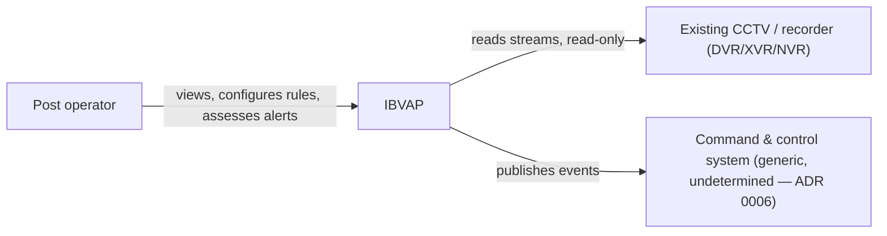

# IBVAP Architecture

This is the system architecture description for IBVAP, following the arc42
template. It records what is already settled by product decisions and ADRs,
and marks plainly what architecture work has not happened yet — per
[CLAUDE.md](../../CLAUDE.md) §2, architecture is not decided ahead of the
research and product scope it depends on.

A fuller, review-ready expansion of the same accepted design — data model,
API contracts, security design and the rest — lives in
[docs/architecture/system-design/](system-design/README.md), synthesised from
the six accepted RFCs. Where the two overlap, the RFC is authoritative.

## Contents

1. [Introduction and Goals](#1-introduction-and-goals)
2. [Constraints](#2-constraints)
3. [Context and Scope](#3-context-and-scope)
4. [Solution Strategy](#4-solution-strategy)
5. [Building Block View](#5-building-block-view)
6. [Runtime View](#6-runtime-view)
7. [Deployment View](#7-deployment-view)
8. [Cross-cutting Concepts](#8-cross-cutting-concepts)
9. [Architecture Decisions](#9-architecture-decisions)
10. [Quality Requirements](#10-quality-requirements)
11. [Risks and Technical Debt](#11-risks-and-technical-debt)
12. [Glossary](#12-glossary)

---

## 1. Introduction and Goals

IBVAP turns CCTV a border force already owns into an intelligent
surveillance network in software — no dedicated FRS, ANPR, or smart-camera
hardware. The requirements, goals and success criteria are owned by product,
not restated here: see the [PRD](https://app.notion.com/p/3c986dda46e28195ba55dd42265e7072?pvs=204)
(Notion) §3 and §5.

The architecture's job is to satisfy those requirements against hardware and
network conditions that are measured, not assumed — see
[§2](#2-constraints).

## 2. Constraints

| Constraint | Source |
|---|---|
| Read-only against the existing camera/recorder estate — never reconfigures, never takes over recording | [ADR 0004](../adr/0004-function-without-remote-monitoring-layer.md), PRD §5.2 |
| Must function correctly with no remote link, for at least 72 hours, with no data loss on reconnect | [ADR 0004](../adr/0004-function-without-remote-monitoring-layer.md), PRD §5.2 |
| No outbound internet dependency required — isolated-network deployable | PRD §5.2 |
| No licence-driven degradation — nothing expires or disables because a licence/update server is unreachable | PRD §5.2 |
| Commissioned by a non-specialist in under an hour, no site survey | PRD §5.2, §3 |
| Validated against the existing development CCTV rig — TCP-only RTSP, fixed 1080N anamorphic encode, a shared 12,288 kbps / 120 fps budget across 8 channels, firmware that reports success for settings it silently discards | [ADR 0015](../adr/0015-mvp-validated-against-development-cctv-rig.md) |
| ANPR and face recognition validated separately, against fed footage that clears their pixel floors — the rig's own wide-area channels cannot demonstrate either working | [ADR 0060](../adr/0060-file-backed-frame-source-for-testing.md), extending ADR 0015 |
| The rig (`dvr.py`, `dvr.env`, `backups/`, `requirements.txt`) is preserved unmodified — consumed, not replaced | [CLAUDE.md](../../CLAUDE.md) rule 5 |
| The real target camera estate (models, resolutions, IP vs. analog-behind-DVR, ONVIF conformance) is unmeasured | PRD §9 |

## 3. Context and Scope

**Business context.** IBVAP sits between an existing CCTV/recorder estate and
a human operator (and, downstream, a command-and-control system it emits
events to). It does not sit between the camera and the existing VMS — it is
an additional, read-only consumer of the same streams.

**Technical context.** The software stack is chosen —
[0032](../adr/0032-inference-runtime-decode-path-and-detector-licence.md),
[0033](../adr/0033-backend-framework-packaging-and-auth.md),
[0034](../adr/0034-local-event-store-on-sqlite.md) and
[0035](../adr/0035-operator-console-stack-and-video-transport.md) between
them settle the decode path, inference runtime, backend, event store,
authentication and operator console. Ingest protocol details and deployment
topology are not; they belong to the [RFCs](../rfcs/README.md) that follow.

## 4. Solution Strategy

The product-level strategy architecture must satisfy, and the mechanism that
satisfies each:

| Strategy | Mechanism |
|---|---|
| Measure per-camera capability before claiming it; refuse what a camera cannot support ([ADR 0007](../adr/0007-refuse-unsupported-capabilities-not-degrade.md)) | A measurement pass at connect derives pixel density at a commissioned reference distance and writes a verdict per capability per illumination mode, each refusal carrying the sentence the console renders verbatim — [RFC 0001](../rfcs/0001-video-ingest-capability-measurement-and-playback.md) |
| Treat the recorder, not just the camera, as a hard limit ([ADR 0015](../adr/0015-mvp-validated-against-development-cctv-rig.md)) | Everything is measured from the delivered stream rather than from what the device reports; the timeline's extent is whatever the recorder holds, drawn with its own edges and gaps |
| Satisfy C2 integration with a generic, versioned, demonstrated event contract ([ADR 0006](../adr/0006-c2-integration-via-generic-event-contract.md)) | `ibvap.event.v1`, generated from the same Pydantic models the API publishes, delivered over webhook or MQTT, demonstrated from S-05 by a test event — [RFC 0005](../rfcs/0005-c2-event-egress-publisher.md) |
| No learned anomaly model for "suspicious activity" ([ADR 0012](../adr/0012-suspicious-activity-as-operator-authored-rules.md)) | A small composition language over primitives — zone, tripline, class, dwell, count, accompaniment, movement, schedule — with no box anywhere in the pipeline that scores behaviour — [RFC 0002](../rfcs/0002-rule-evaluation-engine.md) |

Two structural commitments follow from the hardware rather than from product:

**Decode is the binding cost, so it gets the silicon and everything else is
sized around it.** Analysing fewer frames does not decode fewer frames, so the
model cascade is gated — by capability verdict, by object pixel size, and by
track identity — rather than throttled.

**Inference is central and in-process.** Ingest, decode, inference and rule
evaluation run in one process on one machine, because decode and model weights
compete for the same 4 GB of VRAM
([ADR 0050](../adr/0050-single-process-inference-placement.md)). The
`FrameSource`/`FrameSink` boundary keeps a later split a transport change.

The technology implementing all of it is settled:
[0032](../adr/0032-inference-runtime-decode-path-and-detector-licence.md)–[0035](../adr/0035-operator-console-stack-and-video-transport.md)
for the stack, and
[0051](../adr/0051-face-detection-model-and-refusal-threshold.md)–[0054](../adr/0054-go2rtc-is-the-webrtc-gateway.md)
for the models and the gateway the stack ADRs left open.

## 5. Building Block View

One process, six modules, plus one third-party binary and two stores.

| Building block | Responsibility | Specified by |
|---|---|---|
| Ingest | Per-camera RTSP lifecycle, decode, frame timestamping, capability measurement, playback retrieval | [RFC 0001](../rfcs/0001-video-ingest-capability-measurement-and-playback.md) |
| Analytics | The gated model cascade — detector, tracker, face, plate chain, movement — producing `FrameAnalysis` | [RFC 0006](../rfcs/0006-detection-and-analytics-primitives.md) |
| Rule engine | Geometry, conditions, schedules, timers, debounce; emits `RuleMatch` | [RFC 0002](../rfcs/0002-rule-evaluation-engine.md) |
| Event writer and store | The one transaction: Event, artefacts, Alert, egress rows; retention and reconciliation | [RFC 0003](../rfcs/0003-event-store-and-alert-state.md) |
| API and WebSocket | REST over the store, `/ws/live` push, session auth | [RFC 0004](../rfcs/0004-web-application-and-api-contracts.md) |
| Egress publisher | Drains the queue to webhook or MQTT with backoff and dead-lettering | [RFC 0005](../rfcs/0005-c2-event-egress-publisher.md) |
| go2rtc *(separate process)* | Republishes camera streams to WebRTC without transcoding | [ADR 0054](../adr/0054-go2rtc-is-the-webrtc-gateway.md) |
| SQLite (WAL) + artefact directory | Events, alerts, rules, verdicts, egress queue; clips, crops, snapshots on disk | [RFC 0003](../rfcs/0003-event-store-and-alert-state.md) |

Drawn: [container view](diagrams/c4-l2-container.md), which becomes
authoritative once the RFCs above are accepted.

## 6. Runtime View

The product-level event flow — camera → detection → rule → Event/Alert →
assessment → egress — is fixed by
[PRD §6.2](https://app.notion.com/p/3c986dda46e28195ba55dd42265e7072?pvs=204)
(Notion). The mechanics that implement it are specified in the RFCs:

| Scenario | Specified by |
|---|---|
| A frame's journey from RTSP packet to written Event | [RFC 0001](../rfcs/0001-video-ingest-capability-measurement-and-playback.md), [RFC 0006](../rfcs/0006-detection-and-analytics-primitives.md), [RFC 0002](../rfcs/0002-rule-evaluation-engine.md) |
| The single transaction that writes Event, artefacts, Alert and egress rows | [RFC 0003](../rfcs/0003-event-store-and-alert-state.md) |
| Live View compositing WebRTC pixels with WebSocket boxes | [RFC 0004](../rfcs/0004-web-application-and-api-contracts.md) |
| Signing in, session restore, and both recovery paths | [RFC 0004](../rfcs/0004-web-application-and-api-contracts.md) |
| Assessing an alert, and the mute that may follow | [RFC 0003](../rfcs/0003-event-store-and-alert-state.md), [RFC 0004](../rfcs/0004-web-application-and-api-contracts.md) |
| Scrubbing the timeline, or being refused it | [RFC 0001](../rfcs/0001-video-ingest-capability-measurement-and-playback.md), [RFC 0004](../rfcs/0004-web-application-and-api-contracts.md) |
| Three days offline, then reconnecting | [RFC 0005](../rfcs/0005-c2-event-egress-publisher.md) |

Sequence and state diagrams for each of these are still owed, and are tracked as
remaining Phase 3 work.

## 7. Deployment View

**One machine, at the site, running two processes.**

| Component | Form |
|---|---|
| IBVAP application | A Python 3.12 virtual environment running Uvicorn; ingest, analytics, rules, API and egress in one process ([ADR 0050](../adr/0050-single-process-inference-placement.md)) |
| go2rtc | A single Go binary, configured from a generated YAML listing one stream per camera |
| Event store | One SQLite file in WAL mode |
| Artefact store | A directory on the same disk; the database holds paths, sizes and hashes |
| Models | `models/`, not in git, verified against `models/manifest.json` at startup ([ADR 0058](../adr/0058-model-artefacts-are-versioned-files-with-a-manifest.md)) |
| Console | Static assets served by the same application; no CDN, no external font or icon fetch |

Constrained by [§2](#2-constraints) to no reliable link, no reliable power and
no engineer on site, which produces four requirements this view has to meet:

- **Nothing outbound is required to function.** Both processes talk only to
  devices on the local network and to whatever C2 endpoint is configured.
- **Both processes must be supervised**, because
  [ADR 0050](../adr/0050-single-process-inference-placement.md) puts the API in
  the same process as the decoders, so a decoder crash takes the console with
  it. The supervision mechanism is part of the deployment work that
  [ADR 0033](../adr/0033-backend-framework-packaging-and-auth.md) defers, and is
  carried in [§11](#11-risks-and-technical-debt) until it is chosen.
- **Power loss must be survivable.** WAL with `synchronous = NORMAL` risks at
  most the last transaction; the consequence is bounded and stated in
  [RFC 0003](../rfcs/0003-event-store-and-alert-state.md).
- **Commissioning must fit in under an hour, by a non-specialist, with no site
  survey.** That is why the capability pass asks for two numbers a person can
  pace out, and why nothing requires certificate distribution.

**Containerisation stays deferred**, per ADR 0033. The condition that would
reopen it is a second deployment site, or a target machine where the Python and
CUDA versions cannot be pinned by hand — neither of which exists yet.

## 8. Cross-cutting Concepts

| Concept | Status |
|---|---|
| Honest capability disclosure — refuse, don't degrade | Decided — [ADR 0007](../adr/0007-refuse-unsupported-capabilities-not-degrade.md) |
| No invented vocabulary in any surface (no "intruder", "threat level") | Decided — PRD §5.2 |
| Attributable actions — every consequential action tied to a person and a time | Decided — PRD §5.2 |
| Time-integrity marking on events under a suspect clock | Decided — PRD §8 |
| Payload-progressive event delivery (record → crop → full clip on request) | Decided — PRD §5.1 |
| Model runtime and decode path | Decided — [ADR 0032](../adr/0032-inference-runtime-decode-path-and-detector-licence.md) |
| Authentication mechanism | Decided — [ADR 0033](../adr/0033-backend-framework-packaging-and-auth.md) |
| Storage engine | Decided — [ADR 0034](../adr/0034-local-event-store-on-sqlite.md) |
| Recorded playback on the focused-camera view, read-only, no export | Decided — [ADR 0038](../adr/0038-historical-timeline-on-the-focused-camera-view.md) |
| Inference placement (edge vs. central) | Decided — [ADR 0050](../adr/0050-single-process-inference-placement.md): central, one process, split-ready |
| Face detection, ANPR and night-movement models | Decided — [ADR 0051](../adr/0051-face-detection-model-and-refusal-threshold.md), [0052](../adr/0052-anpr-two-stage-chain-with-a-grammar-gate.md), [0053](../adr/0053-night-movement-as-a-detector-independent-primitive.md) |
| WebRTC gateway | Decided — [ADR 0054](../adr/0054-go2rtc-is-the-webrtc-gateway.md) |
| Offline password recovery | Decided — [ADR 0055](../adr/0055-offline-password-recovery-by-local-admin-reset.md) |
| An event's detection class, for timeline markers | Decided — [ADR 0056](../adr/0056-an-event-carries-one-primary-class.md) |
| Model artefacts and their provenance | Decided — [ADR 0058](../adr/0058-model-artefacts-are-versioned-files-with-a-manifest.md) |
| Face recognition, gated behind a configured watchlist | Decided — [ADR 0059](../adr/0059-face-recognition-ships-against-a-configured-watchlist.md) |
| A file-backed ingest source for testing and demonstration | Decided — [ADR 0060](../adr/0060-file-backed-frame-source-for-testing.md) |
| Recorded-video retrieval route | Decided — established per deployment at commissioning, by trying the three candidates against the recorder in use ([RFC 0001](../rfcs/0001-video-ingest-capability-measurement-and-playback.md)); refused on every camera if none succeed |
| Decode throughput | Decided — treated as a per-site operational fact, observed continuously per camera rather than fixed once against any single recorder ([RFC 0001](../rfcs/0001-video-ingest-capability-measurement-and-playback.md)) |
| Process supervision on the site machine | Open — belongs to the deployment work [ADR 0033](../adr/0033-backend-framework-packaging-and-auth.md) defers |

## 9. Architecture Decisions

Recorded as ADRs, one file per decision, in
[docs/adr/](../adr/README.md) — not duplicated here. Decisions with
architectural consequence so far: 0004, 0006, 0007, 0009, 0011, 0012, 0013,
0015, 0038; the stack itself in 0032–0035; and the placement, model and
gateway decisions Phase 3's RFCs surfaced, 0049–0060.

## 10. Quality Requirements

Owned by product as success criteria — see PRD §3. Not restated here to
avoid the drift risk of two copies of the same numbers.

## 11. Risks and Technical Debt

Owned by product — see PRD §8. The architecture-specific risks, as they stand
with the [RFCs](../rfcs/README.md) drafted:

**Decode throughput is a per-site fact, not a fixed number.** Five concurrent
1080N H.264 streams on a given machine and recorder is the case
([ADR 0032](../adr/0032-inference-runtime-decode-path-and-detector-licence.md))
sizes against, but a number measured against one developer's recorder does not
generalise to the next site's. [RFC 0001](../rfcs/0001-video-ingest-capability-measurement-and-playback.md)'s
per-camera fps and drift telemetry is what surfaces an under-provisioned site
in production; [RFC 0006](../rfcs/0006-detection-and-analytics-primitives.md)'s
frame budget is sized against the 3 fps tracking floor and the cascade's
estimated headroom, not against a single benchmark run.

**The WebRTC gateway is the one third-party binary in the front-end path**
([ADR 0035](../adr/0035-operator-console-stack-and-video-transport.md),
narrowed to go2rtc by [ADR 0054](../adr/0054-go2rtc-is-the-webrtc-gateway.md)).

**Two RTSP sessions per camera.** The two-channel architecture means go2rtc and
the analytics pipeline each pull their own session, against a recorder with a
shared bitrate and frame-rate budget across all channels. Whether the rig
sustains that is unmeasured; the retreat is for go2rtc to take the sub-stream.

**A decoder crash takes the console down with it**, because
[ADR 0050](../adr/0050-single-process-inference-placement.md) puts them in one
process. Process supervision is the mitigation and has not been chosen — it sits
inside the deployment work ADR 0033 defers.

**Timer state does not survive a restart.** In-flight dwell timers are rebuilt
from nothing, so a loiterer's clock restarts
([RFC 0002](../rfcs/0002-rule-evaluation-engine.md)). Accepted deliberately over
a database write per track per frame.

**ANPR and face detection are gated on camera placement, not universally
available.** Both are refused on a wide-area camera below their pixel floor
and supported on a close or choke-point camera above it — a fact about where a
camera is aimed, not a defect in either capability
([RFC 0006](../rfcs/0006-detection-and-analytics-primitives.md)). Demonstrating
either against footage that clears the floor, via
[ADR 0060](../adr/0060-file-backed-frame-source-for-testing.md)'s file-backed
source, is how the maturity table's claims are shown working rather than only
argued.

**The recorded-playback route is established per deployment, not fixed in this
document.** Added by [ADR 0038](../adr/0038-historical-timeline-on-the-focused-camera-view.md):
the timeline is the only surface that reads from someone else's recorder, and
which of three candidate routes actually works — ONVIF Profile G replay, a
vendor RTSP playback URL with a time range, or recorder files read directly —
depends on the recorder's own firmware, which varies by vendor and cannot be
fixed once for every site. Seeking is also decode-bound and competes with live
ingest for the same shared recorder bandwidth. Where a site's recorder offers
none of the three, the timeline is refused per
[ADR 0007](../adr/0007-refuse-unsupported-capabilities-not-degrade.md) rather
than faked, which is honest but is not what the decision is for.

## 12. Glossary

| Term | Meaning |
|---|---|
| BOP | Border Out Post |
| DORI | Detection / Observation / Recognition / Identification — pixel-density standard for camera imagery, IEC/EN 62676-4 |
| Event | Written every time a rule fires |
| Alert | Written in addition to an Event, only for an alerting rule |
| Refusal | A capability a specific camera cannot reliably support, stated inline rather than silently degraded |
| C2 | Command and control system |
