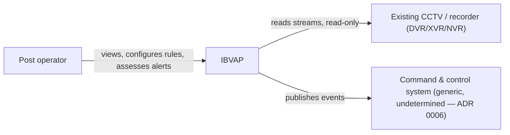

# IBVAP Architecture

This is the system architecture description for IBVAP, following the arc42
template. It records what is already settled by product decisions and ADRs,
and marks plainly what architecture work has not happened yet — per
[CLAUDE.md](../../CLAUDE.md) §2, architecture is not decided ahead of the
research and product scope it depends on.

## Contents

1. [Introduction and Goals](#1-introduction-and-goals)
2. [Constraints](#2-constraints)
3. [Context and Scope](#3-context-and-scope)
4. [Solution Strategy](#4-solution-strategy)
5. [Building Block View](#5-building-block-view)
6. [Runtime View](#6-runtime-view)
7. [Deployment View](#7-deployment-view)
8. [Cross-cutting Concepts](#8-cross-cutting-concepts)
9. [Architecture Decisions](#9-architecture-decisions)
10. [Quality Requirements](#10-quality-requirements)
11. [Risks and Technical Debt](#11-risks-and-technical-debt)
12. [Glossary](#12-glossary)

---

## 1. Introduction and Goals

IBVAP turns CCTV a border force already owns into an intelligent
surveillance network in software — no dedicated FRS, ANPR, or smart-camera
hardware. The requirements, goals and success criteria are owned by product,
not restated here: see the [PRD](https://app.notion.com/p/3c986dda46e28195ba55dd42265e7072?pvs=204)
(Notion) §3 and §5.

The architecture's job is to satisfy those requirements against hardware and
network conditions that are measured, not assumed — see
[§2](#2-constraints).

## 2. Constraints

| Constraint | Source |
|---|---|
| Read-only against the existing camera/recorder estate — never reconfigures, never takes over recording | [ADR 0004](../adr/0004-function-without-remote-monitoring-layer.md), PRD §5.2 |
| Must function correctly with no remote link, for at least 72 hours, with no data loss on reconnect | [ADR 0004](../adr/0004-function-without-remote-monitoring-layer.md), PRD §5.2 |
| No outbound internet dependency required — isolated-network deployable | PRD §5.2 |
| No licence-driven degradation — nothing expires or disables because a licence/update server is unreachable | PRD §5.2 |
| Commissioned by a non-specialist in under an hour, no site survey | PRD §5.2, §3 |
| Validated against the existing development CCTV rig — TCP-only RTSP, fixed 1080N anamorphic encode, a shared 12,288 kbps / 120 fps budget across 8 channels, firmware that reports success for settings it silently discards | [ADR 0015](../adr/0015-mvp-validated-against-development-cctv-rig.md) |
| The rig (`dvr.py`, `dvr.env`, `backups/`, `requirements.txt`) is preserved unmodified — consumed, not replaced | [CLAUDE.md](../../CLAUDE.md) rule 6 |
| The real target camera estate (models, resolutions, IP vs. analog-behind-DVR, ONVIF conformance) is unmeasured | PRD §9 |

## 3. Context and Scope

**Business context.** IBVAP sits between an existing CCTV/recorder estate and
a human operator (and, downstream, a command-and-control system it emits
events to). It does not sit between the camera and the existing VMS — it is
an additional, read-only consumer of the same streams.

**Technical context.** The software stack is chosen —
[0032](../adr/0032-inference-runtime-decode-path-and-detector-licence.md),
[0033](../adr/0033-backend-framework-packaging-and-auth.md),
[0034](../adr/0034-local-event-store-on-sqlite.md) and
[0035](../adr/0035-operator-console-stack-and-video-transport.md) between
them settle the decode path, inference runtime, backend, event store,
authentication and operator console. Ingest protocol details and deployment
topology are not; they belong to the [RFCs](../rfcs/README.md) that follow.

## 4. Solution Strategy

Not yet decided. The product-level strategy that architecture must satisfy:

- Measure per-camera capability before claiming it; refuse what a camera
  cannot support ([ADR 0007](../adr/0007-refuse-unsupported-capabilities-not-degrade.md)).
- Treat the recorder, not just the camera, as a potential hard limit on
  resolution, frame rate and bitrate ([ADR 0015](../adr/0015-mvp-validated-against-development-cctv-rig.md)).
- Satisfy C2 integration with a generic, versioned, demonstrated event
  contract, not a named adapter ([ADR 0006](../adr/0006-c2-integration-via-generic-event-contract.md)).
- No learned anomaly model for "suspicious activity" — an operator-authored
  rule engine over reliable primitives instead ([ADR 0012](../adr/0012-suspicious-activity-as-operator-authored-rules.md)).

The technology that implements this strategy is chosen — see
[0032](../adr/0032-inference-runtime-decode-path-and-detector-licence.md)
through [0035](../adr/0035-operator-console-stack-and-video-transport.md).
Edge-vs-central inference placement remains open.

## 5. Building Block View

Not yet decided. No code exists beyond the development CCTV rig
(`dvr.py`) used for research and validation, which is test tooling, not a
building block of the product.

## 6. Runtime View

Not yet decided. The product-level event flow (camera → detection → rule →
Event/Alert → assessment → egress) is fixed by
[PRD §6.2](https://app.notion.com/p/3c986dda46e28195ba55dd42265e7072?pvs=204)
(Notion); the runtime mechanics that implement it are not.

## 7. Deployment View

Not yet decided. Constrained by [§2](#2-constraints) to: no reliable link
assumed, no reliable power assumed, no console/engineer assumed on-site.

## 8. Cross-cutting Concepts

| Concept | Status |
|---|---|
| Honest capability disclosure — refuse, don't degrade | Decided — [ADR 0007](../adr/0007-refuse-unsupported-capabilities-not-degrade.md) |
| No invented vocabulary in any surface (no "intruder", "threat level") | Decided — PRD §5.2 |
| Attributable actions — every consequential action tied to a person and a time | Decided — PRD §5.2 |
| Time-integrity marking on events under a suspect clock | Decided — PRD §8 |
| Payload-progressive event delivery (record → crop → full clip on request) | Decided — PRD §5.1 |
| Model runtime and decode path | Decided — [ADR 0032](../adr/0032-inference-runtime-decode-path-and-detector-licence.md) |
| Authentication mechanism | Decided — [ADR 0033](../adr/0033-backend-framework-packaging-and-auth.md) |
| Storage engine | Decided — [ADR 0034](../adr/0034-local-event-store-on-sqlite.md) |
| Inference placement (edge vs. central) | Open — belongs to the ingest [RFC](../rfcs/README.md) |

## 9. Architecture Decisions

Recorded as ADRs, one file per decision, in
[docs/adr/](../adr/README.md) — not duplicated here. Decisions with
architectural consequence so far: 0004, 0006, 0007, 0009, 0011, 0012, 0013,
0015, and the stack itself in 0032–0035.

## 10. Quality Requirements

Owned by product as success criteria — see PRD §3. Not restated here to
avoid the drift risk of two copies of the same numbers.

## 11. Risks and Technical Debt

Owned by product — see PRD §8. Architecture-specific risks will be added
here once the [RFCs](../rfcs/README.md) are accepted and implementation
begins. Two are already named in the stack decisions and carried forward:
decode throughput for five concurrent 1080N H.264 streams is unmeasured on
the target machine ([ADR 0032](../adr/0032-inference-runtime-decode-path-and-detector-licence.md)),
and the WebRTC gateway is the one third-party binary in the front-end path
([ADR 0035](../adr/0035-operator-console-stack-and-video-transport.md)).

## 12. Glossary

| Term | Meaning |
|---|---|
| BOP | Border Out Post |
| DORI | Detection / Observation / Recognition / Identification — pixel-density standard for camera imagery, IEC/EN 62676-4 |
| Event | Written every time a rule fires |
| Alert | Written in addition to an Event, only for an alerting rule |
| Refusal | A capability a specific camera cannot reliably support, stated inline rather than silently degraded |
| C2 | Command and control system |
