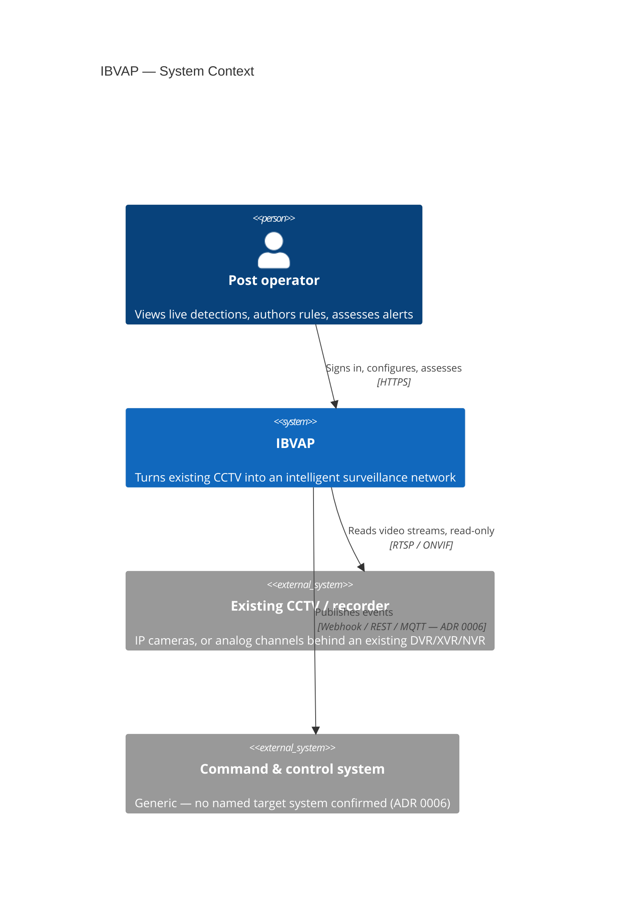

# C4 — Level 1: System Context

The IBVAP system and its direct actors — nothing inside the system boundary.
Referenced from [../README.md §3](../README.md#3-context-and-scope).

## Notes

- IBVAP never writes to the camera or recorder — no reconfiguration, no
  takeover of recording ([ADR 0004](../../adr/0004-function-without-remote-monitoring-layer.md)).
- The existing VMS/live-view path, if any, is unaffected — IBVAP is an
  additional, independent RTSP consumer, not a replacement.
- The C2 system is drawn as external and generic because no real target
  system has been named ([ADR 0006](../../adr/0006-c2-integration-via-generic-event-contract.md)).
