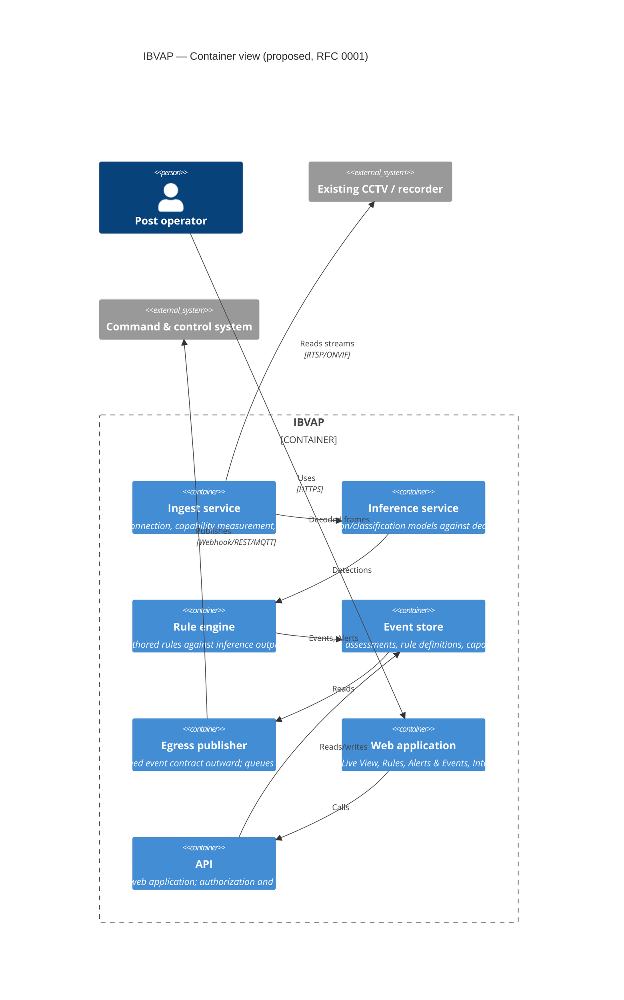

# C4 — Level 2: Container

**Status: proposed, not decided.** This is the container split proposed in
[RFC 0001](../../rfcs/0001-video-ingest-and-analytics-pipeline.md) (Draft),
shown here to make the proposal concrete — it becomes authoritative only if
that RFC is accepted, and this diagram must be updated to match if the
proposal changes during review.

## Open questions this view does not answer

- Edge vs. central placement of the inference container — see RFC 0001.
- Whether ingest and inference are one process or two, given decode is the
  binding compute cost, not inference itself (technical-feasibility research
  §3.3).
- Storage engine for the event store.
- Whether the egress publisher is push (webhook) or pull (MQTT subscriber),
  or both.
