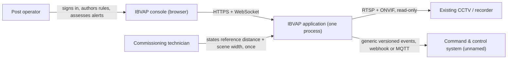

# 01. System Overview

This records what IBVAP is, who it serves, and what sits inside and outside
its boundary, as a synthesis of the immutable
[problem statement](../../problem-statement.md) and the six accepted RFCs that
design against it.

## Contents

- [Purpose](#purpose)
- [Actors](#actors)
- [System context](#system-context)
- [Capabilities in scope](#capabilities-in-scope)
- [Explicit non-goals](#explicit-non-goals)
- [Document map](#document-map)

## Purpose

Border security forces already own CCTV at Border Out Posts, check posts and
border roads. IBVAP turns that existing, standard IP-based estate into an
intelligent surveillance network in software — without dedicated FRS, ANPR or
smart-camera hardware — by ingesting live streams and running AI/CV analytics
in real time (`docs/problem-statement.md`, Description). Full product goals,
success criteria and priority live in the
[Notion PRD](https://app.notion.com/p/3c986dda46e28195ba55dd42265e7072?pvs=204)
and are not restated here.

## Actors

| Actor | Relationship to IBVAP |
|---|---|
| Post operator | Signs in, views Live View, authors rules, assesses alerts, reviews the timeline — the only human actor this build's authorisation model distinguishes a `can_reset` right from ([06-security-and-auth.md](06-security-and-auth.md)) |
| Existing CCTV / recorder (DVR/XVR/NVR) | The read-only source of every frame IBVAP analyses. IBVAP never reconfigures it or takes over recording ([ADR 0004](../../adr/0004-function-without-remote-monitoring-layer.md)) |
| Command-and-control system | A generic, unnamed downstream consumer of IBVAP's event stream ([ADR 0006](../../adr/0006-c2-integration-via-generic-event-contract.md)) |
| Commissioning technician | A non-specialist who connects a camera and states two numbers (reference distance, scene width) in under an hour, with no site survey (RFC 0001) |

## System context

IBVAP is an additional, passive consumer of streams the recorder already
produces — it does not sit between the camera and the recorder's own VMS, and
it holds no path back into the estate (RFC 0001, Cross-cutting concerns).

## Capabilities in scope

The eight capabilities the problem statement names, each with a model and a
declared maturity in [RFC 0006](../../rfcs/0006-detection-and-analytics-primitives.md):

1. Human detection and tracking
2. Vehicle detection and classification (type only)
3. Face detection (unconditional) and face recognition (gated — see
   [06-security-and-auth.md](06-security-and-auth.md))
4. Automatic Number Plate Recognition (gated by camera placement, not
   universally available — see [10-risks-and-open-items.md](10-risks-and-open-items.md))
5. Virtual fence intrusion detection
6. Suspicious activity detection (operator-authored rules, no learned model)
7. Night-time movement detection
8. Real-time alert generation and event logging

None of the eight is claimed unconditionally. Every capability carries a
per-camera verdict — supported or refused, with a stated reason — decided by
measured pixels, not asserted by the platform (RFC 0001, Capability
measurement).

## Explicit non-goals

Carried from the RFCs' own Non-goals sections, because a design document that
only lists what is built is as misleading as one that overclaims:

- **No learned anomaly model.** "Suspicious activity" is operator-composed
  rules over reliable primitives, never a trained classifier of behaviour
  ([ADR 0012](../../adr/0012-suspicious-activity-as-operator-authored-rules.md)).
- **No multi-site aggregation.** One site, one machine
  ([ADR 0014](../../adr/0014-mvp-scoped-to-one-deployment-site.md)).
- **No writing to the camera estate.** Read-only, provably, by construction
  (RFC 0001).
- **No dependency on an outbound link to function.** 72 hours offline changes
  nothing about ingest, analytics, rules or the local console
  (RFC 0001, RFC 0005).
- **No case management, evidence export, or people-and-roles screens.** Cut
  from the MVP UI ([ADR 0016](../../adr/0016-mvp-ui-cut-to-five-screens.md)).
- **No cross-camera correlation.** One rule, one camera, for this build
  (RFC 0002).

## Document map

| Question | Answered by |
|---|---|
| How does a frame get from the camera to the analytics pipeline? | [05-core-components-and-pipeline.md](05-core-components-and-pipeline.md), RFC 0001 |
| What model produces which capability, at what cost? | RFC 0006 |
| How does an operator turn a detection into a rule, and a rule into an alert? | [05-core-components-and-pipeline.md](05-core-components-and-pipeline.md), RFC 0002 |
| What is stored, and for how long? | [03-data-model.md](03-data-model.md), RFC 0003 |
| What can the console call, and what does it get back? | [04-api-contracts.md](04-api-contracts.md), RFC 0004 |
| How does an event leave the site? | [07-integration-and-egress.md](07-integration-and-egress.md), RFC 0005 |
| Where does this run, and what happens with no link for three days? | [08-deployment-and-infrastructure.md](08-deployment-and-infrastructure.md) |
| What isn't decided yet? | [10-risks-and-open-items.md](10-risks-and-open-items.md) |
