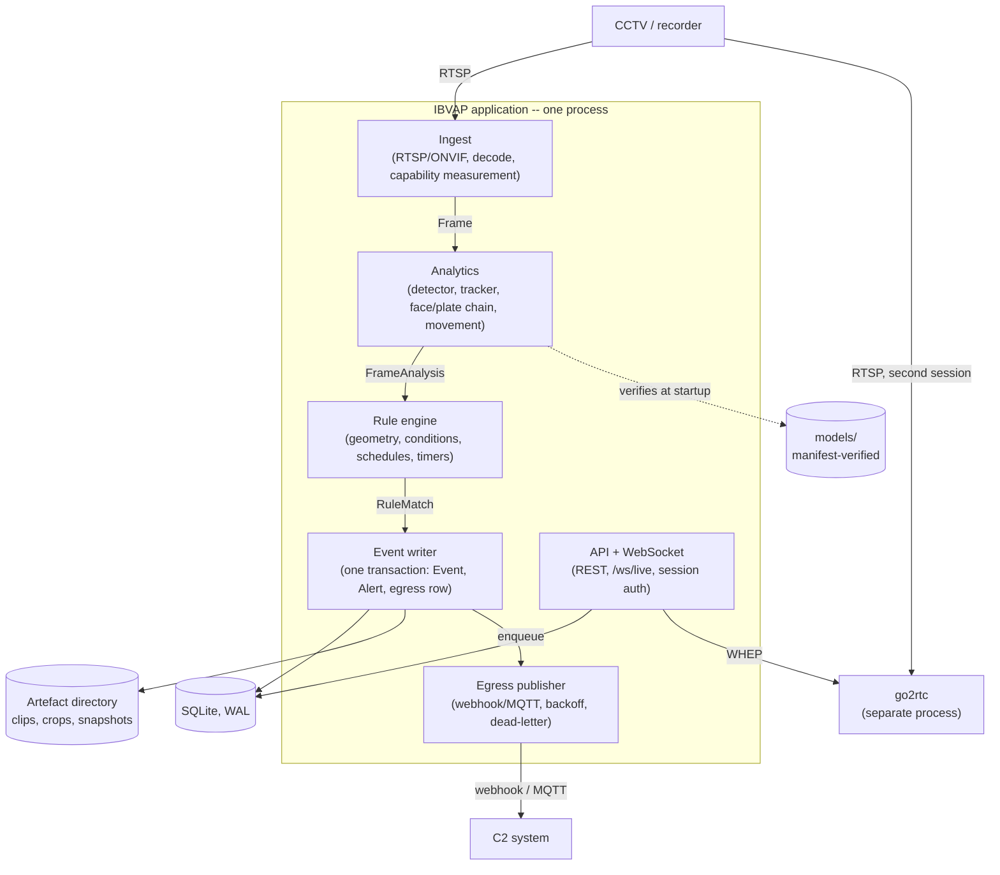
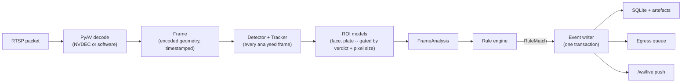

# 02. Architecture Overview

The building-block and technology view of IBVAP: one process, its internal
modules, the one external binary it runs alongside, and the interfaces that
keep the boundary between ingest and analytics a transport detail rather than
a rewrite.

## Contents

- [Architectural style](#architectural-style)
- [Building blocks](#building-blocks)
- [Module boundaries](#module-boundaries)
- [Technology stack](#technology-stack)
- [Threading model](#threading-model)
- [High-level pipeline](#high-level-pipeline)

## Architectural style

**Single-process, modular monolith, split-ready.** Ingest, decode, inference
and rule evaluation run in one Python process on one site machine
([ADR 0050](../../adr/0050-single-process-inference-placement.md)), because
decode and model memory share the same GPU budget and an in-process
handoff avoids a copy the deployment cannot spare. The module boundary is drawn
so a later split to two processes, or an edge/central split, is a change to
one adapter, not a redesign (RFC 0001, Inference placement).

This is a deliberate departure from a microservice-per-capability design: at
one site with one operator and no elastic compute, service boundaries would
buy isolation this deployment does not need yet, at a resource cost it cannot
afford.

## Building blocks



| Building block | Responsibility | Specified by |
|---|---|---|
| Ingest | Per-camera RTSP lifecycle, decode, frame timestamping, capability measurement, playback retrieval, file-backed testing source | RFC 0001 |
| Analytics | The gated model cascade producing `FrameAnalysis` | RFC 0006 |
| Rule engine | Geometry, conditions, schedules, timers, debounce; emits `RuleMatch` | RFC 0002 |
| Event writer and store | The one transaction: Event, artefacts, Alert, egress rows; retention and reconciliation | RFC 0003 |
| API and WebSocket | REST over the store, `/ws/live` push, session auth, overlay sync | RFC 0004 |
| Egress publisher | Drains the queue to webhook or MQTT with backoff and dead-lettering | RFC 0005 |
| go2rtc *(separate process)* | Republishes camera streams to WebRTC/HLS/MJPEG without transcoding | [ADR 0054](../../adr/0054-go2rtc-is-the-webrtc-gateway.md) |
| SQLite (WAL) + artefact directory | Events, alerts, rules, verdicts, egress queue; clips, crops, snapshots on disk | RFC 0003 |

## Module boundaries

Two narrow interfaces are the whole of what ingest and analytics know about
each other:

```python
class FrameSource(Protocol):
    def frames(self) -> Iterator[Frame]: ...
    def stop(self) -> None: ...

class FrameSink(Protocol):
    def submit(self, frame: Frame) -> None: ...   # never blocks; may discard
```

`FrameSource` has two implementations sharing one contract: a live RTSP camera
and a file-backed source used only for development and validation
([ADR 0060](../../adr/0060-file-backed-frame-source-for-testing.md)). Nothing
downstream can distinguish the two.

Three further contracts carry data between the remaining modules, each fixed
by its owning RFC and consumed, not redefined, by the next: `FrameAnalysis`
(RFC 0006 → RFC 0002), `RuleMatch` (RFC 0002 → RFC 0003), and `RecordResult`
(RFC 0003 → the API layer). See
[05-core-components-and-pipeline.md](05-core-components-and-pipeline.md) for
the fields each carries.

## Technology stack

| Layer | Choice | Decided by |
|---|---|---|
| Decode | PyAV, NVDEC with software fallback | [ADR 0032](../../adr/0032-inference-runtime-decode-path-and-detector-licence.md) |
| Inference runtime | ONNX Runtime | ADR 0032 |
| Detector | YOLO-family, exported to ONNX | ADR 0032, [ADR 0051](../../adr/0051-face-detection-model-and-refusal-threshold.md) |
| Tracking | ByteTrack | ADR 0032 |
| Face detection / recognition | YuNet / SFace | ADR 0051, [ADR 0059](../../adr/0059-face-recognition-ships-against-a-configured-watchlist.md) |
| Night movement | OpenCV MOG2 | [ADR 0053](../../adr/0053-night-movement-as-a-detector-independent-primitive.md) |
| Rule geometry | Shapely | RFC 0002 |
| Backend framework | FastAPI, Pydantic v2 | [ADR 0033](../../adr/0033-backend-framework-packaging-and-auth.md) |
| Event store | SQLite (WAL), SQLAlchemy 2.0, Alembic | [ADR 0034](../../adr/0034-local-event-store-on-sqlite.md) |
| Auth | Server-side session, Argon2id | ADR 0033 |
| Video transport | WebRTC via go2rtc, MJPEG fallback | [ADR 0035](../../adr/0035-operator-console-stack-and-video-transport.md), ADR 0054 |
| Console | React Router, TanStack Query, Tailwind v4 tokens from Figma | ADR 0035, RFC 0004 |
| Egress transports | `httpx` (webhook), `aiomqtt` (MQTT) | RFC 0005 |

## Threading model

`asyncio` runs the API and the egress publisher. Decode does not belong on
that loop — PyAV's decode calls block — so each camera gets a dedicated OS
thread, safe because PyAV releases the GIL for the FFmpeg call:

```
per camera:  [decode thread] → latest-frame slot (size 1) → [analytics worker]
```

The slot holds exactly one frame; a writer overwrites rather than blocks, so a
slow consumer drops frames instead of growing a queue and one dead channel
cannot stall the others (RFC 0001, Threading model).

## High-level pipeline



Detail on every stage is in
[05-core-components-and-pipeline.md](05-core-components-and-pipeline.md).
