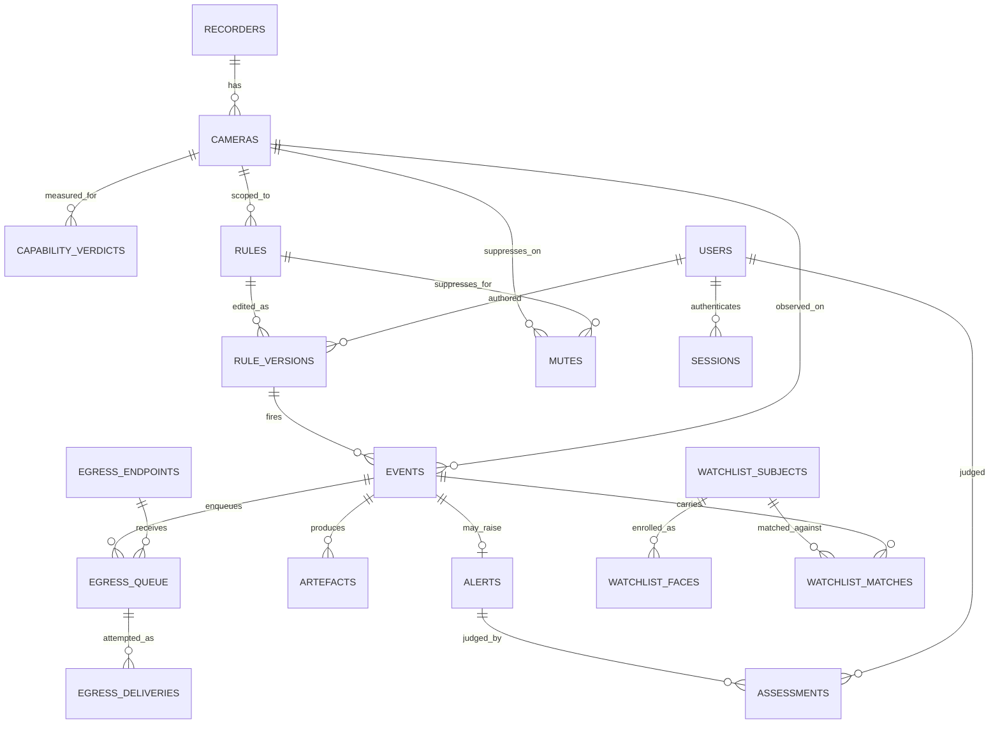

# 03. Data Model

The entities IBVAP stores, their relationships, and the retention rules that
govern how long each lives. This is a structural summary of
[RFC 0003](../../rfcs/0003-event-store-and-alert-state.md), which holds the
exact DDL, column types and indexes — reproduced here only where needed to
show a relationship.

## Contents

- [Storage engine](#storage-engine)
- [Entity groups](#entity-groups)
- [Entity relationships](#entity-relationships)
- [Key modelling decisions](#key-modelling-decisions)
- [Retention](#retention)

## Storage engine

SQLite in WAL mode, one writer, through SQLAlchemy 2.0 with Alembic migrations
from the first schema ([ADR 0034](../../adr/0034-local-event-store-on-sqlite.md)).
`synchronous = NORMAL` survives an application crash always and a power loss
with at most the last transaction lost — a stated trade for a site with
unreliable power (RFC 0003, Engine configuration).

## Entity groups

| Group | Tables | Purpose |
|---|---|---|
| Identity | `users`, `sessions` | Operator accounts, the `can_reset` right, session cookies |
| Estate | `recorders`, `cameras`, `capability_verdicts` | What is connected, its measured geometry, and what it is verdicted to support |
| Rules | `rules`, `rule_versions` | Operator-authored conditions, versioned on every edit |
| Events and alerts | `events`, `alerts`, `assessments`, `mutes` | What fired, whether it alerted, how an operator judged it |
| Artefacts | `artefacts` | Clips, crops, snapshots, and per-frame metadata (opt-in) cut from the stream |
| Egress | `egress_endpoints`, `egress_queue`, `egress_deliveries`, `egress_drops` | Configured C2 destinations and the durable delivery queue |
| Watchlist | `watchlist_config`, `watchlist_subjects`, `watchlist_faces`, `watchlist_matches` | Face-recognition gate and gallery, inert until explicitly enabled |
| Settings | `settings` | Site-configurable values (e.g. retention periods) without a migration |

## Entity relationships

## Key modelling decisions

**Zone geometry is stored normalised against encoded resolution**, together
with the encoded width/height it was drawn against — evaluated in pixels at
rule time. Storing in display coordinates would silently halve a fence on the
rig's anamorphic 960→1920 stretch (RFC 0002, Geometry).

**Capability verdicts are kept as history, never overwritten.** A refusal
that changed after a camera was moved is worth being able to see
(`superseded_at`, not a delete-and-reinsert).

**Rule edits create a new `rule_versions` row**, never mutate the current one.
Every Event records the exact `rule_version_id` that fired it, so an event
from weeks ago still shows the geometry that actually produced it.

**An Event always resolves to exactly one `primary_class`** — the class of
the highest-confidence track that satisfied the rule — with a separate
`class_mixed` boolean for the rest, settling the requirement that a timeline
marker never needs a fifth colour
([ADR 0056](../../adr/0056-an-event-carries-one-primary-class.md)).

**Assessments are append-only.** A changed judgement writes a second row; the
latest wins for display, the history stays. Nothing about an alert's
assessment is ever silently edited.

**No password column exists anywhere except `users.password_hash`.** Recorder
and HMAC secrets are held behind a `secret_ref` indirection, so a database
file copied off the machine for debugging does not carry estate credentials
with it.

**The watchlist tables are inert by construction.** `watchlist_config` is a
singleton row; until its `enabled` flag is set by an administrator, no row is
ever written to `watchlist_faces` or `watchlist_matches`
([ADR 0059](../../adr/0059-face-recognition-ships-against-a-configured-watchlist.md)).
A match is an attribute joined onto an ordinary `events` row, not a distinct
kind of event.

**Timer and debounce state for dwell/absence conditions is in memory only**,
not persisted — rebuilt from nothing on restart. See
[10-risks-and-open-items.md](10-risks-and-open-items.md).

## Retention

A separate clock per artefact class, held in `settings` so a site can change
a period without a migration; `expires_at` is computed once at write time, so
a changed period only affects future artefacts:

| Class | Size | Default retention |
|---|---|---|
| `clip` | ≈ 7.5 MB | 30 days |
| `crop` | ≈ 25 KB | 90 days |
| `snapshot` | ≈ 250 KB | 90 days |
| `frame_metadata` | ≈ 138 MB/camera/day | Off by default |
| Event rows | ≈ 1 KB | 365 days |
| `watchlist_faces.embedding` | Biometric template | `watchlist_config.retention_days` — no platform default |

Event rows outlive their artefacts deliberately: a row whose clip has expired
still says something happened, when, and under which rule. A daily
reconciliation job checks database rows against files on disk and flags —
never silently deletes — either side's orphan (RFC 0003, Reconciliation).
