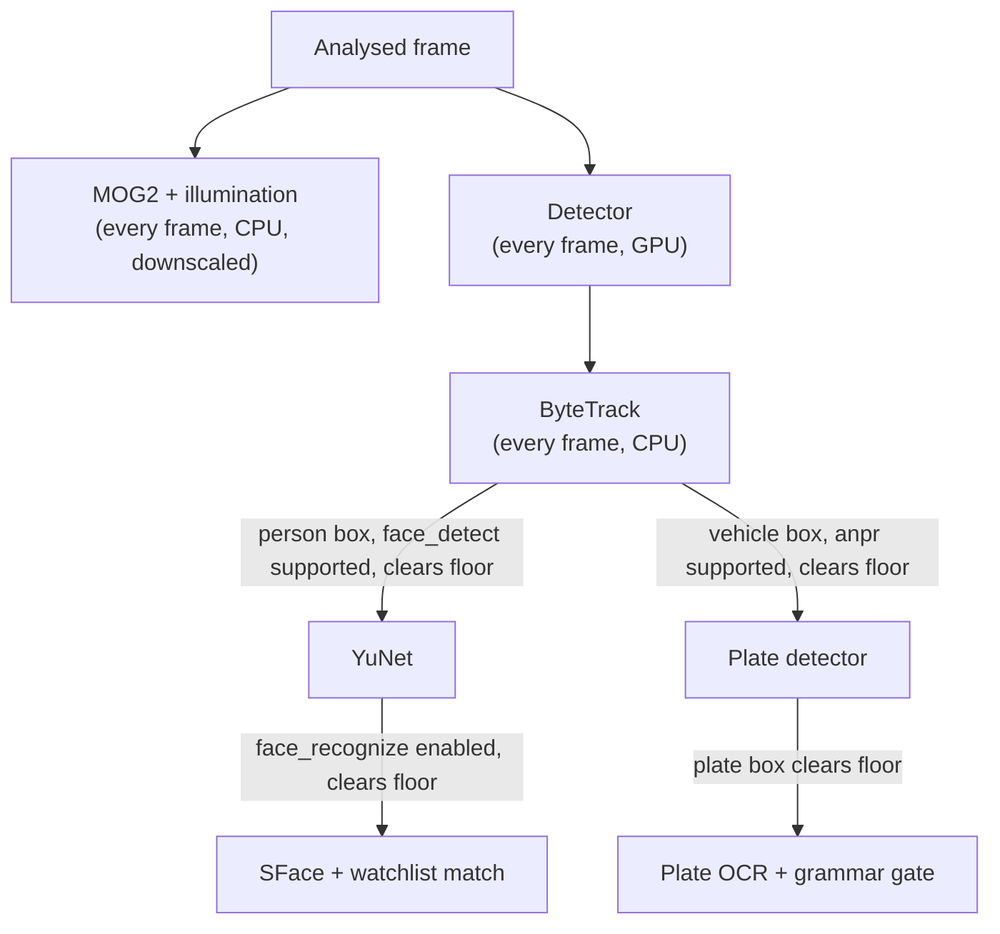

# 05. Core Components and Event Pipeline

The mechanics inside the boxes drawn in
[02-architecture-overview.md](02-architecture-overview.md): how a camera
becomes a stream of trusted frames, how a frame becomes primitives, and how a
primitive becomes a recorded, possibly alerting, Event.

## Contents

- [Camera connection lifecycle](#camera-connection-lifecycle)
- [Capability measurement](#capability-measurement)
- [The detection cascade](#the-detection-cascade)
- [Rule evaluation](#rule-evaluation)
- [The event-write transaction](#the-event-write-transaction)
- [Backpressure and frame budget](#backpressure-and-frame-budget)

## Camera connection lifecycle

```
resolving → connecting → measuring → streaming
                ↑            ↓           ↓
             reconnecting ←──┴───────────┘
                ↓
             stopped
```

`degraded` does not exist as a connection state — a camera either delivers
frames or it does not; a camera that delivers frames but cannot support a
capability is a *refusal* on that capability, recorded on the verdict, not on
the connection (RFC 0001, Connection lifecycle). Reconnection backs off 1s →
15s, doubling, resetting on a successful frame.

Stream URIs are resolved by ONVIF WS-Discovery first, falling back to a
per-recorder configured URL template for devices whose ONVIF is absent or
partial — the rig's own firmware is on record for reporting success on
settings it silently discards (RFC 0001, Discovery).

## Capability measurement

Runs on connect, and again on material change or operator request. Measured
from the stream itself: encoded/display geometry, delivered fps, GOP,
bitrate, illumination mode, noise floor. Declared once, by the commissioner: a
reference distance in metres and the scene width at that distance.

```
px_per_m = encoded_width / scene_width_m
```

That figure is compared against the DORI bands (IEC/EN 62676-4) and a
per-capability pixel floor RFC 0006 owns. The verdict is `supported` or
`refused`, and a refusal always carries a full operator-facing sentence naming
which measured input fell short — stored on the verdict and rendered verbatim
by the console, never recomposed. `face_recognize` carries a second gate on
top of pixels: refused outright, on every camera, until `watchlist_config` is
complete and enabled (RFC 0001; see
[06-security-and-auth.md](06-security-and-auth.md)). Night is measured
separately from day, because a daylight verdict does not imply a night one.

## The detection cascade

Four model families are gated on what the previous stage found, so they fit a
constrained GPU memory budget shared with NVDEC:



Three gates do the work: the **capability verdict** gates whether a stage runs
at all on this camera; **pixel size** gates whether a specific crop is even
attempted; **track identity** gates repetition, so a plate or a face is
re-attempted only when a materially better view of the same track arrives, not
every frame (RFC 0006, The cascade).

Output is a `FrameAnalysis` per analysed frame — tracks, plate reads, face
matches (empty unless recognition is enabled), movement regions and fraction —
carrying the clock-trust flag through unchanged, because time integrity is
decided once, at capture.

## Rule evaluation

Per analysed frame, per camera: fetch active rule versions (cached,
invalidated on edit) → drop rules whose schedule is inactive or that are
refused → evaluate each remaining condition tree against the frame's tracks
and movement regions → check debounce → emit a `RuleMatch` for each satisfied,
un-debounced rule (RFC 0002, Evaluation loop).

A rule is five independent choices — geometry (zone/tripline/frame), class
filter, schedule (always/window/night-scoped by *measured* illumination, not
the clock), condition (crossing, dwell, count, accompaniment, absence,
movement, plate read, watchlist match), and action (log, or log and alert).
Zones are Shapely polygons evaluated against the bottom-centre ground point of
a box. Dwell timers survive a tracker identity switch through a conservative
grace window — same zone, short time, close position — rather than resetting
or double-firing.

A rule that cannot run — its class refused on this camera, or its geometry no
longer matching a reconfigured stream — is stored, shown, and marked refused
with a sentence, in the same voice a capability refusal uses; it never
silently half-works.

## The event-write transaction

One function owns the write, because the transaction boundary is the whole
point of keeping the egress queue in the same database as the events it
publishes:

```python
def record_match(match: RuleMatch, artefacts: list[PendingArtefact]) -> RecordResult:
    """Write an Event, its artefacts, any Alert, and one egress queue row per
    enabled endpoint -- in a single transaction."""
```

An Event is written **always**. An Alert is raised only if the rule is
alerting **and** no mute is active for that camera-and-rule pair — muting
silences the alert, never the log (RFC 0003, Alert state machine;
[ADR 0027](../../adr/0027-suppression-works-like-notification-snooze.md)).

## Backpressure and frame budget

When analytics cannot keep up, **frames are discarded, never cameras** — a
blind channel is a worse failure than a slower one everywhere. The
latest-frame slot from the threading model is the mechanism: the newest frame
always wins, older ones are overwritten, and the drop is counted per camera.

Two floors bound how far the analysed rate can be reduced: **3 analysed fps**,
below which multi-object tracking loses identity association and every
track-dependent rule (dwell, direction) stops being trustworthy; and the fact
that **decode is not reduced by analysing less**, because P-frames depend on
their predecessors under the rig's 1-second GOP. Frame skipping and tracking
are mutually exclusive on this hardware (RFC 0001, Backpressure; RFC 0006,
Frame budget). Full cost tables are in
[09-non-functional-requirements.md](09-non-functional-requirements.md).
