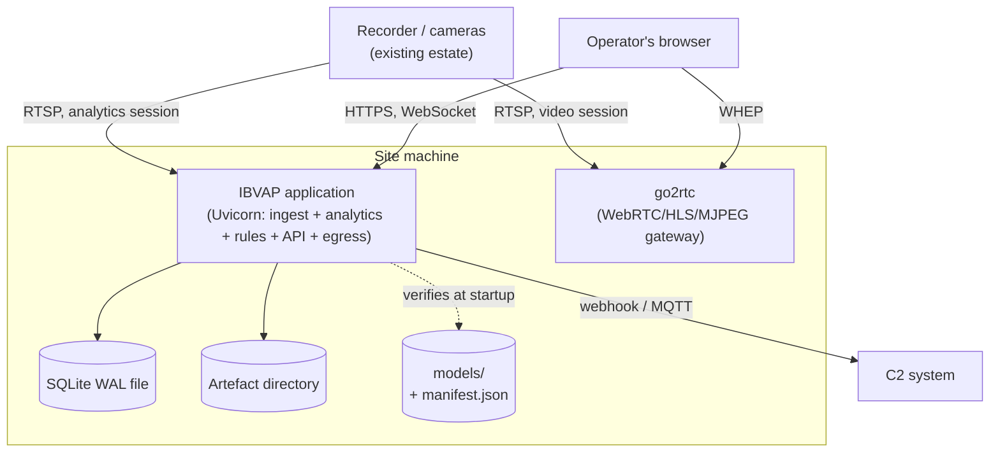

# 08. Deployment and Infrastructure Design

Where IBVAP runs, as one machine at one site, and what that constrains.
Sourced from RFC 0001, RFC 0003, and ADRs 0033, 0050 and 0054.

## Contents

- [Deployment topology](#deployment-topology)
- [Process model](#process-model)
- [Commissioning](#commissioning)
- [Offline behaviour](#offline-behaviour)
- [Backup](#backup)
- [Process supervision](#process-supervision)
- [Containerisation](#containerisation)

## Deployment topology

**One machine, at the site, running two processes.**

| Component | Form |
|---|---|
| IBVAP application | Python 3.12 venv running Uvicorn; ingest, analytics, rules, API and egress in one process ([ADR 0050](../../adr/0050-single-process-inference-placement.md)) |
| go2rtc | A single Go binary, configured from generated YAML, one stream per camera ([ADR 0054](../../adr/0054-go2rtc-is-the-webrtc-gateway.md)) |
| Event store | One SQLite file, WAL mode |
| Artefact store | A directory on the same disk; the database holds paths, sizes and SHA-256 hashes |
| Models | `models/`, not committed to git, hash-verified against `models/manifest.json` at startup ([ADR 0058](../../adr/0058-model-artefacts-are-versioned-files-with-a-manifest.md)) |
| Console | Static assets served by the same application — no CDN, no external font or icon fetch |

## Process model

Ingest, decode, inference and rule evaluation share one process because decode
and model weights compete for the same GPU memory
(RFC 0001; [02-architecture-overview.md](02-architecture-overview.md)). go2rtc
is the one deliberate exception — it needs its own RTSP session to the
recorder to republish video without transcoding, independent of the analytics
pipeline's own session against the same channel.

## Commissioning

Constrained to fit a non-specialist, in under an hour, with no site survey.
The only inputs a human supplies per camera are a reference distance in
metres and the scene width at that distance — everything else (encoded
geometry, frame rate, GOP, illumination, pixel density) is measured from the
stream itself (RFC 0001, Capability measurement).

## Offline behaviour

Ingest and analytics have no remote dependency at all — they talk to devices
on the local network. The egress publisher is the one component whose job is
reaching outward, and it is built to make an extended outage a non-event: the
queue accumulates, backs off to its ceiling, and drains in order on reconnect
([07-integration-and-egress.md](07-integration-and-egress.md)). Seventy-two
hours without a link changes nothing about ingest, analytics, rules, storage,
or the local console.

## Backup

A consistent database copy is `VACUUM INTO` a second file, which works while
the application keeps running — no downtime required at a site with no
engineer to schedule one. The artefact directory copies alongside it (RFC
0003, Cross-cutting concerns).

## Process supervision

**Open.** Because the API shares a process with the decoders
([ADR 0050](../../adr/0050-single-process-inference-placement.md)), a decoder
crash takes the console down with it. What supervises and restarts both
processes on the site machine is deployment work
[ADR 0033](../../adr/0033-backend-framework-packaging-and-auth.md) explicitly
defers — not yet chosen. See
[10-risks-and-open-items.md](10-risks-and-open-items.md).

## Containerisation

Deferred, per ADR 0033. The condition that would reopen it: a second
deployment site, or a target machine where the Python and CUDA versions
cannot be pinned by hand — neither exists yet. Nothing about the module
boundaries drawn in
[02-architecture-overview.md](02-architecture-overview.md) precludes adding it
later.
